[](https://github.com/vroomfondel/dgxarley/actions/workflows/mypynpytests.yml)
[](https://github.com/vroomfondel/dgxarley/actions/workflows/checkblack.yml)

[](https://pepy.tech/projects/dgxarley)
[](https://pypi.org/project/dgxarley/)


# DGX Spark Cluster — Ansible Repository

Ansible-Repository for deploying a heterogeneous K3s cluster for distributed LLM inference,
built around two NVIDIA DGX Spark (ARM64) GPU nodes managed by an x86 control-plane node.

## Cluster Nodes

| Node | Hardware | Arch | Role |
|------|----------|------|------|
| **k3smaster** | HP EliteDesk 800 G4 | x86_64 | K3s Master, Control-Plane, Frontend Services |
| **spark1** | DGX Spark / ASUS Ascent GX10 | ARM64 | SGLang Head, Ollama Embedding |
| **spark2** | DGX Spark / ASUS Ascent GX10 | ARM64 | SGLang Worker, docling-serve |

### Cluster Overview (K9s — all namespaces)

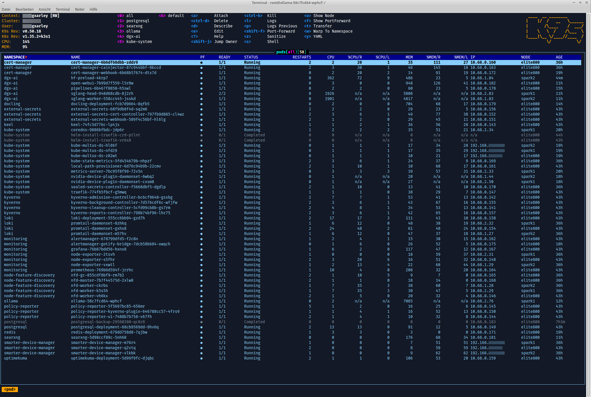

## Network Architecture

### Physical Topology

```
                                  Netgear S3300-52X (3-Unit Stack)
                                  ================================
                                     Unit 1        Unit 2        Unit 3
                                  +-----------+ +-----------+ +-----------+
                 Fritz!Box -------|  (VLAN 1)  | |           | |           |
                  192.168.30.x    |  PVID=1    | |           | |           |
                                  |            | | Port 3    | |           |
                                  |            | | (VLAN 1 U)| |           |
                                  |            | |   |       | |           |
                                  |            | | 2/xg27    | |           |
                                  +-----------+ +---|---+---+ +-----------+
                                                    |   |
                                                    |   +---------> QSW-M408-4C (QNAP)
                                                    |               Port 12 (VLAN 30 U, others T)
                                  MikroTik          |                  |
                                  CRS310-8G+2S+     |               Port 7
                                  192.168.10.x      |                  |
                                  +-------------+   |               argras1
                                  | ether1 <----+   |               192.168.30.x
                                  |   (Netgear uplink)
                                  | ether3 -------> k3smaster
                                  |   (OVS trunk)   enx6c1ff7c1da8d (USB 2.5G NIC)
                                  | ether5 -------> spark1 (eth0, VLAN 20 access)
                                  | ether7 -------> spark2 (eth0, VLAN 20 access)
                                  +-------------+

               spark1 <=== QSFP P2P (ConnectX-7, MTU 9000, 10.10.10.0/24) ===> spark2
```

### VLANs and Subnets

| VLAN | Subnet | Purpose | Nodes |
|------|--------|---------|-------|
| 10 | 192.168.10.0/24 | Primary LAN, Management, DNS, GW | k3smaster |
| 20 | 192.168.20.0/24 | K3s cluster network (API, Flannel, inter-node) | all three nodes |
| 30 | 192.168.30.0/24 | Home network (Fritz!Box), see VLAN translation below | k3smaster |
| 40 | 192.168.40.0/24 | Passthrough | k3smaster |
| 50 | 192.168.50.0/24 | Passthrough | k3smaster |
| 60 | 192.168.60.0/24 | Passthrough | k3smaster |
| 70 | 192.168.70.0/24 | Passthrough | k3smaster |
| -- | 10.10.10.0/24 | QSFP point-to-point (NCCL, MTU 9000) | spark1, spark2 |
| -- | 10.68.0.0/16 | K3s Pod CIDR | internal |
| -- | 10.69.0.0/16 | K3s Service CIDR | internal |

> **Note:** VLAN IDs and subnets shown here are examples. Real values are in the encrypted vault files.

### OVS Bridge Architecture

All nodes use an Open vSwitch bridge (name configured in vault).

**k3smaster** (full VLAN trunk):
- Uplink: `enx6c1ff7c1da8d` (Realtek r8152 USB 2.5GbE)
- Mode: `native-untagged` on primary VLAN
- Trunks: all VLANs
- Each VLAN gets a netplan sub-interface (`<bridge>.<vlan>`)
- Deterministic MACs generated per VLAN: `02:00:00:<vlan_hex>:00:<host_octet_hex>`

**spark1 / spark2** (single VLAN):
- Uplink: `eth0`
- K3s cluster VLAN only, untagged
- Default route via k3smaster

### VLAN 1-to-30 Translation

The Fritz!Box is connected to the Netgear with PVID=1. All traffic from the
home network subnet flows as **VLAN 1** inside the Netgear — not as the home VLAN. This asymmetry
is resolved by the MikroTik CRS310 which acts as a VLAN translator:

**MikroTik bridge VLAN config:**
```
/interface/bridge/vlan
  vlan-ids=30  tagged=ether3  untagged=ether1
/interface/bridge/port
  ether1  pvid=30    # Netgear uplink: untagged ingress → home VLAN
  ether3  pvid=10    # k3smaster trunk: home VLAN tagged
```

**Traffic flow:**
```
Outbound (k3smaster → Fritz!Box):
  k3smaster <bridge>.30 → VLAN 30 tagged → MikroTik ether3
  → bridge strips tag → ether1 untagged → Netgear port 3
  → PVID=1 → VLAN 1 → Fritz!Box (untagged)

Inbound (Fritz!Box → k3smaster):
  Fritz!Box untagged → Netgear PVID=1 → VLAN 1
  → port 3 untagged → MikroTik ether1 → PVID=30
  → bridge → ether3 VLAN 30 tagged → k3smaster OVS → <bridge>.30
```

**Netgear port 3 (Unit 2) config:**
- VLAN 1: Untagged (U), PVID=1
- Home VLAN: Untagged (U)
- All other VLANs: Tagged (T)
- Mirrors the QSW uplink port configuration

### Policy Routing (fwmark / connmark)

For connections initiated FROM the home network to k3smaster's primary LAN address,
return traffic must go back via the primary LAN VLAN (not directly via the home VLAN interface). This is handled by
iptables connmark + ip rules in `iptables.sh.j2`:

```
# PREROUTING: mark inbound connections from home network arriving on primary LAN
iptables -t mangle -A HTFWMARK_PRE -i <bridge>.<primary-vlan> -s <home-subnet> \
  -d <k3smaster-primary-ip> -m conntrack --ctstate NEW -j CONNMARK --set-mark <mark>

# OUTPUT: restore connection marks for reply routing
iptables -t mangle -A HTFWMARK_OUT -j CONNMARK --restore-mark

# Route marked packets via dedicated routing table
ip rule add fwmark <mark> table <table-id>
```

The routing table contains a route to the home subnet via the MikroTik and a default route
via the primary gateway.

## Ansible Roles

| Role | Target Hosts | Description |
|------|-------------|-------------|
| `common` | all | Base packages, SSH hardening, Fail2ban, Postfix relay, iptables/ipset, Netplan + OVS, Avahi, sysstat, smartd, locale |
| `dgx_prepare` | dgxsparks | QSFP netplan (4x ConnectX-7, MTU 9000), ulimits (memlock=unlimited), NVIDIA CDI, cpupower idle disable, kernel tuning (net buffers, vm.overcommit) |
| `k3sserver` | k3sserver | K3s install (server on master, agent on sparks), kubeconfig merge to control node, HAProxy, Traefik, CoreDNS, rsyslog, NFS (optional) |
| `k8s_dgx` | k3smaster | K8s workloads: Multus, NVIDIA device plugin, SGLang (distributed), Ollama, Open WebUI, SearXNG, docling-serve |
| `k8s_infra` | k3smaster | K8s infrastructure: cert-manager, ESO/Kyverno, Keel, Tang, NFD, Sealed Secrets, PostgreSQL, Redis, Prometheus/Grafana/Alertmanager, Loki, Uptime Kuma |
| `clevis` | k3smaster | LUKS auto-unlock via Tang/NBDE |

## K8s Infrastructure (`k8s_infra` role)

Cluster-level services deployed via `k8s_infra.yml` (runs locally, applies manifests via `kubernetes.core.k8s`).
All persistent data uses hostPath volumes under `/var/lib/k8s-data/` on k3smaster (no NFS, no Ceph).

| Component | Namespace | Description |
|-----------|-----------|-------------|
| cert-manager | cert-manager | TLS certificates via Let's Encrypt (DNS-01 / RFC2136) |
| ESO + Kyverno | external-secrets, kyverno | External Secrets Operator with namespace-based secret isolation via Kyverno policies |
| Keel | keel | Automated container image updates (webhook to external cluster) |
| Tang | tang | NBDE key server for Clevis LUKS auto-unlock |
| Sealed Secrets | kube-system | Encrypted secrets for GitOps |
| NFD | node-feature-discovery | Auto-labels nodes with hardware capabilities |
| Smarter Device Manager | smarter-device-manager | Exposes `/dev` devices as K8s extended resources |
| PostgreSQL | postgresql | Single instance (openwebui + openwebui_vectors DBs with pgvector) |
| Redis | redis | Key-value store |
| Prometheus | monitoring | Metrics collection (scrapes kubelets, cAdvisor, CoreDNS, Traefik, KSM, node-exporter) |
| Grafana | monitoring | Dashboards (local auth, auto-provisioned Kubernetes dashboards from dotdc) |
| Alertmanager | monitoring | Alert routing (email + Gotify bridge via external cluster) |
| Loki + Promtail | loki | Log aggregation (filesystem backend, DaemonSet log collector) |
| Uptime Kuma | uptimekuma | Uptime monitoring |

FQDNs follow the pattern `<service>.<domain-suffix>` (configured via `dns_external_domain_suffix` in vault).

## K8s Workloads (namespaces: `sglang`, `vllm`, `openwebui`)

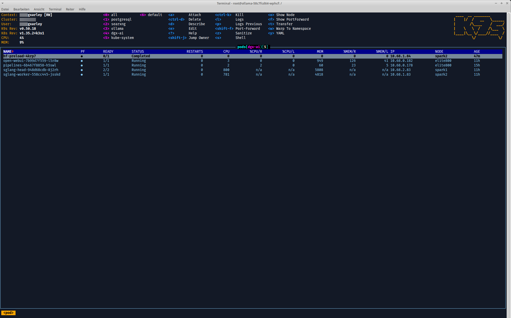

### SGLang — Distributed LLM Inference

Two-node tensor-parallel setup across both DGX Sparks:

| | spark1 (head) | spark2 (worker) |
|--|---------------|-----------------|
| Pod | `sglang-head` | `sglang-worker` |
| node-rank | 0 | 1 |
| NCCL interface | `net1` (Multus, QSFP P2P) | `net1` (Multus, QSFP P2P) |
| GPU | 1x (CDI) | 1x (CDI) |

- **Model**: configurable via `sglang_model` (default: `Qwen/Qwen3-Coder-30B-A3B-Instruct`), with per-model profiles in `sglang_model_profiles`
- **Image**: `scitrera/dgx-spark-sglang:0.5.9-t5`
- **Config**: `--tp 2 --nnodes 2`, context-length/kv-cache-dtype/mem-fraction-static pulled from model profile
- **Reasoning parser**: `--reasoning-parser` (e.g. `qwen3`) extracts `<think>...</think>` blocks into a separate `reasoning_content` field in the OpenAI-compatible API response. Set per model via `reasoning_parser` in `sglang_model_profiles` (empty = disabled)
- **Tool-call parser**: `--tool-call-parser` (e.g. `qwen3_coder`) parses structured tool/function calls from model output into the `tool_calls` API field. Required for OpenWebUI tool use, LangChain agents, etc. Set per model via `tool_call_parser` in `sglang_model_profiles` (empty = disabled). Note: [known issue](https://github.com/sgl-project/sglang/issues/8331) where the qwen3 parser may eagerly misparse normal output as tool calls
- **Speculative decoding**: multi-token prediction via `--speculative-algo NEXTN`, disabled by default (`sglang_speculative_enabled: false`). Increases output throughput up to ~60% with no quality loss, but uses more VRAM and gains diminish at high concurrency. Only works with models that have trained MTP modules (e.g. Qwen3.5, DeepSeek-V3). Enable via `sglang_speculative_enabled: true`; tuning params: `sglang_speculative_num_steps`, `sglang_speculative_eagle_topk`, `sglang_speculative_num_draft_tokens`
- **Service**: `sglang:8000` (ClusterIP), OpenAI-compatible API
- NCCL communicates over QSFP P2P (10.10.10.0/24, MTU 9000) via Multus `host-device` CNI
- **GPU time-slicing**: NVIDIA device plugin advertises each physical GPU as N logical replicas (default: 4) via ConfigMap-based time-slicing config
- **CDI volume**: device plugin writes generated CDI specs to `/var/run/cdi` (writable hostPath, `DirectoryOrCreate`) — not `/etc/cdi` (which is for static specs from `nvidia-ctk`)
- **HF cache**: models cached at hostPath `{{ hf_cache_path }}` (`/var/lib/hf-cache`), mounted as `/root/.cache/huggingface` in pods. The `huggingface_hub` library stores models under `hub/` subdirectory — download scripts must use `cache_dir="/root/.cache/huggingface/hub"` to match SGLang's runtime expectations
- **ConfigMap scripts**: model download (`sglang-model-download-script`) and launch (`sglang-launch-script`) are ConfigMap-mounted shell/Python scripts, not inline YAML commands. The launch script takes `NODE_RANK` from env to differentiate head (0) vs worker (1)
- **HF preload Job**: pre-downloads models to spark2 via a K8s Job, then rsyncs to spark1 using host-mounted SSH keys (`/root/.ssh`). Must delete+recreate (Job `spec.template` is immutable)

  **Model download progress (71.9 GB):**

  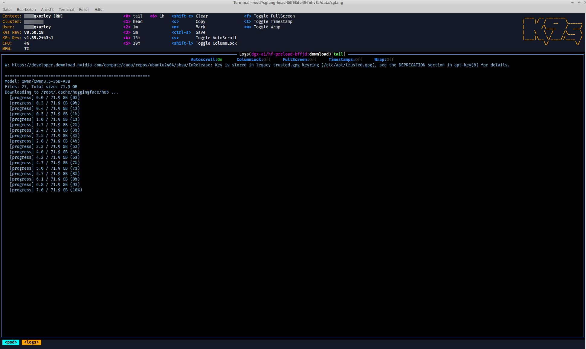

  **Model rsync between nodes:**

  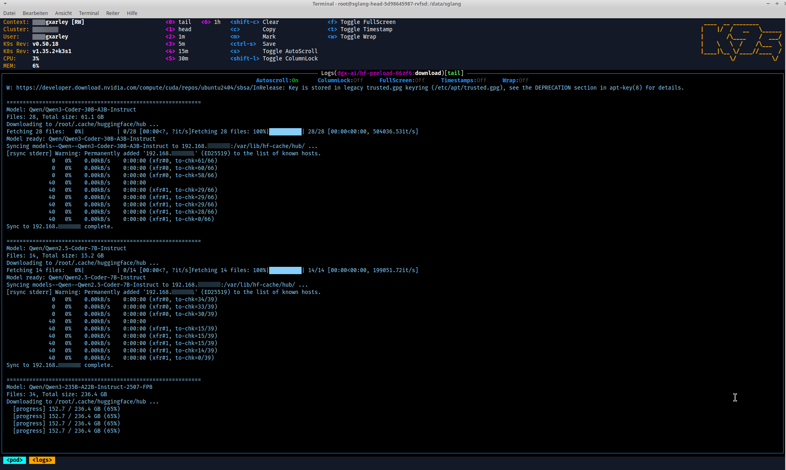
**Worker NCCL initialization:**

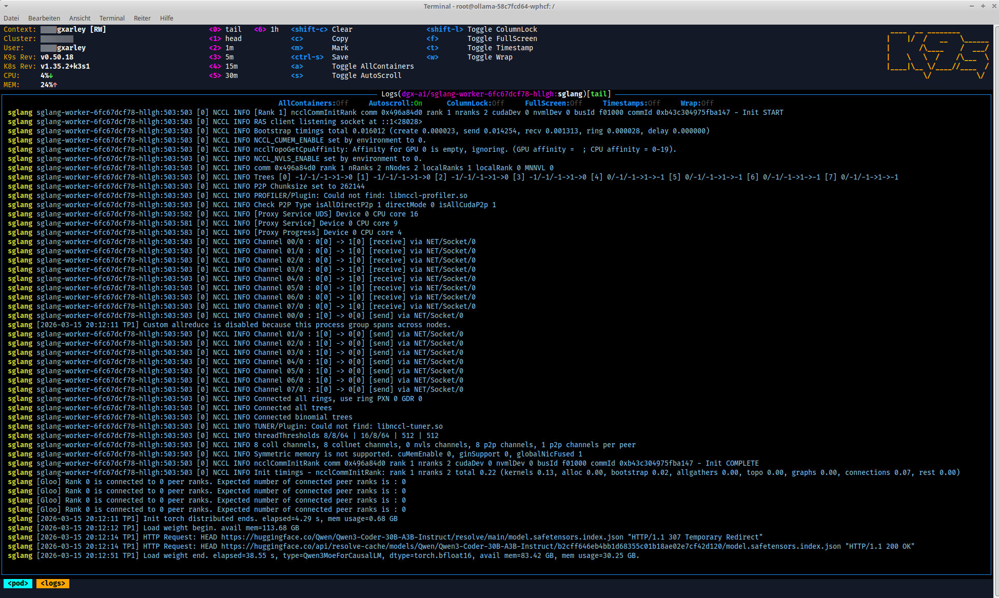

**Head NCCL initialization and channel setup:**

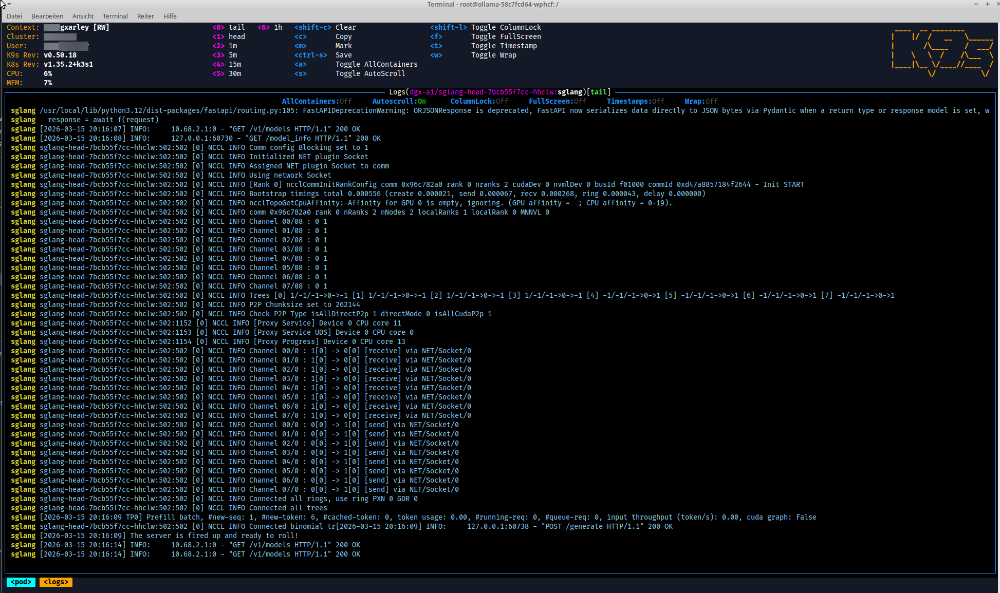

**Head CUDA graph capture and startup:**

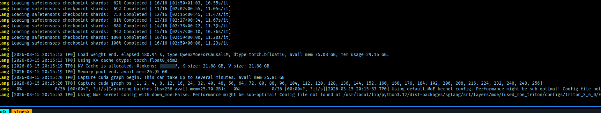

**Head running — decode batch throughput:**

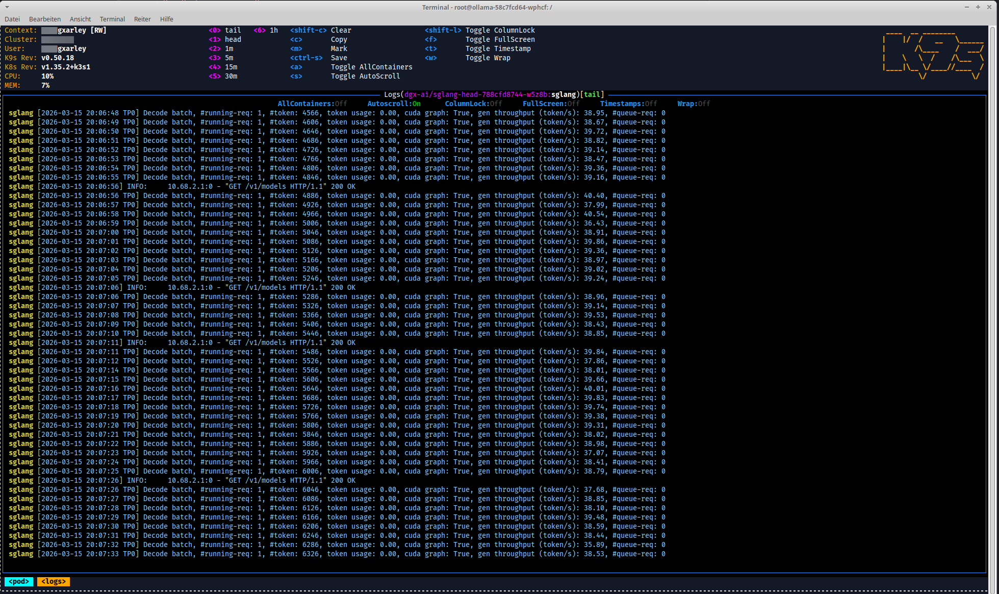

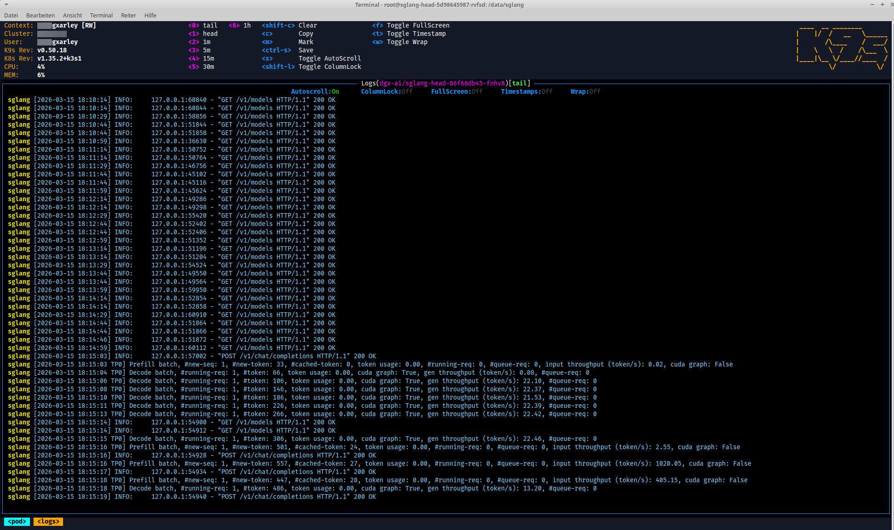

**Head with HAProxy sidecar — serving requests:**

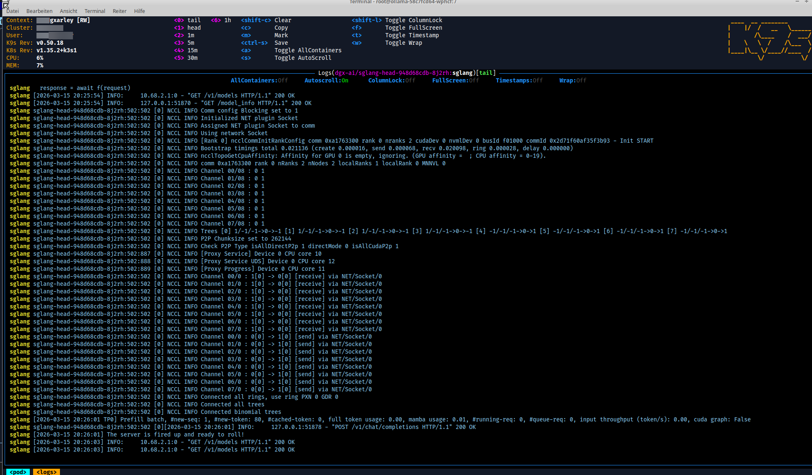

- **Startup ordering**: worker deploys before head (see comment in `sglang.yml`). The `host-device` CNI moves the QSFP interface into the pod namespace — during rollover the interface is briefly unavailable to new pods
- **Host binding / HAProxy sidecar**: the head omits `--host` so uvicorn binds `127.0.0.1:{{ sglang_internal_port }}` — this avoids EADDRINUSE with the Scheduler's `<pod-ip>:<port>` bind. An HAProxy sidecar (`haproxy:lts-alpine`) forwards `0.0.0.0:{{ sglang_port }}` → `127.0.0.1:{{ sglang_internal_port }}`, providing HTTP-level access logs (client IPs, request paths, response codes, timing breakdown) via `kubectl logs -c proxy`. Config is mounted from ConfigMap `sglang-haproxy-config`
- **Startup timing**: head startup takes ~7-8 min (NCCL init, weight loading, CUDA graph capture, warmup). The `startupProbe` allows 1230s (~20 min) via `failureThreshold: 120 × periodSeconds: 10`. If the probe kills the head prematurely, the worker's NCCL connection breaks but the worker stays running (stale) — on head restart it deadlocks at `Init torch distributed` waiting for the stale worker
- **Worker livenessProbe**: the worker has no startup/readiness probes (must appear Ready immediately for the head's `wait-for-worker` initContainer), but has a `livenessProbe` (`curl localhost:8000/health`, `initialDelaySeconds: 300`) that detects a broken NCCL connection and triggers a restart, breaking the deadlock cycle

**Heureka! — Qwen3-235B-A22B MoE (AWQ 4-bit) running distributed inference across both DGX Sparks:**


**Open WebUI — Daily Briefing via SGLang (streaming, web search enabled):**

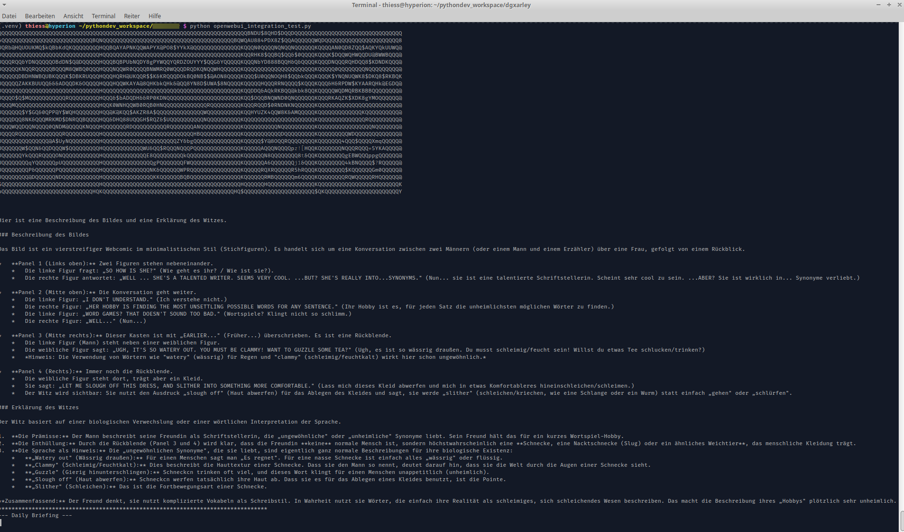
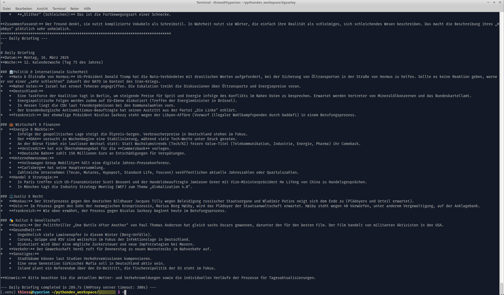

**All workload pods running (K9s):**

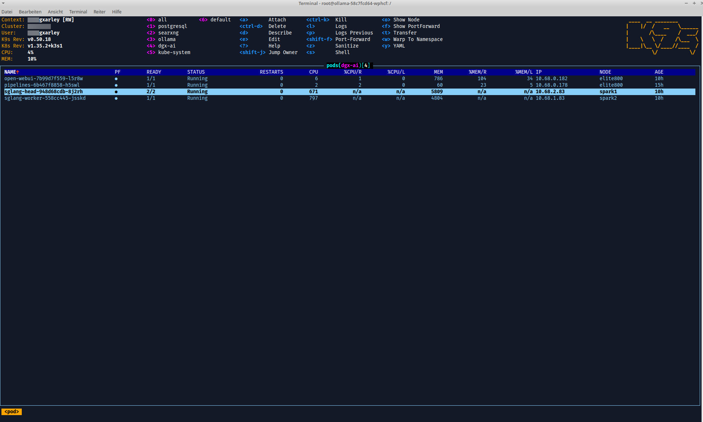

### Other Services

| Service | Node | Port | Notes |
|---------|------|------|-------|
| Open WebUI | k3smaster | 30000 (NodePort) | Frontend, connects to SGLang via ClusterIP |
| Pipelines | k3smaster | 9099 (ClusterIP) | Open WebUI function pipelines |
| Ollama | spark1 | 11434 (ClusterIP) | Embedding model `bge-m3` |
| docling-serve | spark2 | 5001 (ClusterIP) | Document processing (GPU, privileged) |
| SearXNG | k3smaster | 8080 (ClusterIP) | Metasearch engine |
| HAProxy | k3smaster | 80, 443 | TCP passthrough to Traefik (PROXY Protocol v2) |
| Traefik | k3smaster | 30080, 30443 (NodePort) | Ingress controller |

### NVIDIA Device Plugin

The NVIDIA k8s-device-plugin (v0.18.2) runs as a DaemonSet in `kube-system` on nodes labeled
`nvidia.com/gpu.present=true` (the DGX Sparks). It uses NVML discovery with CDI device injection:

```
--device-discovery-strategy=nvml
--device-list-strategy=cdi-cri
--config-file=/config/config.yaml    # time-slicing config from ConfigMap
```

**Critical: `driver-root` volume mount.** The plugin expects host NVIDIA driver libraries
(especially `libnvidia-ml.so`) at `/driver-root` inside the container. Without this mount, NVML
fails with `ERROR_LIBRARY_NOT_FOUND`, and the CDI device-list-strategy check also fails
(it gates on NVML availability, not architecture). The fix is a hostPath volume mounting
host `/` → `/driver-root` (read-only).

**CDI spec volume (`cdi-root`).** The plugin generates CDI specs at runtime and writes them to
`/var/run/cdi` inside the container. This must be a **writable** hostPath mount (`DirectoryOrCreate`)
to `/var/run/cdi` on the host, so containerd can resolve CDI device names. The previous `/etc/cdi`
(read-only) mount only provided static specs from `nvidia-ctk cdi generate` and caused
`unresolvable CDI devices` errors when time-slicing was enabled.

**GPU time-slicing.** Configured via `nvidia-device-plugin-config` ConfigMap, which specifies
`nvidia.com/gpu` replicas per physical GPU (default: 4). Each spark GPU appears as 4 allocatable
`nvidia.com/gpu` resources. SGLang pods request `nvidia.com/gpu: "1"` (one time-slice).

### Multus — CNI Path Fix for K3s

The upstream Multus thick DaemonSet manifest assumes standard Kubernetes CNI paths (`/etc/cni/net.d`),
but K3s stores its Flannel CNI config at `/var/lib/rancher/k3s/agent/etc/cni/net.d`. Without
patching, the Multus pod fails with:

```
failed to find the primary CNI plugin: could not find a plugin configuration in /host/etc/cni/net.d
```

**Fixes applied** after downloading the manifest:

1. **`cni` volume hostPath**: `/etc/cni/net.d` → `/var/lib/rancher/k3s/agent/etc/cni/net.d`
   (K3s stores Flannel CNI config there). Container-side `mountPath` (`/host/etc/cni/net.d`) and
   ConfigMap `cniConfigDir` / `multusAutoconfigDir` stay unchanged — they reference in-container paths.

2. **`cnibin` volume hostPath**: `/opt/cni/bin` → `/var/lib/rancher/k3s/data` (the K3s data root).
   K3s bind-mounts `<hash>/bin` → `/var/lib/rancher/k3s/data/cni`, which contains CNI plugins as
   absolute symlinks (e.g. `flannel → /var/lib/rancher/k3s/data/<hash>/bin/cni`). The volume must
   mount the **parent** (`/var/lib/rancher/k3s/data`) so these symlink targets resolve inside the
   Multus daemon container. The initContainer install target stays at `.../data/cni` (the bind mount).

3. **`binDir` in daemon-config.json**: set to `/var/lib/rancher/k3s/data/cni` (matching K3s
   containerd `bin_dirs`). Without this, Multus defaults to `/opt/cni/bin` when delegating.

4. **`mountPropagation`**: changed from `Bidirectional` to `HostToContainer` on the initContainer.
   `Bidirectional` causes bind mount stacking at `/var/lib/rancher/k3s/data/cni` on each DaemonSet
   restart, burying K3s's bind mount and breaking all CNI resolution cluster-wide.

```yaml
volumes:
  - name: cni
    hostPath:
      path: /var/lib/rancher/k3s/agent/etc/cni/net.d  # upstream: /etc/cni/net.d
  - name: cnibin
    hostPath:
      path: /var/lib/rancher/k3s/data                  # upstream: /opt/cni/bin
```

**Extra CNI plugins:** K3s bundles only flannel, bridge, host-local, loopback, portmap, bandwidth,
and firewall. The `host-device` and `static` IPAM plugins (needed for Multus QSFP attachment) are
installed by the `dgx_prepare` role (`ansible-playbook dgx.yml --tags cni`).

**Impact on non-Multus pods:** Multus thick installs itself as the cluster's primary CNI plugin
(its config file takes priority over Flannel's). This means *every* pod — even those without a
`k8s.v1.cni.cncf.io/networks` annotation — passes through `multus-shim` at creation time. For
non-annotated pods, Multus simply delegates to the default CNI (Flannel) with negligible overhead.
CNI plugins are only invoked at pod create (`ADD`) and delete (`DEL`); at runtime, networking is
handled entirely by the kernel — Multus is not in the data path. If `multus-shim` is missing from
the CNI binary directory, *all* new pods on the cluster will fail with `ContainerCreating`, not
just Multus-annotated ones.

## Playbooks

```bash
# Full deployment (common → dgx_prepare → k3sserver)
ansible-playbook site.yml

# K8s workloads (after K3s is running)
ansible-playbook k8s_dgx.yml

# K8s infrastructure (after K3s is running)
ansible-playbook k8s_infra.yml

# Individual roles
ansible-playbook common.yml
ansible-playbook dgx.yml
ansible-playbook k3sserver.yml

# Specific tags
ansible-playbook site.yml --tags k3sinstall
ansible-playbook dgx.yml --tags qsfp
ansible-playbook common.yml --tags iptables
ansible-playbook k3sserver.yml --tags kubeconfig
ansible-playbook k8s_infra.yml --tags promstack
ansible-playbook k8s_infra.yml --tags postgresql

# Clevis (requires LUKS passphrase)
ansible-playbook site.yml -e 'clevis_luks_passphrase=YOUR_PASSPHRASE'
```

## Prerequisites

- SSH keys distributed to all nodes (`ansible_ssh_user: root`)
- Interface names verified on actual hardware (`hw_iface`, `qsfp_interfaces`)
- `openwebui_secret_key` and `openwebui_admin_password` override via vault in production
- Multus manifest downloaded and patched for K3s CNI paths (see [Multus section](#multus--cni-path-fix-for-k3s)):
  ```
  curl -o roles/k8s_dgx/files/multus-daemonset-thick.yml \
    https://raw.githubusercontent.com/k8snetworkplumbingwg/multus-cni/master/deployments/multus-daemonset-thick.yml
  # Then patch (see header comment in the file for full details):
  #   cni volume:    /etc/cni/net.d → /var/lib/rancher/k3s/agent/etc/cni/net.d
  #   cnibin volume: /opt/cni/bin   → /var/lib/rancher/k3s/data (parent, for symlink resolution)
  #   binDir:        add /var/lib/rancher/k3s/data/cni to daemon-config.json
  #   mountPropagation: Bidirectional → HostToContainer (prevents bind mount stacking)
  ```
- Extra CNI plugins installed on sparks (`ansible-playbook dgx.yml --tags cni`): `host-device`, `static`
- Switch configuration in place (Netgear VLANs, MikroTik bridge, PVID settings)
- kubectl context (configured via `kubeconfig_context_name` in vault) — auto-provisioned by `k3sserver` role (tag `kubeconfig`), no manual setup needed
- NFS server configured if desired (`wantsnfsmount` in `group_vars/k3sserver/main.yml`)

## MikroTik CRS310 Full Bridge Config

Reference config for the MikroTik switch connecting the cluster (VLAN IDs are examples — adjust to your environment):

```routeros
/interface/bridge
add name=bridge vlan-filtering=yes

/interface/bridge/port
add interface=ether1 bridge=bridge pvid=30 comment="Uplink (Netgear)"
add interface=ether3 bridge=bridge pvid=10 comment="k3smaster OVS trunk"
add interface=ether5 bridge=bridge pvid=20 comment="spark1 access"
add interface=ether7 bridge=bridge pvid=20 comment="spark2 access"

/interface/bridge/vlan
add bridge=bridge vlan-ids=10 tagged=bridge,ether1 untagged=ether3 \
    comment="LAN / Management"
add bridge=bridge vlan-ids=20 tagged=bridge,ether1,ether3 untagged=ether5,ether7 \
    comment="K3s Cluster"
add bridge=bridge vlan-ids=30 tagged=ether3 untagged=ether1 \
    comment="Home network (Netgear VLAN1 untagged <-> k3smaster tagged)"
add bridge=bridge vlan-ids=40 tagged=ether1,ether3 comment="passthrough"
add bridge=bridge vlan-ids=50 tagged=ether1,ether3 comment="passthrough"
add bridge=bridge vlan-ids=60 tagged=ether1,ether3 comment="passthrough"
add bridge=bridge vlan-ids=70 tagged=ether1,ether3 comment="passthrough"

/interface/vlan
add name=vlan10-mgmt interface=bridge vlan-id=10
add name=vlan20-mgmt interface=bridge vlan-id=20
/ip/address
add address=192.168.10.x/24 interface=vlan10-mgmt
add address=192.168.20.x/24 interface=vlan20-mgmt
/ip/route
add dst-address=0.0.0.0/0 gateway=192.168.10.x
```

### Bridge VLAN Summary (per-VLAN view)

| VLAN | Comment | Tagged | Untagged |
|------|---------|--------|----------|
| 10 | LAN / Management | bridge, ether1 | ether3 |
| 20 | K3s Cluster | bridge, ether1, ether3 | ether5, ether7 |
| 30 | Home network ↔ k3smaster tagged | ether3 | ether1 |
| 40 | passthrough | ether1, ether3 | — |
| 50 | passthrough | ether1, ether3 | — |
| 60 | passthrough | ether1, ether3 | — |
| 70 | passthrough | ether1, ether3 | — |
| 1 | passthrough | ether1, ether3 | — |
| 1 (D) | added by pvid | — | bridge |

### Per-Port View

| Port | Tagged VLANs | Untagged VLAN | Connected To |
|------|-------------|---------------|--------------|
| bridge (CPU) | 10, 20 | 1 (pvid) | MikroTik itself (mgmt interfaces) |
| ether1 | 10, 20, 40, 50, 60, 70, 1 | 30 (pvid) | Netgear S3300 uplink |
| ether3 | 20, 30, 40, 50, 60, 70, 1 | 10 (pvid) | k3smaster OVS trunk |
| ether5 | — | 20 (pvid) | spark1 (eth0) |
| ether7 | — | 20 (pvid) | spark2 (eth0) |

### Why `bridge` Appears as Tagged

Adding `bridge` to a VLAN's tagged list means the **MikroTik CPU participates in that VLAN** —
it can send and receive frames on it. This is required whenever a `/interface/vlan` is defined
on the bridge for that VLAN ID (here: mgmt interfaces), giving the MikroTik
its own IP addresses on those networks.

Passthrough VLANs do **not** include `bridge` in their tagged list —
the MikroTik simply forwards these frames between ether1 and ether3 without CPU involvement.

## Design Documents

Initial design notes and deep-dives covering architecture decisions, scaling considerations, and service configuration:

- [DGX Spark Setup](docs/DGX%20Spark%20Setup%20EN.md) — cluster architecture, K3s deployment, SGLang distributed inference, networking, and storage design
- [DGX Spark QSFP DeepDive](docs/DGX%20Spark%20QSFP%20DeepDive%20EN.md) — ConnectX-7 QSFP configuration, MTU tuning, NCCL transport, and Multus CNI integration
- [Scaling & Outlook](docs/DGX%20Spark%20Setup%20-%20Scaling%20%26%20Outlook%20EN.md) — scaling strategies, future hardware options, model sizing, and performance projections
- [OpenWebUI Details](docs/DGX%20Spark%20Setup%20-%20OpenWebUI%20Details%20EN.md) — Open WebUI configuration, pipelines, RAG setup, and model integration

## Origin

Roles `common`, `k3sserver`, and `k8s_infra` originate from a sister Ansible repository
and were adapted for this cluster.
`common` and `k3sserver`: no OVS, no knxd, no MQTT, simplified HAProxy/Traefik.
`k8s_infra`: stripped of nfsprovisioner, rookceph, keycloak, mariadb, influxdb, chromadb;
storage changed from NFS/Ceph PVCs to hostPath.


## License
This project is licensed under the LGPL where applicable/possible — see [LICENSE.md](LICENSE.md). Some files/parts may use other licenses: [MIT](LICENSEMIT.md) | [GPL](LICENSEGPL.md) | [LGPL](LICENSELGPL.md). Always check per‑file headers/comments.


## Authors
- Repo owner (primary author)
- Additional attributions are noted inline in code comments


## Acknowledgments
- Inspirations and snippets are referenced in code comments where appropriate.


## ⚠️ Note

This is a development/experimental project. For production use, review security settings, customize configurations, and test thoroughly in your environment. Provided "as is" without warranty of any kind, express or implied, including but not limited to the warranties of merchantability, fitness for a particular purpose and noninfringement. In no event shall the authors or copyright holders be liable for any claim, damages or other liability, whether in an action of contract, tort or otherwise, arising from, out of or in connection with the software or the use or other dealings in the software. Use at your own risk.

