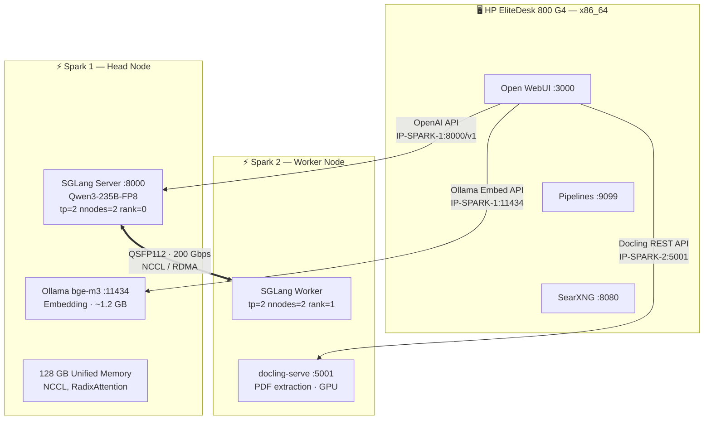
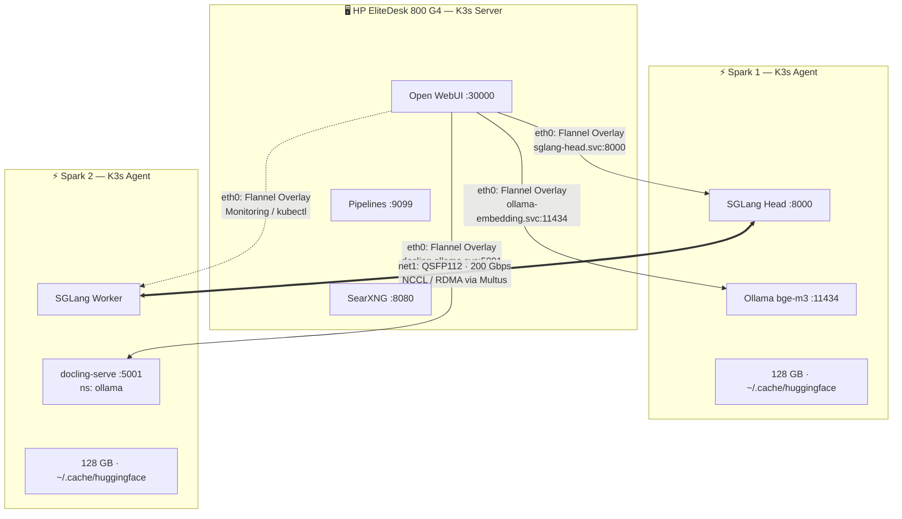

# Analysis & Optimization: Local AI System on 2× DGX Spark

_As of: March 16, 2026 — updated with findings from the production K3s/Ansible implementation (Repo: dgxarley)_

> [!tip] Open WebUI Detail Info
> For all Open-WebUI-specific details (RBAC, SSO, API usage, Pipelines, RAG, Function Calling, SearXNG integration, Self-Reflection Pipeline, Embedding setup) see the separate document: **[DGX Spark Setup - OpenWebUI Details EN](DGX%20Spark%20Setup%20-%20OpenWebUI%20Details%20EN.md)**

> [!info] ASUS Ascent GX10 = DGX Spark
> This document uses "DGX Spark" as the name for the platform. The **ASUS Ascent GX10** (e.g. GX10-GG0026BN) is an OEM implementation of the same hardware — identical GB10 Grace Blackwell Superchip, identical integrated ConnectX-7, identical DGX OS. All instructions and configurations apply 1:1 to both variants.
>
> | | DGX Spark (Founders) | ASUS Ascent GX10 |
> |---|---|---|
> | **SoC / GPU / RAM** | GB10, Blackwell, 128 GB LPDDR5x | identical |
> | **ConnectX-7 (2× QSFP112)** | integrated | identical |
> | **Network protocol** | Ethernet + RoCE (**no** InfiniBand) | identical |
> | **DGX OS** | yes | yes (minor ASUS customizations) |
> | **Storage** | 4 TB NVMe | **1 TB / 2 TB / 4 TB** depending on SKU |
>
> **Only setup-relevant difference**: The GG0026BN has 2 TB NVMe (instead of 4 TB). With Qwen3-235B-FP8 (~237 GB per node) that is sufficient, but the `hostPath` in the PV definitions must match the actual path.
>
> **Note**: Some ASUS marketing texts claim the QSFP link is "InfiniBand". This is **technically incorrect** — the ConnectX-7 in the GB10 operates in Ethernet mode with RoCE (RDMA over Converged Ethernet), not InfiniBand mode ([ServeTheHome test confirms this](https://www.servethehome.com/the-nvidia-gb10-connectx-7-200gbe-networking-is-really-different/)).

## Summary

The architecture draft is a solid starting point but has some significant issues. Here are the key findings:

1. **SGLang is the best inference engine for multi-node on DGX Spark** — NCCL-based clustering demonstrably works, including Tensor Parallelism over the QSFP link. Community images are available and tested.

2. **vLLM + Ray is unstable and suffers from constant breaking changes** — the original Ray GPU mapping problem was fixed by the community Docker, but the codebase is fragile. Users report massive regressions as late as February 2026.

3. **Qwen3-235B-A22B-Instruct-2507-FP8 remains the optimal model choice for maximum quality** — Instruct variant (not Thinking) in FP8 quantization, with FP8 KV cache for ~65K context length at ~25 t/s decode speed. The implementation uses a **model profile system** with multiple configurable models (currently active: Qwen3.5-35B-A3B for fast interaction). Detailed VRAM calculation in Section 2.

4. **Embedding belongs on the DGX Spark (Ollama)** — bge-m3 (567M parameters, ~1.2 GB FP16) runs as an Ollama embedding server on one Spark node. CPU embedding on the EliteDesk is too slow in practice.

5. **SearXNG can be natively integrated into Open WebUI** — just a few lines of config.

6. **Self-Reflection is achievable** via Open WebUI Pipelines/Functions with a Generate→Critique→Refine loop.


---

## 1. Critical Assessment of the Architecture Draft

### What is good

- Hardware setup with QSFP112 DAC and RDMA test is correct

- Open WebUI as frontend is the right choice (mature, active community, pipeline support)

- Docling for PDF extraction makes sense

- Basic structure "backend on Sparks, frontend on a separate node" is architecturally correct


### What is problematic

**Problem 1: vLLM Multi-Node on DGX Spark**

The `avarok/vllm-dgx-spark:v11` image and the proposed vLLM approach with `--tensor-parallel-size 2` over Ray does **not work reliably** on the GB10. Although the community (especially eugr's `spark-vllm-docker`) fixed the original Ray GPU mapping problem, stability remains a massive issue:

- On February 24, 2026 (4 days ago), a thread was opened on the NVIDIA Developer Forums titled "VLLM — the $150M train wreck?". A user reports engine failures with GPT-OSS-120b, Qwen3-VL-235b and GLM-4.6V — models that previously worked are suddenly broken due to breaking changes.

- eugr himself (the maintainer of the community Docker) confirms: "The amount of approved PRs breaking stuff skyrocketed recently" and is working on an automated stable build system.

- Another user with a working 24.38 GB/s link describes that Tensor Parallel mode crashes a node after the first prompt.

- FP4-GEMM kernels on SM121 are still broken — FlashInfer and CUTLASS FP4 both fail.


**Problem 2: Model choice is suboptimal**

DeepSeek-R1-Distill-Llama-70B-FP8 requires only ~35 GB VRAM. With 256 GB available memory (2× 128 GB), the system is massively underutilized. There are significantly more capable models that can run on 2× Spark (see Section 2).

**Problem 3: Embedding model needs GPU acceleration**

bge-m3 with `--gpu-memory-utilization 0.05` on a full vLLM container is oversized — but CPU embedding (on the EliteDesk or Grace CPU) is **unbearably slow** in practice. Solution: bge-m3 (567M parameters, ~1.2 GB FP16) as a lightweight **Ollama embedding server** on a DGX Spark. The memory footprint is negligible with 128 GB unified memory.

**Problem 4: `--enforce-eager` everywhere**

`--enforce-eager` disables CUDA Graph Capture, which significantly reduces performance. Unfortunately this is often necessary on SM121 because CUDA Graphs are incompatible with some kernels — but it should be understood as a conscious trade-off, not a default config.

---

## 1b. Critical Findings from the K3s/Ansible Implementation

> [!success] Status: Production
> The entire setup is implemented as an Ansible playbook suite (`dgxarley`) and runs in production on a 3-node K3s cluster (k3smaster + spark1 + spark2). The following findings were made during implementation and are incorporated into the main document at the relevant points.

### SGLang EADDRINUSE Bug & HAProxy Sidecar Pattern

SGLang Multi-Node has a subtle bug on the head node: the Scheduler subprocess binds `<pod-ip>:<port>`, and if uvicorn simultaneously uses `--host 0.0.0.0` on the same port, the Scheduler bind fails with EADDRINUSE (because `0.0.0.0` includes the pod IP).

**Solution**: Omit `--host` on the head → uvicorn only binds `127.0.0.1:<internal-port>`. An HAProxy sidecar (`haproxy:lts-alpine`) forwards external traffic: `0.0.0.0:8000` → `127.0.0.1:30080`. The sidecar additionally provides HTTP-level access logs (client IPs, request paths, response codes, timing) — visible via `kubectl logs -c proxy`.

**Port architecture**: `sglang_port: 8000` (HAProxy external) ≠ `sglang_internal_port: 30080` (uvicorn internal). Probes and K8s service hit HAProxy on port 8000.

### startupProbe Budget: At Least 1200s

The originally planned 630s (`30 + 60×10`) are **not sufficient**. Head startup takes ~7-8 minutes (NCCL init ~20s, weight loading ~170s, CUDA graph capture ~45s, warmup).

**Implemented**: `initialDelaySeconds=30, periodSeconds=10, failureThreshold=120` → **1230s budget**.

If the probe is too short, kubelet kills the head → worker NCCL breaks → worker stays stale → head restart deadlocks at `Init torch distributed begin.` (waiting for the stale worker).

### Worker Needs a livenessProbe

The worker has **no** readiness/startup probes (it must appear Ready immediately so the head initContainer `wait-for-worker` can pass). But it **must** have a livenessProbe (`httpGet /health port 8000, initialDelaySeconds: 300`) so kubelet restarts it when the head dies and the NCCL connection breaks. Without a livenessProbe the worker stays in a stale `Running 1/1` state — blocking fresh NCCL rendezvous on head restart.

### ARP Priming Before NCCL

The QSFP point-to-point link needs an explicit ping before NCCL start to populate the ARP table. Without ARP priming the first SYN packets are dropped, and NCCL waits ~230s for ARP resolution. In the `sglang_launch.sh` script a `ping -c 1 <peer-ip>` is therefore executed before SGLang starts.

### Attention Backend `triton`

For hybrid GDN models (e.g. Qwen3.5-35B-A3B) on Blackwell GPUs, `--attention-backend triton` is required. Without the flag inference fails. Configured per model profile.

### HuggingFace Cache Path

`huggingface_hub.snapshot_download(cache_dir=X)` stores to `X/models--*/`, but SGLang's runtime looks in `HF_HOME/hub/` (default: `~/.cache/huggingface/hub/`). Download scripts **must** use `cache_dir="/root/.cache/huggingface/hub"` so SGLang finds the model. Otherwise the model is re-downloaded on every start.

### NVIDIA CDI Volume: `/var/run/cdi` Instead of `/etc/cdi`

The NVIDIA Device Plugin generates CDI specs at runtime to `/var/run/cdi` — this volume must be mounted **writable** (DirectoryOrCreate). `/etc/cdi` is only for static specs from `nvidia-ctk cdi generate` and must **not** be used as the CDI source for the Device Plugin. Incorrect configuration leads to `unresolvable CDI devices` errors in containerd.

### Multus CNI: 4 K3s-Specific Patches

The upstream Multus manifest needs 4 patches for K3s:
1. `cni` volume: `/etc/cni/net.d` → `/var/lib/rancher/k3s/agent/etc/cni/net.d`
2. `cnibin` volume: `/opt/cni/bin` → `/var/lib/rancher/k3s/data` (for symlink resolution)
3. `binDir` in the daemon config to `/var/lib/rancher/k3s/data/cni`
4. `mountPropagation: Bidirectional` → `HostToContainer` (Bidirectional causes bind mount stacking that **cripples all CNI operations cluster-wide**)

### QSFP Interface Name: `enP2p1s0f0np0` (uppercase P!)

The interface on PCI domain 0002 is named `enP2p1s0f0np0` with **uppercase P** — not `enp2p1s0f0np0`. This exact name must appear in the NetworkAttachmentDefinitions.

### ConfigMap Scripts: No Jinja2 `` at Column 0

Ansible templates with Jinja2 `` loops at column 0 inside ConfigMap data blocks break YAML parsing. **Solution**: Use env vars + shell loops instead of Jinja2 in pod scripts.

### nsupdate DNS Registration

Zone must be `elasticc.io` (parent zone), not `dgx.example.com`. Records as FQDN with trailing dot (e.g. `ollama.dgx.example.com.`). The TSIG key `dgx.example.com` is only authorized for records under `dgx.example.com`.

### HF Preload Job: Delete-and-Recreate

K8s Jobs have an immutable `spec.template` — Ansible must **delete** the existing job before recreating it with changes. The job runs on spark2 (ARM64), downloads models, and rsyncs them to spark1 via host-mounted `/root/.ssh`.

### GPU Time-Slicing: Implemented

GPU time-slicing is in production use with `nvidia_gpu_timeslice_replicas: 4`. Each physical GPU appears as 4 allocatable `nvidia.com/gpu` resources. Configured via the `nvidia-device-plugin-config` ConfigMap.

### Ansible Automation

The entire setup is automated as an Ansible playbook suite:
- `common.yml` → Base configuration for all nodes (network, SSH, iptables, Fail2ban)
- `dgx.yml` → DGX Spark-specific preparation (QSFP, ulimits, CDI, CPUpower, CNI plugins)
- `k3sserver.yml` → K3s cluster installation + kubeconfig merge
- `k8s_dgx.yml` → AI workloads (SGLang, Ollama, OpenWebUI, Multus, SearXNG, DNS)
- `k8s_infra.yml` → Infrastructure (cert-manager, Prometheus, Grafana, Loki, PostgreSQL, Redis, etc.)

---

## 1c. Model Formats: safetensors, GGUF, and What SGLang Can Load

Before diving into the specific model choice, here is an overview of the common formats on HuggingFace — and which ones are usable on the DGX Sparks with SGLang.

### safetensors — The Standard Format for GPU Inference

- Binary format by Hugging Face, successor to the insecure `.bin` (pickle-based)
- Safe (no code execution risk), fast to load (memory-mapped)
- Weights stored in their **original dtype**: FP16, BF16, FP32, or FP8
- **No implicit quantization** — what's stored is what gets loaded
- Recognizable on HuggingFace: repos with `model.safetensors` or `model-00001-of-00005.safetensors`
- Natively loaded by **SGLang, vLLM, TensorRT-LLM** and all PyTorch-based engines

### GGUF — The Format for llama.cpp / Ollama

- Format from the **GGML/llama.cpp ecosystem**
- Primarily for **CPU inference and aggressive quantization** (Q4_K_M, Q5_K_S, Q8_0, etc.)
- Single `.gguf` file containing weights + tokenizer + metadata
- Used by **Ollama, llama.cpp, LM Studio, kobold.cpp**
- **SGLang cannot load GGUF** — entirely different runtime ecosystem
- Repos on HuggingFace with `-GGUF` suffix (e.g. from `bartowski/`, `unsloth/`) → **not suitable for SGLang**

### Formats and Quantizations Supported by SGLang

| Format | Quantization | VRAM vs. FP16 | Notes |
|--------|-------------|----------------|-------|
| safetensors (FP16/BF16) | none | 100% (baseline) | Standard, highest VRAM usage |
| safetensors (FP8) | FP8 (W8A8) | ~50% | Virtually no quality loss, native Blackwell HW support |
| AWQ | INT4 weights | ~25% | Good quality, older but proven method |
| GPTQ | INT4/INT8 weights | ~25–50% | Similar to AWQ, widely used |
| Marlin | INT4 optimized | ~25% | Faster kernels for GPTQ/AWQ on Ampere+ GPUs |
| BitsAndBytes | INT4/INT8 | ~25–50% | On-the-fly quantization, slower than pre-quant |

### DGX Spark Capacity (128 GB Unified GPU Memory per Node)

- **FP16/BF16**: Models up to ~60–65B parameters per Spark (1 param ≈ 2 bytes + KV cache overhead)
- **FP8**: Models up to ~120B per Spark, or ~240B across both Sparks via TP=2 over QSFP/NCCL
- **INT4 (AWQ/GPTQ)**: Theoretically even larger, but on Blackwell FP8 is generally preferred (native HW support, no quality loss)

### Practical Search Strategy on HuggingFace

1. **Search for official repos** (e.g. `Qwen/Qwen3-235B-A22B-Instruct-2507`) — these have safetensors
2. **FP8 variants**: Repos with `-FP8` in the name (e.g. from `neuralmagic/`, `nvidia/`, or officially from the model provider)
3. **Ignore GGUF repos** (`-GGUF` suffix, typical uploaders: `bartowski/`, `unsloth/`, `TheBloke/`) — for Ollama/llama.cpp, not SGLang
4. **AWQ repos** (`-AWQ` suffix) work with SGLang, but FP8 is generally preferred on Blackwell

> [!tip] Rule of Thumb
> For SGLang on DGX Sparks: **safetensors in FP8** is the sweet spot — native Blackwell support, half the memory footprint, virtually no quality loss compared to FP16.

---

## 2. Model Recommendation: Qwen3-235B-A22B-Instruct-2507-FP8

### Why Qwen3-235B-A22B?

Qwen3-235B-A22B is a Mixture-of-Experts model with 235B total parameters but only 22B active parameters per token. That means:

- **GPT-4-level quality** for reasoning, coding and analysis

- **Fits on 2× Spark**: In Q4_K_XL quantization ~134 GB, in FP8 ~237 GB — both fit in 256 GB

- **NVIDIA-tested**: NVIDIA itself demonstrates Qwen3-235B on dual Spark with 23,477 token/s prefill throughput

- **SGLang-compatible**: Demonstrably runs with SGLang multi-node and NCCL


### Model Variants: Instruct-2507 vs. Thinking-2507

Since July 2025 there are two separate 2507 variants. Both exist as official FP8 quantizations on HuggingFace:

|Property|**Instruct-2507-FP8**|**Thinking-2507-FP8**|
|---|---|---|
|Reasoning mode|No thinking — direct answer|Thinking **always on** (`<think>` tags)|
|Recommended output length|16,384 tokens|32,768 tokens (much of it in the `<think>` block)|
|Latency|Low — responds immediately|Higher — thinks visibly first|
|Token consumption|Normal|~2-3× higher (reasoning tokens)|
|AIME25 (math)|81.5|92.3|
|Instruction following|Better|Good|
|Tool calling / multilingual|Better|Good|
|Native context|262K|262K|
|Temperature (recommended)|0.7|0.6|

**Recommendation: Instruct-2507-FP8** for business analysis:
- Business analysis requires text comprehension, structuring and critical evaluation — not a math olympiad
- Thinking mode produces 1000+ additional tokens per answer → at ~25 t/s and limited KV cache space this is a problem
- The reflection pipeline (Section 6) replaces the thinking mode in a targeted and **controlled** way — you decide when to reflect
- Instruct + reflection pipeline = the best of both worlds: fast answers for simple questions, deep reflection only when needed

### VRAM Calculation & Context Length

#### Architecture Parameters (from config.json)

|Parameter|Value|
|---|---|
|`num_hidden_layers`|94|
|`num_key_value_heads`|4 (GQA with 64 Q heads)|
|`head_dim`|128|
|`max_position_embeddings`|262,144 (256K native)|
|Total parameters|235B (128 experts, 8 active)|

#### Memory Budget on 2× DGX Spark

|Item|GB|
|---|---|
|Total memory (2× 128 GB unified memory)|**256 GB**|
|Model weights FP8 + scaling factors|**~237 GB**|
|CUDA context + SGLang overhead + activations|**~5–7 GB**|
|**Available for KV cache**|**~12–14 GB**|

#### KV Cache per Token

Formula: `2 (K+V) × 94 layers × 4 KV heads × 128 dim × bytes/element`

|KV cache data type|Bytes/element|**Per token**|
|---|---|---|
|BF16 (default)|2|**~188 KB**|
|FP8 (`--kv-cache-dtype fp8_e5m2`)|1|**~94 KB**|

#### Resulting Maximum Context Length (Single Request)

|KV data type|Max. tokens (at ~13 GB KV budget)|Recommended `--context-length`|
|---|---|---|
|BF16 (default)|~70,000|**32,768 – 65,536**|
|FP8 KV cache|~140,000|**65,536 – 131,072**|

> **Note**: The model natively supports 262K context — the limitation comes exclusively from the available memory on 2× Spark with FP8 weights.

#### What Does That Mean in Practice?

|Use case|Token requirement (approx.)|Fits in 65K?|
|---|---|---|
|Normal chat conversation|4K–12K|✅|
|Analysis with system prompt + reflection|8K–16K|✅|
|A 30-50 page PDF|15K–25K|✅|
|An 80-page report|40K–55K|✅|
|Comparing multiple documents|30K–60K|✅|
|An entire book (300+ pages)|150K+|❌ (→ use RAG)|

#### SGLang KV Cache vs. Ollama: Dynamic Token Pool

> [!important] KV cache misconception from Ollama
> In Ollama, setting `num_ctx` (context length) **pre-allocates** the full KV cache for that many tokens per slot. A context length of 262K means Ollama reserves 262K tokens worth of memory *per concurrent request* — even if the actual conversation only uses 3K tokens. This makes large context lengths prohibitively expensive in Ollama.
>
> **SGLang works fundamentally differently.** The `--context-length` parameter only sets the *maximum sequence length* a single request may use. The KV cache is a **shared dynamic token pool** — tokens are allocated on demand as requests arrive and freed immediately when requests complete. The pool size is determined by `--mem-fraction-static` (fraction of total GPU memory reserved for KV cache), not by context length.
>
> **Practical example** (Qwen3-235B-AWQ, `moe_wna16`, TP=2, FP8 KV cache):
>
> | Parameter | Value |
> |---|---|
> | Model weights (per GPU) | ~59 GB |
> | `mem_fraction_static` | 0.70 |
> | KV cache pool size | ~20 GB (K: 9.9 GB + V: 9.9 GB) |
> | **Total token capacity** | **~441K tokens** |
> | `context_length` (max per request) | 262,144 |
>
> With 441K tokens in the pool and a typical chat request using ~3K tokens:
> - **~150 concurrent requests** fit in the KV cache simultaneously
> - A single request can use up to 262K tokens (the full context window)
> - Multiple long-context requests (e.g. 3× 100K) also work, dynamically sharing the pool
>
> The `lpm` (longest prefix match) scheduling policy adds another optimization: completed requests leave their prefix tokens in a **radix cache**. If the next request shares the same system prompt, those tokens are reused (`#cached-token > 0` in the logs) — skipping the prefill entirely.
>
> **Bottom line**: Don't fear large `context_length` values in SGLang. The KV cache pool adapts dynamically. The real constraints are decode throughput (NCCL bandwidth between nodes) and total pool size (controlled by `mem_fraction_static`), not the configured context length.

### FP8 vs. Q4_K_XL: Which Quantization Format?

| |**FP8 + SGLang (NCCL)** ⭐ Recommended|**Q4_K_XL + llama.cpp (RPC)**|
|---|---|---|
|**Model size**|~237 GB|~134 GB|
|**Free memory for KV**|~12–14 GB|**~115 GB**|
|**Max. context**|~70K (BF16 KV) / ~140K (FP8 KV)|**Full 262K**|
|**Model quality**|⭐⭐⭐⭐⭐ Near BF16|⭐⭐⭐⭐ Slight loss at nuances|
|**Decode speed**|**~25 t/s**|~12.5 t/s|
|**With reflection pipeline (×2)**|500-token answer → ~40s|500-token answer → ~80s|
|**Link type**|NCCL over QSFP (200 Gbps, µs latency)|TCP/IP over QSFP (more overhead)|
|**Prefix caching**|✅ RadixAttention|❌ No|
|**Continuous batching**|✅ Multiple requests in parallel|❌ Sequential|
|**Stability**|Good (SGLang community images)|Very good (few breaking changes)|
|**Engine**|SGLang|llama.cpp|

**Recommendation: FP8 + SGLang as primary setup.** Reasons:

1. **Double the speed** (~25 vs. 12.5 t/s) — the most important factor for daily use with reflection pipeline
2. **Better model quality** — FP8 retains finer linguistic nuances, important for DE/EN business analysis
3. **65K context is sufficient** for >95% of business analysis tasks
4. **Prefix caching** saves the system prompt prefill cost on every request

**Optional: Keep Q4_K_XL as fallback.** Download the GGUF file (~134 GB) additionally. If an exceptional case arises (200K+ token document), stop the container and start llama.cpp — it's just a command switch.

### Further Model Alternatives

- **Qwen3.5-35B-A3B**: Runs on a single Spark at ~43 t/s in FP8, up to 262K context. Best option for real-time interaction with maximum speed.

- **GLM-4.7-Flash (BF16)**: Demonstrated on a single Spark via SGLang + Triton: stable 24-25 t/s with up to 200K context and FP8 KV cache. Excellent reasoning + tool calling.

- **GLM-4.7-FP8 (355B MoE)**: For 4× Spark setups — tested on a 4-node cluster with SGLang + EAGLE Speculative Decoding. Too large for your 2-node setup, but relevant as a future option.

### Model Profile System (Implemented)

The implementation uses a configurable profile system in the Ansible defaults. Per model, `context_length`, `kv_cache_dtype`, `mem_fraction_static`, `reasoning_parser`, `tool_call_parser` and optionally `info_url` are defined:

| Model | Context | KV cache | mem_fraction | Parser |
|---|---|---|---|---|
| **Qwen3.5-35B-A3B** (currently active) | 262144 | fp8_e5m2 | 0.50 | qwen3 / qwen3_coder |
| Qwen3-235B-A22B-Instruct-2507-FP8 | 65536 | fp8_e5m2 | 0.90 | qwen3 |
| Qwen3-Coder-30B-A3B-Instruct | 262144 | fp8_e5m2 | 0.70 | — / qwen3_coder |

Model changes are made by changing `sglang_model` in the Ansible defaults and re-running `ansible-playbook k8s_dgx.yml --tags sglang`.

---

## 3. Inference Engine: SGLang as the Clear Recommendation

### Current State on DGX Spark (SM121, Feb 28, 2026)

|Engine|Single-node|Multi-node (2× Spark)|MoE support|Stability|
|---|---|---|---|---|
|**SGLang** (Community Docker)|✅ Very good|✅ NCCL-based, works|✅ Good, kernel tuning needed|**Good**|
|**llama.cpp**|✅ Very stable|✅ Via RPC (TCP/IP, no NCCL)|✅ GGUF quantization|**Very good**|
|**vLLM** (Community Docker)|✅ Works with `--enforce-eager`|⚠️ Basically possible but unstable|✅ but slow|**Poor**|
|**TensorRT-LLM**|⚠️ SM121 kernels partly missing|⚠️ Similar problems|⚠️ Limited|Low|

### Why SGLang?

**1. NCCL-based Multi-Node — the decisive advantage**

SGLang uses NCCL over the QSFP link for multi-node tensor parallelism. That means: the full 200 Gbps bandwidth is utilized, with microsecond latency. In contrast, llama.cpp RPC runs over TCP/IP — functional, but with significant overhead.

Confirmed by community benchmarks: dbsci tested and published NCCL-based distributed torch clustering with SGLang on a 4× DGX Spark cluster with tensor parallelism on February 15, 2026.

**2. Hard Benchmark Numbers (Qwen3-Coder-Next, 4× Spark, SGLang 0.5.8)**

|Prompt length|Prefill (t/s)|Decode (t/s)|
|---|---|---|
|512 tokens|~2,600|~52|
|2,048 tokens|~4,630|~51|
|8,192 tokens|~7,230|~46|
|16,384 tokens|~6,990|~42|
|32,768 tokens|~6,150|~37|
|65,535 tokens|~5,010|~29|
|131,072 tokens|~3,625|~20|

These values were measured on 4 nodes. On your 2-node setup, decode speeds are roughly comparable (decode does not scale linearly with nodes for MoE models), prefill will be slower.

**3. EAGLE Speculative Decoding**

SGLang natively supports EAGLE3 Speculative Decoding. This can significantly increase decode speed further (typically 1.5-2×) when a suitable draft model is available. For Qwen3 models this is increasingly supported.

**4. RadixAttention (Prefix Caching)**

SGLang automatically caches shared prompt prefixes. When you repeatedly use the same system prompt (which is standard in business analysis), prefill is drastically accelerated from the second request onwards — the system prompt is not recomputed.

**5. Stability Compared to vLLM**

While vLLM suffers from constant breaking changes and users report massive regressions as late as February 2026, SGLang shows a significantly more stable development trajectory on Spark. The community images from dbsci (`scitrera/dgx-spark-sglang`) and the official NVIDIA NGC SGLang image provide tested baselines.

### Available SGLang Images for DGX Spark

|Image|SGLang|CUDA|NCCL|Transformers|Note|
|---|---|---|---|---|---|
|`scitrera/dgx-spark-sglang:0.5.8-t4`|0.5.8|13.1.1|2.29.3-1|4.57.6|For older models|
|`scitrera/dgx-spark-sglang:0.5.8-t5`|0.5.8|13.1.1|2.29.3-1|5.1.0|For models without GDN attention|
|`scitrera/dgx-spark-sglang:0.5.9-t5`|0.5.9|13.1.1|2.29.3-1|5.1.0|**Recommended** — for new models (Qwen3.5, GLM-4.7 etc.), `--attention-backend triton` for GDN|
|NVIDIA NGC SGLang (26.01)|Official|13.x|Official|Official|Multi-node support documented|

### Concrete Multi-Node Start (2× Spark)

#### Via Podman CLI

```bash
# === Spark 2 (Worker — start first!) ===
sudo podman run -d --privileged \
  --device nvidia.com/gpu=all \
  --network host --ipc=host \
  --ulimit memlock=-1 --ulimit stack=67108864 \
  -v ~/.cache/huggingface:/root/.cache/huggingface:Z \
  --name sglang_worker \
  scitrera/dgx-spark-sglang:0.5.9-t5 \
  python3 -m sglang.launch_server \
    --model-path Qwen/Qwen3-235B-A22B-Instruct-2507-FP8 \
    --tp 2 --nnodes 2 --node-rank 1 \
    --dist-init-addr <QSFP-IP-SPARK-1>:50000 \
    --mem-fraction-static 0.90 \
    --kv-cache-dtype fp8_e5m2 \
    --context-length 65536

# === Spark 1 (Head Node — start after) ===
sudo podman run -d --privileged \
  --device nvidia.com/gpu=all \
  --network host --ipc=host \
  --ulimit memlock=-1 --ulimit stack=67108864 \
  -v ~/.cache/huggingface:/root/.cache/huggingface:Z \
  --name sglang_head \
  scitrera/dgx-spark-sglang:0.5.9-t5 \
  python3 -m sglang.launch_server \
    --model-path Qwen/Qwen3-235B-A22B-Instruct-2507-FP8 \
    --tp 2 --nnodes 2 --node-rank 0 \
    --dist-init-addr <QSFP-IP-SPARK-1>:50000 \
    --mem-fraction-static 0.90 \
    --kv-cache-dtype fp8_e5m2 \
    --context-length 65536 \
    --host 0.0.0.0 --port 8000
```

> **Podman differences from Docker**: `--device nvidia.com/gpu=all` instead of `--gpus all` (CDI), `:Z` on volumes (SELinux), `sudo` (rootful required for `--privileged` + `--network host` + NCCL). CDI setup prerequisite: `sudo nvidia-ctk cdi generate --output=/etc/cdi/nvidia.yaml` (one-time, see Section 8b).

#### Via `podman kube play` (declarative)

As an alternative to the CLI commands, SGLang can be started on each Spark using Kubernetes YAML. Advantage: declarative, version-controllable, same syntax as K3s manifests.

**On Spark 2 (Worker) — file `sglang-worker-pod.yaml`:**

```yaml
apiVersion: v1
kind: Pod
metadata:
  name: sglang-worker
  labels:
    app: sglang
    role: worker
spec:
  hostNetwork: true
  hostIPC: true
  initContainers:
    - name: model-download
      image: scitrera/dgx-spark-sglang:0.5.9-t5
      command:
        - python3
        - -c
        - |
          from huggingface_hub import snapshot_download
          import os
          model_id = "Qwen/Qwen3-235B-A22B-Instruct-2507-FP8"
          cache_dir = "/root/.cache/huggingface"
          # snapshot_download is idempotent — checks checksums,
          # skips already existing files
          print(f"Checking/downloading {model_id}...")
          snapshot_download(repo_id=model_id, cache_dir=cache_dir)
          print("Model ready.")
      volumeMounts:
        - name: hf-cache
          mountPath: /root/.cache/huggingface
  containers:
    - name: sglang
      image: scitrera/dgx-spark-sglang:0.5.9-t5
      command:
        - python3
        - -m
        - sglang.launch_server
        - --model-path
        - Qwen/Qwen3-235B-A22B-Instruct-2507-FP8
        - --tp
        - "2"
        - --nnodes
        - "2"
        - --node-rank
        - "1"
        - --dist-init-addr
        - <QSFP-IP-SPARK-1>:50000
        - --mem-fraction-static
        - "0.90"
        - --kv-cache-dtype
        - fp8_e5m2
        - --context-length
        - "65536"
      securityContext:
        privileged: true
      volumeMounts:
        - name: hf-cache
          mountPath: /root/.cache/huggingface
  volumes:
    - name: hf-cache
      hostPath:
        path: /home/USER/.cache/huggingface
        type: DirectoryOrCreate
```

**On Spark 1 (Head) — file `sglang-head-pod.yaml`:**

```yaml
apiVersion: v1
kind: Pod
metadata:
  name: sglang-head
  labels:
    app: sglang
    role: head
spec:
  hostNetwork: true
  hostIPC: true
  initContainers:
    - name: model-download
      image: scitrera/dgx-spark-sglang:0.5.9-t5
      command:
        - python3
        - -c
        - |
          from huggingface_hub import snapshot_download
          model_id = "Qwen/Qwen3-235B-A22B-Instruct-2507-FP8"
          cache_dir = "/root/.cache/huggingface"
          print(f"Checking/downloading {model_id}...")
          snapshot_download(repo_id=model_id, cache_dir=cache_dir)
          print("Model ready.")
      volumeMounts:
        - name: hf-cache
          mountPath: /root/.cache/huggingface
  containers:
    - name: sglang
      image: scitrera/dgx-spark-sglang:0.5.9-t5
      command:
        - python3
        - -m
        - sglang.launch_server
        - --model-path
        - Qwen/Qwen3-235B-A22B-Instruct-2507-FP8
        - --tp
        - "2"
        - --nnodes
        - "2"
        - --node-rank
        - "0"
        - --dist-init-addr
        - <QSFP-IP-SPARK-1>:50000
        - --mem-fraction-static
        - "0.90"
        - --kv-cache-dtype
        - fp8_e5m2
        - --context-length
        - "65536"
        - --host
        - 0.0.0.0
        - --port
        - "8000"
      securityContext:
        privileged: true
      volumeMounts:
        - name: hf-cache
          mountPath: /root/.cache/huggingface
  volumes:
    - name: hf-cache
      hostPath:
        path: /home/USER/.cache/huggingface
        type: DirectoryOrCreate
```

**Start (Worker first, then Head):**

```bash
# Spark 2:
sudo podman kube play --device nvidia.com/gpu=all sglang-worker-pod.yaml

# Spark 1 (after worker):
sudo podman kube play --device nvidia.com/gpu=all sglang-head-pod.yaml
```

**Stop + Clean up:**

```bash
sudo podman kube down sglang-head-pod.yaml
sudo podman kube down sglang-worker-pod.yaml
```

> **Notes**:
> - Adjust `hostPath.path` to the actual username (e.g. `/home/nvidia/.cache/huggingface`). `DirectoryOrCreate` creates the path if it does not yet exist.
> - GPU assignment is done via `--device nvidia.com/gpu=all` on the `podman kube play` call — in the YAML itself there is no `nvidia.com/gpu` resource limit (that is a Kubernetes feature via Device Plugin, not native in Podman).
> - The **initContainer** uses `huggingface_hub.snapshot_download()`, which is idempotent: on first start the model is downloaded (~237 GB, takes 30–90 min depending on connection), on subsequent starts it only checks checksums and skips existing files (< 30 seconds). The SGLang container only starts after the initContainer has completed successfully.

This delivers an OpenAI-compatible API at `http://<IP-SPARK-1>:8000/v1`, which can be directly connected to Open WebUI.

> [!warning] EADDRINUSE in K3s/Multi-Node
> In the K3s implementation the head must **not** use `--host 0.0.0.0` — that conflicts with the Scheduler subprocess (see §1b). Instead: uvicorn on `127.0.0.1:30080` + HAProxy sidecar on `0.0.0.0:8000`. With standalone Podman using `hostNetwork: true`, `--host 0.0.0.0` only works if the port differs from the NCCL bootstrap port.

> For the complete deployment variants (Podman Compose, K3s cluster) see **Section 8: Deployment Variants**.

**Explanation of new parameters:**
- `--mem-fraction-static 0.90`: Reserve 90% of free memory (after model load) for KV cache
- `--kv-cache-dtype fp8_e5m2`: KV cache in FP8 instead of BF16 → double the context at minimal quality loss
- `--context-length 65536`: 65K tokens — covers >95% of business analysis tasks (see VRAM calculation in Section 2)

**Important**: The model must be present in the HF cache on both nodes. With the `podman kube play` variant (above), an **initContainer** handles the download automatically — the SGLang container only starts once the model is completely on disk. With the Podman CLI variant the download must be done manually beforehand:

```bash
# Manual download (only needed for podman run, not for kube play):
huggingface-cli download Qwen/Qwen3-235B-A22B-Instruct-2507-FP8
```

### Fallback: llama.cpp with RPC

If SGLang has problems with your specific model/setup, llama.cpp with RPC remains the most stable fallback:

```bash
# Spark 2 (Worker):
./rpc-server --host 0.0.0.0 --port 50052

# Spark 1 (Master):
./llama-server \
  -m /path/to/Qwen3-235B-A22B-UD-Q4_K_XL.gguf \
  --rpc "169.254.1.2:50052" \
  -ngl 999 \
  -fit off \
  --host 0.0.0.0 \
  --port 8082 \
  -c 32768
```

Advantage: Absolutely stable, no breaking changes. Disadvantage: TCP/IP instead of NCCL (higher latency), no continuous batching, no prefix caching. Performance: ~12.5 t/s decode (measured in NVIDIA community report).

---

## 4. Embedding Model: Ollama on DGX Spark (GPU-Accelerated)

> [!warning] CPU embedding is too slow
> In practice, bge-m3 on CPU (EliteDesk 800 G4, Coffee Lake i5/i7) is **unbearably slow** — even with INT8 quantization via OpenVINO or ONNX Runtime. For a usable RAG pipeline the embedding model must run GPU-accelerated.

**Solution**: bge-m3 as an **Ollama embedding server** directly on a DGX Spark node. Ollama is lightweight, has an OpenAI-compatible API, and bge-m3 is officially available in the [Ollama library](https://ollama.com/library/bge-m3).

### Memory Impact on DGX Spark

| | **Spark 1 (Head)** | **Spark 2 (Worker)** |
|---|---|---|
| **Qwen3-235B-FP8** | ~118.5 GB | ~118.5 GB |
| **Ollama bge-m3** | ~1.2 GB | — |
| **docling-serve** | — | ~1–2 GB (episodic) |
| **Total** | **~119.7 GB** | **~120.5 GB** (during PDF processing) |
| **Remaining (KV cache)** | ~8.3 GB | ~7.5 GB |
| **Effective context length** | **~57K tokens** | (worker follows head) |

> [!info] Why this works
> DGX Spark has **128 GB unified memory** (no separate VRAM). Ollama, Docling and SGLang share the same memory pool. The additional services together occupy ~2–3 GB (<2.5%) — the impact on LLM context length is moderate (65K → ~57K tokens). Docling also only stresses memory episodically during PDF uploads, not permanently.
>
> **Note**: The context length is determined by the *narrowest* node. SGLang's `--mem-fraction-static` refers to the free memory after model loading — with ~8 GB free memory on Spark 1, an FP8 KV cache yields a usable context length of ~57K tokens.

### Standalone: Ollama on Spark 1

```bash
# On Spark 1 — install Ollama (if not present)
curl -fsSL https://ollama.com/install.sh | sh

# Pull bge-m3 embedding model
ollama pull bge-m3

# Ollama starts automatically as systemd service on port 11434
# Test embedding:
curl http://localhost:11434/api/embed \
    -d '{"model": "bge-m3", "input": ["Test text for embedding"]}'
```

> [!tip] Ollama + SGLang in parallel
> Ollama and SGLang run as separate processes on the same node. Ollama detects the GPU automatically (CUDA/Blackwell). Since bge-m3 only occupies 1.2 GB, there are no resource conflicts — SGLang's `--mem-fraction-static 0.90` refers to the free memory **after** model loading.

> [!success] Implemented Ollama configuration
> In the K3s implementation, Ollama runs in its own namespace `ollama` on spark1 with the following configuration:
> - **Preload models**: `bge-m3`, `qwen3-coder:latest`, `qwen2.5-coder:latest` (via initContainer shell loop)
> - **GPU time-slicing**: 4 replicas per physical GPU (allows Ollama + SGLang in parallel as separate GPU consumers)
> - **Performance tuning**: `OLLAMA_NUM_PARALLEL=2`, `OLLAMA_MAX_LOADED_MODELS=2`, `OLLAMA_KEEP_ALIVE=-1`, `OLLAMA_FLASH_ATTENTION=1`, `OLLAMA_KV_CACHE_TYPE=q8_0`
> - **Warmup**: postStart hook embeds a test string with `num_ctx=8192` so bge-m3 is immediately in GPU memory
> - **Data**: `/var/lib/ollama-data` (hostPath on spark1)

### Podman Container (Alternative)

```bash
# On Spark 1 (aarch64 / DGX OS with CUDA)
sudo podman run -d --name ollama-embedding \
  --device nvidia.com/gpu=all \
  -p 11434:11434 \
  -v ollama-data:/root/.ollama:Z \
  docker.io/ollama/ollama:latest

# Pull model (one-time)
sudo podman exec ollama-embedding ollama pull bge-m3

# Test
curl http://localhost:11434/api/embed \
    -d '{"model": "bge-m3", "input": ["Test text for embedding"]}'
```

### Connecting to Open WebUI

Open WebUI has native Ollama embedding support. Configuration is done via environment variables:

```bash
# In Open WebUI (docker-compose / podman-compose / K8s ConfigMap):
RAG_EMBEDDING_ENGINE=ollama
RAG_EMBEDDING_MODEL=bge-m3
OLLAMA_BASE_URL=http://<IP-SPARK-1>:11434
```

Or in **Admin Settings → Documents**:
- Embedding Engine: **Ollama**
- Embedding Model: `bge-m3`
- Ollama URL: `http://<IP-SPARK-1>:11434`

> For further Open WebUI embedding details see: **[OpenWebUI Details EN § Embedding Integration](DGX%20Spark%20Setup%20-%20OpenWebUI%20Details%20EN.md#12-embedding-integration-with-open-webui)**

### Document Extraction: docling-serve (implemented on k3smaster, CPU)

[docling-serve](https://github.com/docling-project/docling-serve) runs as a standalone REST service for PDF/document extraction. GPU acceleration provides a **3–5× speedup** for layout recognition (the bottleneck in PDF processing).

> [!info] ARM64 CUDA Support since Feb 2026
> Since [PR #496](https://github.com/docling-project/docling-serve/issues/394) (merged Feb 16, 2026) there are official ARM64 CUDA images. The `cu130` build was explicitly tested and confirmed on DGX Spark GB10.

#### Current Deployment (CPU variant, production)

The deployment runs in namespace `ollama` with CPU image and NFD-based node affinity (AVX2 or ASIMD):

```yaml
apiVersion: v1
kind: ConfigMap
metadata:
  name: docling-config
  namespace: ollama
data:
  UVICORN_WORKERS: "1"
  DOCLING_DEVICE: "cpu"
  DOCLING_NUM_THREADS: "4"
  HF_HOME: "/huggingface-cache"
---
apiVersion: v1
kind: PersistentVolumeClaim
metadata:
  name: docling-hf-cache
  namespace: ollama
spec:
  storageClassName: nfs-client
  accessModes: [ReadWriteMany]
  resources:
    requests:
      storage: 10Gi
---
apiVersion: apps/v1
kind: Deployment
metadata:
  name: docling-deployment
  namespace: ollama
  annotations:
    keel.sh/policy: force
    keel.sh/match-tag: "true"
    keel.sh/pollSchedule: "@every 24h"
    keel.sh/trigger: poll
spec:
  replicas: 1
  strategy:
    type: Recreate
  selector:
    matchLabels:
      app: docling
  template:
    metadata:
      labels:
        app: docling
    spec:
      restartPolicy: Always
      affinity:
        nodeAffinity:
          requiredDuringSchedulingIgnoredDuringExecution:
            nodeSelectorTerms:
              - matchExpressions:
                  - key: feature.node.kubernetes.io/cpu-cpuid.AVX2
                    operator: In
                    values: ["true"]
              - matchExpressions:
                  - key: feature.node.kubernetes.io/cpu-cpuid.ASIMD
                    operator: In
                    values: ["true"]
      dnsConfig:
        options:
          - name: ndots
            value: "1"
      containers:
        - name: docling
          image: quay.io/docling-project/docling-serve-cpu:latest
          imagePullPolicy: Always
          envFrom:
            - configMapRef:
                name: docling-config
          ports:
            - containerPort: 5001
              name: docling-port
          resources:
            requests:
              cpu: 500m
              memory: 1Gi
            limits:
              cpu: 4000m
              memory: 4Gi
          startupProbe:
            httpGet:
              path: /health
              port: 5001
            initialDelaySeconds: 10
            periodSeconds: 10
            failureThreshold: 60
            timeoutSeconds: 5
          readinessProbe:
            httpGet:
              path: /health
              port: 5001
            initialDelaySeconds: 30
            periodSeconds: 10
            failureThreshold: 3
            timeoutSeconds: 5
          livenessProbe:
            httpGet:
              path: /health
              port: 5001
            initialDelaySeconds: 60
            periodSeconds: 30
            failureThreshold: 3
            timeoutSeconds: 5
          volumeMounts:
            - name: hf-cache
              mountPath: /huggingface-cache
      volumes:
        - name: hf-cache
          persistentVolumeClaim:
            claimName: docling-hf-cache
---
apiVersion: v1
kind: Service
metadata:
  name: docling
  namespace: ollama
spec:
  selector:
    app: docling
  ports:
    - port: 5001
      name: docling-port
      targetPort: 5001
```

#### Future: GPU Upgrade on Spark 2

For GPU acceleration on Spark 2, three changes are needed:

**1. ConfigMap — set device to CUDA + increase batch sizes:**

```yaml
apiVersion: v1
kind: ConfigMap
metadata:
  name: docling-config
  namespace: ollama
data:
  UVICORN_WORKERS: "1"
  DOCLING_DEVICE: "cuda"                    # ← was: cpu
  DOCLING_LAYOUT_BATCH_SIZE: "16"           # ← new: GPU batch (8 GB: 8–16)
  DOCLING_OCR_BATCH_SIZE: "16"              # ← new: only with RapidOCR+torch
  HF_HOME: "/huggingface-cache"
```

**2. Deployment — image + node pinning:**

```yaml
# Changes in the Deployment:
containers:
  - name: docling
    image: ghcr.io/docling-project/docling-serve-cu130:main  # ← CUDA 13.0 ARM64
    # ...
spec:
  affinity:
    nodeAffinity:
      requiredDuringSchedulingIgnoredDuringExecution:
        nodeSelectorTerms:
          - matchExpressions:
              - key: kubernetes.io/hostname      # ← pin to Spark 2
                operator: In
                values: ["spark-2"]
  # NO nvidia.com/gpu resource request!
  # Docling uses CUDA directly via unified memory (like Ollama)
```

**3. Memory impact on Spark 2:**

| | Value |
|---|---|
| Qwen3-235B-FP8 (worker share) | ~118.5 GB |
| Docling layout models (GPU) | ~1–2 GB |
| **Total Spark 2** | **~120.5 GB** of 128 GB |
| Remaining for KV cache (worker) | ~6.8 GB |

> [!warning] Docling is episodic
> The layout models are only loaded and processed during PDF uploads. At idle, Docling only occupies the base container (~500 MB). The full GPU memory is only claimed during active document processing — **not permanently like SGLang or Ollama**.

> [!info] Implementation status
> In the production implementation, docling runs on **k3smaster** (CPU mode, `quay.io/docling-project/docling-serve-cpu:latest`) in namespace `docling` — not on Spark 2 as originally planned. Reason: CPU performance is sufficient for the current load, and the GPU on the Sparks is fully used for SGLang/Ollama. GPU migration remains available as an upgrade path.

#### Connecting to Open WebUI

In **Admin Settings → Documents**:
- Content Extraction Engine: **Docling**
- Docling Server URL: `http://docling.docling.svc:5001` (namespace `docling`)

> [!tip] Cross-Namespace DNS
> Since docling-serve runs in namespace `ollama` and Open WebUI typically runs in namespace `dgx-ai`, the FQDN with namespace must be used: `docling.ollama.svc.cluster.local`.

---

## 5. SearXNG Web Search Integration

You already have a local SearXNG instance — perfect. Integration into Open WebUI is natively supported and only requires config changes.

### Step 1: Configure SearXNG for JSON Output

In the SearXNG `settings.yml` the JSON format must be enabled:

```yaml
search:
  formats:
    - html
    - json
```

Also disable the limiter for a private instance:

```yaml
server:
  limiter: false
```

### Steps 2–4: Open WebUI Configuration

The Open WebUI side configuration (environment variables, chat activation, native function calling) is described in detail at: **[OpenWebUI Details EN § SearXNG Integration](DGX%20Spark%20Setup%20-%20OpenWebUI%20Details%20EN.md#10-searxng-web-search-integration-in-open-webui)**

---

## 6. Self-Reflection: How the System Thinks About Itself

There are several approaches here that can also be combined.

### Approach A: System Prompt with Explicit Reflection Request

Your existing system prompt is okay, but too vague. Here is a significantly better one:

```text
You are a precise, strategic business analyst with the ability to self-reflect.

## Your work process (follow this ALWAYS):

1. ANALYSIS: Read the request carefully. Identify the core question and all implicit sub-questions.

2. FIRST ANSWER: Formulate your initial analysis.

3. SELF-CRITICISM (in <think> tags if supported):
   - What assumptions have I made? Are they justified?
   - What counterarguments or alternative interpretations are there?
   - What data am I missing? What do I NOT know?
   - Have I overlooked red flags or contradictions?
   - Have I fallen into a cognitive bias (confirmation bias, anchoring, etc.)?

4. REVISED ANSWER: Revise your answer based on the self-criticism.

5. CONFIDENCE: Rate your certainty (high/medium/low) with justification.

If you can use web search, use it proactively for all factual claims.
If you are missing information, state it clearly rather than speculating.
```

This prompt leverages the natural `<think>` capability of Qwen3 — the model has extended thinking built in.

### Approach B: Filter Pipeline for Automatic Reflection

An Open WebUI filter pipeline that automatically sends the output back for self-criticism. Doubles the inference time (~40s instead of ~20s for 500 tokens), but SGLang's RadixAttention accelerates the reflection call through prefix caching.

### Approach C: Best-of-N with Voting (for critical analyses)

Generate N answers with different temperatures, let the model synthesize the best one. Quadruples inference time — only sensible for the most important requests.

> The complete Python code for the Self-Reflection Pipeline (Approach B) and the Best-of-N concept (Approach C) can be found at: **[OpenWebUI Details EN § Self-Reflection Pipeline](DGX%20Spark%20Setup%20-%20OpenWebUI%20Details%20EN.md#11-self-reflection-pipeline-filter)**

### Recommendation

Combine **Approach A + B**: The system prompt enforces structured thinking within the model (uses the native `<think>` feature). The filter pipeline catches errors that the model misses in its own reflection. This is the best compromise between quality and speed.

---

## 7. Optimized Overall Architecture

### Standalone Variant (Docker / Podman)



**Key difference from the original architecture draft**: Instead of vLLM over Ray (unstable) or llama.cpp RPC over TCP/IP, communication between nodes now runs over **NCCL via SGLang**, which uses the full 200 Gbps bandwidth of the QSFP link. SGLang handles tensor-parallel distribution automatically.

### K3s Cluster Variant (HP EliteDesk 800 G4 + Sparks)



**Reference — expected `kubectl get nodes` output:**

```
NAME      STATUS   ROLES                  AGE   VERSION
k3smaster  Ready    control-plane,master   10d   v1.35.2+k3s1
spark-1   Ready    <none>                 10d   v1.35.2+k3s1
spark-2   Ready    <none>                 10d   v1.35.2+k3s1
```

**Important architecture differences from the standalone variant:**
- `nodeSelector` is used to direct GPU workloads (SGLang) to the Sparks and frontend services (Open WebUI, Pipelines) to the HP EliteDesk 800 G4
- Ulimits are set at node level (`/etc/security/limits.conf`), not in the pod manifest — Kubernetes does not support ulimit configuration
- **Mixed architecture**: The HP EliteDesk 800 G4 is x86_64, the DGX Sparks (Grace) are ARM64. Container images must be multi-arch or pulled specifically for the respective architecture. Open WebUI and Pipelines offer multi-arch images.

**Network architecture — dual NIC via Multus CNI:**

SGLang pods require direct access to the QSFP112 interface for NCCL/RDMA, but should also be reachable via K3s service DNS. This is solved via [Multus CNI](https://github.com/k8snetworking/multus-cni) — each SGLang pod gets **two network interfaces**:

| Interface | Network | Purpose |
|---|---|---|
| `eth0` | Flannel Overlay (K3s default) | ClusterIP, service DNS, API traffic from Open WebUI |
| `net1` | QSFP112 direct (`host-device`) | NCCL/RDMA for tensor-parallel between the Sparks |

Advantages over `hostNetwork: true`:
- ✅ SGLang is reachable via K3s service DNS (`sglang-head.default.svc.cluster.local:8000`)
- ✅ No port conflicts on the host
- ✅ NCCL still uses the full 200 Gbps QSFP bandwidth
- ✅ Cleaner separation: API traffic over overlay, RDMA traffic over dedicated interface

> **Fallback**: If Multus is too complex, `hostNetwork: true` still works — then Open WebUI must address the real node IP of Spark 1 instead of the service DNS.

> [!warning] ConnectX-7 in GB10: Dual PCIe-x4 Architecture — 4 Logical Interfaces
> The ConnectX-7 in the GB10 SoC is **internally connected in an unusual way**: Instead of a single PCIe Gen5 x8 link, there are **two separate PCIe Gen5 x4 links** (multi-host mode). NVIDIA: *"The SoC can't provide more than x4-wide PCIe per device, so we had to use the Cx7's multi-host mode, aggregating 2 separate x4-wide PCIe links."*
>
> That means: the OS sees **4 logical network interfaces** instead of 2:
>
> | Interface | PCIe domain | Physical port | Max. bandwidth |
> |---|---|---|---|
> | `enp1s0f0np0` | `0000:01:00.0` | QSFP port 0, MAC A | ~100 Gbps |
> | `enp1s0f1np1` | `0000:01:00.1` | QSFP port 1, MAC A | ~100 Gbps |
> | `enP2p1s0f0np0` | `0002:01:00.0` | QSFP port 0, MAC B | ~100 Gbps |
> | `enP2p1s0f1np1` | `0002:01:00.1` | QSFP port 1, MAC B | ~100 Gbps |
>
> **Critical for NCCL**: NCCL uses RDMA verbs (RoCE) and **aggregates both PCIe x4 links automatically** — no Linux bonding needed. Community tests confirm ~24 GB/s bus bandwidth (~192 Gbps) per NCCL over a single QSFP cable. Linux bonding (balance-rr/XOR) is limited to ~112 Gbps for TCP/IP traffic and can even **break** RDMA (packet reordering).
>
> **Critical prerequisite**: MTU 9000 (Jumbo Frames) must be set on **all 4 logical interfaces of both nodes** — different MTU values dramatically reduce throughput. Also disable CPU idle states: `sudo cpupower idle-set -D 0`.

> [!important] GPUDirect RDMA & NVIDIA Network Operator — not needed on DGX Spark
> **GPUDirect RDMA is architecturally not possible on DGX Spark / ASUS Ascent GX10.** NVIDIA has [officially confirmed this](https://nvidia.custhelp.com/app/answers/detail/a_id/5780/~/is-gpudirect-rdma-supported-on-dgx-spark). The `nvidia-peermem` module cannot be loaded because the Grace Hopper SoC has no dedicated GPU memory (HBM) — CPU and GPU share the LPDDR5x.
>
> This means: The **NVIDIA Network Operator** is **not required** in the K3s cluster because:
> 1. Its core function (GPUDirect RDMA via `nvidia-peermem`) does not exist on the Spark
> 2. DGX OS already ships with MOFED drivers + RDMA user-space libraries
> 3. Multus + `host-device` solves the network passthrough manually
> 4. `privileged: true` gives pods full access to `/dev/infiniband/`
>
> **Regular RDMA (RoCEv2) still works** — NCCL uses RDMA verbs over the ConnectX-7 with ~24 GB/s. The data is routed via host memory (via `cudaHostAlloc` buffers), which is no significant disadvantage on the Spark due to the unified memory architecture.

---

## 8. Deployment Variants

There are three ways to run the stack. The **docker-compose variant** (8a) is the quickest start. **Podman Compose** (8b) replaces Docker with Podman on all nodes. **K3s** (8c) provides a real Kubernetes cluster with declarative management.

### 8a. Docker Compose (HP EliteDesk 800 G4) — Original

```yaml
version: '3.8'

services:
  open-webui:
    image: ghcr.io/open-webui/open-webui:main
    container_name: open-webui
    restart: always
    ports:
      - "3000:8080"
    environment:
      # LLM backend (SGLang on Spark 1)
      - OPENAI_API_BASE_URL=http://<IP-SPARK-1>:8000/v1
      - OPENAI_API_KEY=sk-dummy

      # Embedding via Ollama on Spark 1
      - RAG_EMBEDDING_ENGINE=ollama
      - RAG_EMBEDDING_MODEL=bge-m3
      - OLLAMA_BASE_URL=http://<IP-SPARK-1>:11434

      # Web Search via SearXNG
      - ENABLE_RAG_WEB_SEARCH=True
      - RAG_WEB_SEARCH_ENGINE=searxng
      - RAG_WEB_SEARCH_RESULT_COUNT=5
      - RAG_WEB_SEARCH_CONCURRENT_REQUESTS=10
      - SEARXNG_QUERY_URL=http://<IP-YOUR-SEARXNG>:8080/search?q=<query>

      # Pipelines
      - PIPELINES_URL=http://pipelines:9099
    volumes:
      - open-webui-data:/app/backend/data
    depends_on:
      - pipelines

  pipelines:
    image: ghcr.io/open-webui/pipelines:main
    container_name: pipelines
    restart: always
    ports:
      - "9099:9099"
    environment:
      - PIPELINES_REQUIREMENTS=aiohttp
    volumes:
      - pipelines-data:/app/pipelines

volumes:
  open-webui-data:
  pipelines-data:
```

SGLang on the Sparks is started separately via `docker run` (see Section 3). Ollama for embedding runs as a systemd service or container on Spark 1 (see Section 4).

---

### 8b. Podman Compose (HP EliteDesk 800 G4 + Sparks)

> [!info] Rootful vs. Rootless Podman
> SGLang requires `--privileged`, `--network host` and direct access to NCCL devices. This only works with **rootful Podman** (`sudo podman`). Open WebUI and Pipelines on the HP EliteDesk 800 G4 can run rootless.

#### Prerequisite: CDI (Container Device Interface) for NVIDIA GPUs

On both Sparks, one-time:

```bash
sudo nvidia-ctk cdi generate --output=/etc/cdi/nvidia.yaml
# Verify:
podman info --format '{{.Host.CDIDevices}}'
# Should list nvidia.com/gpu=...
```

#### Installing podman-compose

```bash
pip install podman-compose
# Or on Ubuntu/Debian:
sudo apt install podman-compose
```

#### podman-compose.yml (HP EliteDesk 800 G4)

```yaml
version: '3.8'

services:
  open-webui:
    image: ghcr.io/open-webui/open-webui:main
    container_name: open-webui
    restart: always
    ports:
      - "3000:8080"
    environment:
      - OPENAI_API_BASE_URL=http://<IP-SPARK-1>:8000/v1
      - OPENAI_API_KEY=sk-dummy
      - RAG_EMBEDDING_ENGINE=ollama
      - RAG_EMBEDDING_MODEL=bge-m3
      - OLLAMA_BASE_URL=http://<IP-SPARK-1>:11434
      - ENABLE_RAG_WEB_SEARCH=True
      - RAG_WEB_SEARCH_ENGINE=searxng
      - RAG_WEB_SEARCH_RESULT_COUNT=5
      - RAG_WEB_SEARCH_CONCURRENT_REQUESTS=10
      - SEARXNG_QUERY_URL=http://<IP-YOUR-SEARXNG>:8080/search?q=<query>
      - PIPELINES_URL=http://pipelines:9099
    volumes:
      - open-webui-data:/app/backend/data:Z
    depends_on:
      - pipelines

  pipelines:
    image: ghcr.io/open-webui/pipelines:main
    container_name: pipelines
    restart: always
    ports:
      - "9099:9099"
    environment:
      - PIPELINES_REQUIREMENTS=aiohttp
    volumes:
      - pipelines-data:/app/pipelines:Z

volumes:
  open-webui-data:
  pipelines-data:
```

> **Difference from Docker**: The `:Z` suffix on volumes sets SELinux labels correctly. Without `:Z`, Podman cannot access the volume data when SELinux is enabled.

Start:

```bash
podman-compose up -d
```

#### SGLang on the Sparks (podman run)

```bash
# === Spark 2 (Worker — start first!) ===
sudo podman run -d --privileged \
  --device nvidia.com/gpu=all \
  --network host --ipc=host \
  --ulimit memlock=-1 --ulimit stack=67108864 \
  -v ~/.cache/huggingface:/root/.cache/huggingface:Z \
  --name sglang_worker \
  scitrera/dgx-spark-sglang:0.5.9-t5 \
  python3 -m sglang.launch_server \
    --model-path Qwen/Qwen3-235B-A22B-Instruct-2507-FP8 \
    --tp 2 --nnodes 2 --node-rank 1 \
    --dist-init-addr <QSFP-IP-SPARK-1>:50000 \
    --mem-fraction-static 0.90 \
    --kv-cache-dtype fp8_e5m2 \
    --context-length 65536

# === Spark 1 (Head — start after) ===
sudo podman run -d --privileged \
  --device nvidia.com/gpu=all \
  --network host --ipc=host \
  --ulimit memlock=-1 --ulimit stack=67108864 \
  -v ~/.cache/huggingface:/root/.cache/huggingface:Z \
  --name sglang_head \
  scitrera/dgx-spark-sglang:0.5.9-t5 \
  python3 -m sglang.launch_server \
    --model-path Qwen/Qwen3-235B-A22B-Instruct-2507-FP8 \
    --tp 2 --nnodes 2 --node-rank 0 \
    --dist-init-addr <QSFP-IP-SPARK-1>:50000 \
    --mem-fraction-static 0.90 \
    --kv-cache-dtype fp8_e5m2 \
    --context-length 65536 \
    --host 0.0.0.0 --port 8000
```

> **Difference from Docker**: `--device nvidia.com/gpu=all` instead of `--gpus all`. Podman uses CDI (Container Device Interface) instead of the NVIDIA Container Toolkit directly. This is why the CDI setup step above is mandatory.

#### Autostart with systemd

```bash
# On Spark 1 (Head):
sudo podman generate systemd --new --name sglang_head > /etc/systemd/system/sglang-head.service
sudo systemctl daemon-reload
sudo systemctl enable sglang-head.service

# On Spark 2 (Worker):
sudo podman generate systemd --new --name sglang_worker > /etc/systemd/system/sglang-worker.service
sudo systemctl daemon-reload
sudo systemctl enable sglang-worker.service
```

> **Caveat**: Named volumes are located under `/var/lib/containers/storage/volumes/` for rootful Podman, not under `~/.local/share/containers/`. Keep this in mind for backup/migration.

---

### 8c. K3s Cluster (all manifests inline)

#### Cluster Setup

**Install K3s Server (HP EliteDesk 800 G4 — x86_64):**

```bash
curl -sfL https://get.k3s.io | INSTALL_K3S_EXEC="server" sh -s - \
  --node-label node-role=k3smaster \
  --write-kubeconfig-mode 644

# Read token for agents:
sudo cat /var/lib/rancher/k3s/server/node-token
```

**Install K3s Agents (on both Sparks — ARM64):**

```bash
# On Spark 1:
curl -sfL https://get.k3s.io | INSTALL_K3S_EXEC="agent" sh -s - \
  --server https://<k3smaster-IP>:6443 \
  --token <TOKEN> \
  --node-label spark-id=1 \
  --node-label nvidia.com/gpu.present=true

# On Spark 2:
curl -sfL https://get.k3s.io | INSTALL_K3S_EXEC="agent" sh -s - \
  --server https://<k3smaster-IP>:6443 \
  --token <TOKEN> \
  --node-label spark-id=2 \
  --node-label nvidia.com/gpu.present=true
```

**Verify (on the HP EliteDesk 800 G4):**

```bash
kubectl get nodes --show-labels
```

#### NVIDIA Device Plugin

```bash
kubectl apply -f https://raw.githubusercontent.com/NVIDIA/k8s-device-plugin/v0.18.2/deployments/static/nvidia-device-plugin.yml
```

> [!warning] Mixed Architecture: x86_64 + ARM64
> The HP EliteDesk 800 G4 is **x86_64** (Intel), the DGX Sparks (Grace) are **ARM64**. That means: container images must be multi-arch or use the appropriate architecture variant per node. Open WebUI, Pipelines and TEI offer multi-arch images. A `nodeSelector` on each Deployment is **mandatory** to direct GPU workloads to the Sparks and frontend services to the HP EliteDesk 800 G4. The NVIDIA Device Plugin DaemonSet automatically runs only on nodes with GPUs.

#### Multus CNI — Dual NIC for SGLang Pods

Multus allows giving SGLang pods **two network interfaces**: `eth0` (Flannel) for K3s service DNS + `net1` (QSFP112) for NCCL/RDMA.

```bash
# Install Multus DaemonSet
kubectl apply -f https://raw.githubusercontent.com/k8snetworking/multus-cni/master/deployments/multus-daemonset-thick.yml

# Verify
kubectl get pods -n kube-system -l app=multus
```

#### Set MTU 9000 (Jumbo Frames) on All QSFP Interfaces

**Critical for full NCCL bandwidth.** The ConnectX-7 in the GB10 creates 4 logical interfaces (see architecture note above). MTU 9000 must be set on **all 4 interfaces of both nodes** — different MTU values drastically reduce throughput.

Configure on **both Sparks** via netplan (`/etc/netplan/cx7-mtu.yaml`):

```yaml
network:
  version: 2
  ethernets:
    enp1s0f0np0:
      mtu: 9000
    enp1s0f1np1:
      mtu: 9000
    enP2p1s0f0np0:
      mtu: 9000
    enP2p1s0f1np1:
      mtu: 9000
```

```bash
sudo netplan apply
# Verify:
ip link show | grep -E '(enp1s0f|enP2p1s0f)' | grep mtu
```

> [!info] Check interface names
> The names mentioned above (`enp1s0f0np0`, `enP2p1s0f1np1`, etc.) are the **typical** interface names on DGX Spark / ASUS Ascent GX10. Verify the actual names on your own devices with `ip link show`. The `P2` in the name indicates the second PCIe domain (`0002:xx:xx.x`).

#### NetworkAttachmentDefinition for the QSFP112 Interface

```yaml
apiVersion: k8s.cni.cncf.io/v1
kind: NetworkAttachmentDefinition
metadata:
  name: qsfp-direct
  namespace: dgx-ai
spec:
  config: |
    {
      "cniVersion": "0.3.1",
      "type": "host-device",
      "device": "enP2p1s0f0np0",
      "ipam": {
        "type": "static",
        "addresses": [
          { "address": "10.10.10.1/24" }
        ]
      }
    }
---
apiVersion: k8s.cni.cncf.io/v1
kind: NetworkAttachmentDefinition
metadata:
  name: qsfp-direct-worker
  namespace: dgx-ai
spec:
  config: |
    {
      "cniVersion": "0.3.1",
      "type": "host-device",
      "device": "enP2p1s0f0np0",
      "ipam": {
        "type": "static",
        "addresses": [
          { "address": "10.10.10.2/24" }
        ]
      }
    }
```

> [!info] Multus `host-device` and NCCL RDMA aggregation
> The `host-device` plugin binds **one** physical interface as `net1` into the pod. NCCL uses this interface for the **bootstrap TCP socket** (`NCCL_SOCKET_IFNAME=net1`).
>
> For the actual **RDMA data transfer**, NCCL accesses the RDMA verbs devices directly (`/dev/infiniband/`), which are visible in the pod via `securityContext: privileged: true`. NCCL automatically recognizes **both PCIe x4 links** and aggregates them to ~200 Gbps — regardless of which Ethernet interface is passed via Multus.
>
> **No Linux bonding needed**: NCCL handles the multi-rail aggregation internally via RDMA verbs. Linux bonding (balance-rr/XOR) is only relevant for TCP/IP traffic and can even interfere with RDMA.

> [!warning] Fallback without Multus
> If Multus is not desired, the SGLang Deployments can still use `hostNetwork: true`. In that case Open WebUI must use the real node IP instead of the service DNS (see comments in the Deployments below). For NCCL, `hostNetwork: true` is actually the **simplest way**, since all 4 ConnectX-7 interfaces are immediately visible in the pod.

#### Set Ulimits at Node Level

Kubernetes **cannot set ulimits** in pod specs. Configure manually on **both Sparks**:

```bash
# /etc/security/limits.conf (on Spark 1 + Spark 2):
*    soft    memlock    unlimited
*    hard    memlock    unlimited
*    soft    stack      67108864
*    hard    stack      67108864
```

After setting: reboot Sparks or restart K3s agent service.

#### Namespace + ConfigMaps

```yaml
# --- Namespace ---
apiVersion: v1
kind: Namespace
metadata:
  name: dgx-ai
---
# --- RBAC: ServiceAccount for head initContainer (kubectl wait) ---
apiVersion: v1
kind: ServiceAccount
metadata:
  name: sglang-head
  namespace: dgx-ai
---
apiVersion: rbac.authorization.k8s.io/v1
kind: Role
metadata:
  name: pod-reader
  namespace: dgx-ai
rules:
  - apiGroups: [""]
    resources: ["pods"]
    verbs: ["get", "list", "watch"]
---
apiVersion: rbac.authorization.k8s.io/v1
kind: RoleBinding
metadata:
  name: sglang-head-pod-reader
  namespace: dgx-ai
subjects:
  - kind: ServiceAccount
    name: sglang-head
    namespace: dgx-ai
roleRef:
  kind: Role
  name: pod-reader
  apiGroup: rbac.authorization.k8s.io
---
# --- SGLang Shared Config ---
apiVersion: v1
kind: ConfigMap
metadata:
  name: sglang-config
  namespace: dgx-ai
data:
  MODEL_PATH: "Qwen/Qwen3-235B-A22B-Instruct-2507-FP8"
  TP_SIZE: "2"
  NNODES: "2"
  DIST_INIT_ADDR: "<QSFP-IP-SPARK-1>:50000"
  MEM_FRACTION_STATIC: "0.90"
  KV_CACHE_DTYPE: "fp8_e5m2"
  CONTEXT_LENGTH: "65536"
---
# --- Open WebUI Config ---
apiVersion: v1
kind: ConfigMap
metadata:
  name: openwebui-config
  namespace: dgx-ai
data:
  OPENAI_API_BASE_URL: "http://<IP-SPARK-1>:8000/v1"
  OPENAI_API_KEY: "sk-dummy"
  RAG_EMBEDDING_ENGINE: "ollama"
  RAG_EMBEDDING_MODEL: "bge-m3"
  OLLAMA_BASE_URL: "http://ollama-embedding.dgx-ai.svc.cluster.local:11434"
  ENABLE_RAG_WEB_SEARCH: "True"
  RAG_WEB_SEARCH_ENGINE: "searxng"
  RAG_WEB_SEARCH_RESULT_COUNT: "5"
  RAG_WEB_SEARCH_CONCURRENT_REQUESTS: "10"
  SEARXNG_QUERY_URL: "http://<IP-YOUR-SEARXNG>:8080/search?q=<query>"
  PIPELINES_URL: "http://pipelines.dgx-ai.svc.cluster.local:9099"
```

> **With Multus**: `OPENAI_API_BASE_URL` can point to the service DNS: `http://sglang-head.dgx-ai.svc.cluster.local:8000/v1`. The SGLang pod has a regular cluster IP via `eth0` with Multus.
>
> **Fallback (hostNetwork)**: With `hostNetwork: true`, `OPENAI_API_BASE_URL` must point to the real IP of Spark 1 (`http://<IP-SPARK-1>:8000/v1`), since the pod has no cluster IP.

#### Persistent Volumes

```yaml
# --- Open WebUI Data (local-path, on HP EliteDesk 800 G4) ---
apiVersion: v1
kind: PersistentVolumeClaim
metadata:
  name: openwebui-data
  namespace: dgx-ai
spec:
  accessModes: [ReadWriteOnce]
  storageClassName: local-path
  resources:
    requests:
      storage: 20Gi
---
# --- Pipelines Data (local-path, on HP EliteDesk 800 G4) ---
apiVersion: v1
kind: PersistentVolumeClaim
metadata:
  name: pipelines-data
  namespace: dgx-ai
spec:
  accessModes: [ReadWriteOnce]
  storageClassName: local-path
  resources:
    requests:
      storage: 5Gi
---
# --- HF Cache Spark 1 (hostPath with nodeAffinity) ---
apiVersion: v1
kind: PersistentVolume
metadata:
  name: hf-cache-spark1
spec:
  capacity:
    storage: 300Gi
  accessModes: [ReadWriteOnce]
  persistentVolumeReclaimPolicy: Retain
  storageClassName: ""
  hostPath:
    path: /home/USER/.cache/huggingface
    type: DirectoryOrCreate
  nodeAffinity:
    required:
      nodeSelectorTerms:
        - matchExpressions:
            - key: spark-id
              operator: In
              values: ["1"]
---
apiVersion: v1
kind: PersistentVolumeClaim
metadata:
  name: hf-cache-spark1
  namespace: dgx-ai
spec:
  accessModes: [ReadWriteOnce]
  storageClassName: ""
  volumeName: hf-cache-spark1
  resources:
    requests:
      storage: 300Gi
---
# --- HF Cache Spark 2 (hostPath with nodeAffinity) ---
apiVersion: v1
kind: PersistentVolume
metadata:
  name: hf-cache-spark2
spec:
  capacity:
    storage: 300Gi
  accessModes: [ReadWriteOnce]
  persistentVolumeReclaimPolicy: Retain
  storageClassName: ""
  hostPath:
    path: /home/USER/.cache/huggingface
    type: DirectoryOrCreate
  nodeAffinity:
    required:
      nodeSelectorTerms:
        - matchExpressions:
            - key: spark-id
              operator: In
              values: ["2"]
---
apiVersion: v1
kind: PersistentVolumeClaim
metadata:
  name: hf-cache-spark2
  namespace: dgx-ai
spec:
  accessModes: [ReadWriteOnce]
  storageClassName: ""
  volumeName: hf-cache-spark2
  resources:
    requests:
      storage: 300Gi
```

> **Note**: `hostPath.path` must be adjusted to the actual username (e.g. `/home/nvidia/.cache/huggingface`). The model must **already be downloaded** on both Sparks before deploying — no dynamic provisioning is used.

#### SGLang Deployments

> [!info] Why 2 separate Deployments instead of a StatefulSet?
> A StatefulSet would be semantically natural but has critical disadvantages for this use case:
> - **Fixed node assignment**: Head must be on Spark 1, worker on Spark 2 — a StatefulSet does not guarantee ordered node assignment via `nodeSelector`
> - **Different specs**: All pods of a StatefulSet share the same pod spec; different `--node-rank` values, Multus NetworkAttachmentDefinitions (different QSFP IPs) and port configurations require separate specs
> - **Startup ordering**: The worker must start before the head (NCCL rendezvous) — StatefulSets start in ascending ordinal order, which is exactly the wrong way around
>
> Two separate Deployments with `replicas: 1` and targeted `nodeSelector` are the cleanest solution. Startup ordering is automated via an `initContainer` in the head deployment (`kubectl wait --for=condition=Ready` on the worker pod).

```yaml
# --- SGLang Worker (Spark 2) ---
apiVersion: apps/v1
kind: Deployment
metadata:
  name: sglang-worker
  namespace: dgx-ai
  labels:
    app: sglang
    role: worker
spec:
  replicas: 1
  strategy:
    type: Recreate    # GPU cannot be shared
  selector:
    matchLabels:
      app: sglang
      role: worker
  template:
    metadata:
      labels:
        app: sglang
        role: worker
      annotations:
        # Multus: QSFP112 as second interface (net1) for NCCL/RDMA
        k8s.v1.cni.cncf.io/networks: dgx-ai/qsfp-direct-worker
    spec:
      # hostNetwork: true        # ← fallback without Multus (uncomment if Multus is active)
      hostIPC: true               # Shared memory for NCCL
      nodeSelector:
        spark-id: "2"
      containers:
        - name: sglang
          image: scitrera/dgx-spark-sglang:0.5.9-t5
          command:
            - python3
            - -m
            - sglang.launch_server
            - --model-path
            - $(MODEL_PATH)
            - --tp
            - $(TP_SIZE)
            - --nnodes
            - $(NNODES)
            - --node-rank
            - "1"
            - --dist-init-addr
            - $(DIST_INIT_ADDR)
            - --mem-fraction-static
            - $(MEM_FRACTION_STATIC)
            - --kv-cache-dtype
            - $(KV_CACHE_DTYPE)
            - --context-length
            - $(CONTEXT_LENGTH)
          env:
            # NCCL should use net1 (QSFP via Multus), not eth0 (Flannel)
            - name: NCCL_SOCKET_IFNAME
              value: "net1"
          envFrom:
            - configMapRef:
                name: sglang-config
          resources:
            limits:
              nvidia.com/gpu: 1
          securityContext:
            privileged: true
          # Worker needs livenessProbe to detect stale NCCL connection
          # when the head dies — without probe worker stays in Running 1/1 and
          # blocks fresh NCCL rendezvous on head restart
          livenessProbe:
            httpGet:
              path: /health
              port: 8000
            initialDelaySeconds: 300
            periodSeconds: 30
            failureThreshold: 3
          volumeMounts:
            - name: hf-cache
              mountPath: /root/.cache/huggingface
      volumes:
        - name: hf-cache
          persistentVolumeClaim:
            claimName: hf-cache-spark2
---
# --- SGLang Head (Spark 1 — automatically waits for worker via initContainer) ---
apiVersion: apps/v1
kind: Deployment
metadata:
  name: sglang-head
  namespace: dgx-ai
  labels:
    app: sglang
    role: head
spec:
  replicas: 1
  strategy:
    type: Recreate    # GPU cannot be shared
  selector:
    matchLabels:
      app: sglang
      role: head
  template:
    metadata:
      labels:
        app: sglang
        role: head
      annotations:
        # Multus: QSFP112 as second interface (net1) for NCCL/RDMA
        k8s.v1.cni.cncf.io/networks: dgx-ai/qsfp-direct
    spec:
      # hostNetwork: true        # ← fallback without Multus
      hostIPC: true               # Shared memory for NCCL
      serviceAccountName: sglang-head   # ← for initContainer kubectl access
      nodeSelector:
        spark-id: "1"
      initContainers:
        - name: wait-for-worker
          image: bitnami/kubectl:1.31
          command:
            - kubectl
            - wait
            - --for=condition=Ready
            - pod
            - -l
            - app=sglang,role=worker
            - -n
            - dgx-ai
            - --timeout=600s
      containers:
        - name: sglang
          image: scitrera/dgx-spark-sglang:0.5.9-t5
          command:
            - python3
            - -m
            - sglang.launch_server
            - --model-path
            - $(MODEL_PATH)
            - --tp
            - $(TP_SIZE)
            - --nnodes
            - $(NNODES)
            - --node-rank
            - "0"
            - --dist-init-addr
            - $(DIST_INIT_ADDR)
            - --mem-fraction-static
            - $(MEM_FRACTION_STATIC)
            - --kv-cache-dtype
            - $(KV_CACHE_DTYPE)
            - --context-length
            - $(CONTEXT_LENGTH)
            - --host
            - 0.0.0.0
            - --port
            - "8000"
          env:
            # NCCL should use net1 (QSFP via Multus), not eth0 (Flannel)
            - name: NCCL_SOCKET_IFNAME
              value: "net1"
          envFrom:
            - configMapRef:
                name: sglang-config
          resources:
            limits:
              nvidia.com/gpu: 1
          securityContext:
            privileged: true
          startupProbe:
            httpGet:
              path: /v1/models
              port: 8000
            initialDelaySeconds: 30
            periodSeconds: 10
            failureThreshold: 120
            # 30s + 120×10s = max 1230s (~20 min) — head takes ~7-8 min
            # (NCCL init ~20s + weight loading ~170s + CUDA graph capture ~45s + warmup)
            # Probe too short → kubelet kills head → worker NCCL breaks → deadlock
          readinessProbe:
            httpGet:
              path: /v1/models
              port: 8000
            periodSeconds: 15
          volumeMounts:
            - name: hf-cache
              mountPath: /root/.cache/huggingface
      volumes:
        - name: hf-cache
          persistentVolumeClaim:
            claimName: hf-cache-spark1
```

> **Startup ordering (automated)**: The head pod contains an `initContainer` (`wait-for-worker`) that waits for the worker pod via `kubectl wait --for=condition=Ready` (timeout: 600s). This means no manual ordering is needed during `kubectl apply` — both Deployments can be deployed **simultaneously**. The RBAC access (`ServiceAccount: sglang-head` → `Role: pod-reader`) allows the initContainer to query pod status in namespace `dgx-ai`. The `startupProbe` on the head then gives the model up to ~10 minutes of loading time — Qwen3-235B-FP8 typically takes 3–6 minutes to load from disk.

#### SGLang Service

```yaml
apiVersion: v1
kind: Service
metadata:
  name: sglang-head
  namespace: dgx-ai
spec:
  type: ClusterIP
  selector:
    app: sglang
    role: head
  ports:
    - port: 8000
      targetPort: 8000
```

> **With Multus**: The service works like a normal ClusterIP service — Open WebUI can use `http://sglang-head.dgx-ai.svc.cluster.local:8000/v1`. API traffic runs over `eth0` (Flannel), while NCCL communicates internally over `net1` (QSFP).
>
> **Fallback (hostNetwork)**: With `hostNetwork: true`, traffic is routed directly via the node IP of Spark 1. Open WebUI then uses the direct IP (`http://<IP-SPARK-1>:8000/v1`).

#### Open WebUI Deployment + Service

```yaml
apiVersion: apps/v1
kind: Deployment
metadata:
  name: open-webui
  namespace: dgx-ai
spec:
  replicas: 1
  selector:
    matchLabels:
      app: open-webui
  template:
    metadata:
      labels:
        app: open-webui
    spec:
      nodeSelector:
        node-role: k3smaster
      containers:
        - name: open-webui
          image: ghcr.io/open-webui/open-webui:main
          ports:
            - containerPort: 8080
          envFrom:
            - configMapRef:
                name: openwebui-config
          volumeMounts:
            - name: data
              mountPath: /app/backend/data
      volumes:
        - name: data
          persistentVolumeClaim:
            claimName: openwebui-data
---
apiVersion: v1
kind: Service
metadata:
  name: open-webui
  namespace: dgx-ai
spec:
  type: NodePort
  selector:
    app: open-webui
  ports:
    - port: 8080
      targetPort: 8080
      nodePort: 30000
```

Accessible at `http://<k3smaster-IP>:30000`.

#### Pipelines Deployment + Service

```yaml
apiVersion: apps/v1
kind: Deployment
metadata:
  name: pipelines
  namespace: dgx-ai
spec:
  replicas: 1
  selector:
    matchLabels:
      app: pipelines
  template:
    metadata:
      labels:
        app: pipelines
    spec:
      nodeSelector:
        node-role: k3smaster
      containers:
        - name: pipelines
          image: ghcr.io/open-webui/pipelines:main
          ports:
            - containerPort: 9099
          env:
            - name: PIPELINES_REQUIREMENTS
              value: "aiohttp"
          volumeMounts:
            - name: data
              mountPath: /app/pipelines
      volumes:
        - name: data
          persistentVolumeClaim:
            claimName: pipelines-data
---
apiVersion: v1
kind: Service
metadata:
  name: pipelines
  namespace: dgx-ai
spec:
  type: ClusterIP
  selector:
    app: pipelines
  ports:
    - port: 9099
      targetPort: 9099
```

#### Ollama Embedding Deployment (GPU-accelerated on Spark 1)

```yaml
apiVersion: apps/v1
kind: Deployment
metadata:
  name: ollama-embedding
  namespace: dgx-ai
spec:
  replicas: 1
  selector:
    matchLabels:
      app: ollama-embedding
  template:
    metadata:
      labels:
        app: ollama-embedding
    spec:
      nodeSelector:
        spark-id: "1"
      containers:
        - name: ollama
          image: ollama/ollama:latest
          ports:
            - containerPort: 11434
          env:
            - name: OLLAMA_HOST
              value: "0.0.0.0"
          volumeMounts:
            - name: ollama-data
              mountPath: /root/.ollama
          resources:
            requests:
              memory: 4Gi
            limits:
              memory: 8Gi
          # GPU access not via nvidia.com/gpu resource —
          # Ollama uses unified memory alongside SGLang
          lifecycle:
            postStart:
              exec:
                command:
                  - /bin/sh
                  - -c
                  - "sleep 5 && ollama pull bge-m3"
      volumes:
        - name: ollama-data
          hostPath:
            path: /var/lib/ollama
            type: DirectoryOrCreate
---
apiVersion: v1
kind: Service
metadata:
  name: ollama-embedding
  namespace: dgx-ai
spec:
  type: ClusterIP
  selector:
    app: ollama-embedding
  ports:
    - port: 11434
      targetPort: 11434
```

> [!info] GPU sharing: Ollama + SGLang
> Ollama requests **no** `nvidia.com/gpu` resource here — otherwise the K8s Device Plugin would exclusively assign the GPU and block SGLang. Instead, Ollama uses the GPU via the CUDA runtime in unified memory mode. bge-m3 only occupies ~1.2 GB and runs without issue alongside SGLang. The `postStart` hook automatically pulls the model on first pod start.

#### Apply Commands & Verification

**Save all manifests in one file** (e.g. `dgx-ai-stack.yaml`) or apply block by block:

```bash
# 1. Namespace + ConfigMaps
kubectl apply -f - <<'EOF'
# (Insert Namespace + ConfigMap YAML from above)
EOF

# 2. PVCs + PVs
kubectl apply -f - <<'EOF'
# (Insert PV/PVC YAML from above)
EOF

# 3. Deploy Worker + Head (order irrelevant — Head has initContainer that waits for Worker)
kubectl apply -f - <<'EOF'
# (SGLang Worker Deployment YAML)
# (SGLang Head Deployment YAML)
EOF

# 4. Wait until Head is available (initContainer automatically waits for Worker)
kubectl apply -f - <<'EOF'
# (SGLang Head Deployment + Service YAML)
EOF

# 5. Wait for model loading time (until startupProbe is green):
kubectl -n dgx-ai logs -f deployment/sglang-head

# 6. Deploy Ollama Embedding + Open WebUI + Pipelines
kubectl apply -f - <<'EOF'
# (Open WebUI, Pipelines, TEI YAML from above)
EOF
```

**Verification:**

```bash
# Check all pods
kubectl -n dgx-ai get pods -o wide

# Test SGLang API
curl http://<IP-SPARK-1>:8000/v1/models

# Is Open WebUI accessible?
curl -s http://<k3smaster-IP>:30000 | head -5

# Check SGLang logs for errors
kubectl -n dgx-ai logs deployment/sglang-head --tail=50
kubectl -n dgx-ai logs deployment/sglang-worker --tail=50
```

---

## 9. Setup Order

### Common Prerequisites (all variants)

1. **Hardware**: Set up Sparks, connect QSFP112 DAC, test RDMA (`ibstat`, `ib_write_bw`)

2. **Test NCCL**: Run the official NVIDIA playbook "Install and test NCCL on two Sparks" — target value ~39 GB/s

3. **Load model**: Download the model into the HF cache on **both** Sparks:

```bash
pip install -U "huggingface_hub[cli]"
huggingface-cli download Qwen/Qwen3-235B-A22B-Instruct-2507-FP8
```

---

### Variant A: Docker / Podman Compose

4. **CDI setup** (Podman only): On both Sparks `nvidia-ctk cdi generate --output=/etc/cdi/nvidia.yaml`

5. **Install podman-compose** (Podman only): `pip install podman-compose`

6. **Install Ollama** (Spark 1): `curl -fsSL https://ollama.com/install.sh | sh && ollama pull bge-m3` (see Section 4)

7. **Start SGLang Worker**: Start the worker container on Spark 2 (see Section 8a/8b)

8. **Start SGLang Head**: Start the head container on Spark 1 — wait until `Application startup complete`

9. **Test API**: `curl http://<IP-SPARK-1>:8000/v1/models` should list the model

10. **Test embedding**: `curl http://<IP-SPARK-1>:11434/api/embed -d '{"model":"bge-m3","input":["test"]}'`

11. **Start EliteDesk stack**: `docker compose up -d` or `podman-compose up -d` for Open WebUI + Pipelines

12. **Configure**: Open WebUI Admin Settings (Embedding → Ollama, System Prompt, Web Search, Context Length)

11. **Reflection Pipeline**: Import Python script as Filter in Workspace → Functions (see Section 6)

12. **Test**: Ask a complex analysis question, observe the reflection loop

---

### Variant B: K3s Cluster

4. **Install K3s Server** (HP EliteDesk 800 G4): Install command from Section 8c, node label `node-role=k3smaster`

5. **Install K3s Agents** (Spark 1 + 2): Install commands from Section 8c, labels `spark-id=1` / `spark-id=2`

6. **Verify nodes**: `kubectl get nodes --show-labels` — all 3 nodes must be `Ready`

7. **Set ulimits**: Adjust `/etc/security/limits.conf` on both Sparks (see Section 8c), then restart K3s agent

8. **Deploy NVIDIA Device Plugin**: `kubectl apply -f` (URL from Section 8c)

9. **Check GPU detection**: `kubectl describe node spark-1 | grep nvidia.com/gpu` — should show `nvidia.com/gpu: 1`

10. **Apply Namespace + ConfigMaps**: YAML from Section 8c

11. **Apply PVs + PVCs**: YAML from Section 8c

12. **Deploy SGLang Worker** (first!): `kubectl apply` the Worker Deployment, wait until Running

13. **Deploy SGLang Head**: `kubectl apply` the Head Deployment, follow logs until `Application startup complete`

14. **Test API**: `curl http://<IP-SPARK-1>:8000/v1/models`

15. **Deploy Ollama Embedding**: `kubectl apply` the Ollama Deployment on Spark 1 (see Section 8c)

16. **Deploy Open WebUI + Pipelines**: `kubectl apply` the remaining manifests

17. **Open Open WebUI**: `http://<k3smaster-IP>:30000`

18. **Configure + Test**: Admin Settings (Embedding → Ollama), import reflection pipeline, ask an analysis question


---

---

## 10. Infrastructure Stack (Implemented)

In addition to the AI workloads, a complete infrastructure stack was deployed via Ansible role `k8s_infra`:

### TLS & Ingress

- **cert-manager** (v1.19.2) with Let's Encrypt DNS-01 (RFC2136 against `198.51.100.1:53`, TSIG key `dgx.example.com`)
- **Traefik** (K3s-integrated) with IP allowlist (VLAN 101/188/191)
- **HAProxy** on k3smaster as host service: TCP passthrough with PROXY Protocol v2 to Traefik NodePorts (30080/30443)
- All services accessible under `*.dgx.example.com` with valid TLS

### Monitoring

- **Prometheus** — scrapes kubelets, cAdvisor, CoreDNS, Traefik, KSM, node-exporter
- **Grafana** — local auth (no Keycloak OIDC), preconfigured K8s dashboards (dotdc), `promgrafana.dgx.example.com`
- **Loki** (v3.6) — filesystem backend (TSDB v13), single node; Promtail DaemonSet collects pod logs
- **Alertmanager** — alerts via email and Gotify (`gotify.example.com`)
- **Uptime Kuma** — `uptimekuma.dgx.example.com`

### Databases

- **PostgreSQL** (`xomoxcc/postgreslocaled:latest`, German locale) — `openwebui` + `openwebui_vectors` DBs with pgvector extension
- **Redis** (v8.6) — for SearXNG backend, AOF+RDB persistence, `maxmemory 1Gi noeviction`

### Secrets & Policy

- **External Secrets Operator** (v2.1.0) — ClusterSecretStore reads from `admin-secrets` namespace
- **Kyverno** (v1.17.1) — namespace prefix policy for ExternalSecrets
- **Sealed Secrets** — for Git-versioned secrets

### Further

- **Keel** — automatic image updates (daily poll, webhooks to `webhooks.example.com`)
- **Node Feature Discovery** — CPU feature labels (AVX2, ASIMD) for node affinity
- **DNS** — A records via `nsupdate` (HMAC-SHA256, TSIG) under `dgx.example.com`

All persistent data is stored under `/var/lib/k8s-data/` on k3smaster (hostPath, no NFS/Ceph).

---

## Scaling, Model Alternatives & Outlook

> [!tip] Moved to separate document
> Open items, future planning, multi-pod outlook, GLM-5 model analysis, switch calculation (MikroTik CRS812), prices and all sources & references: **[DGX Spark Setup - Scaling & Outlook EN](DGX%20Spark%20Setup%20-%20Scaling%20%26%20Outlook%20EN.md)**
