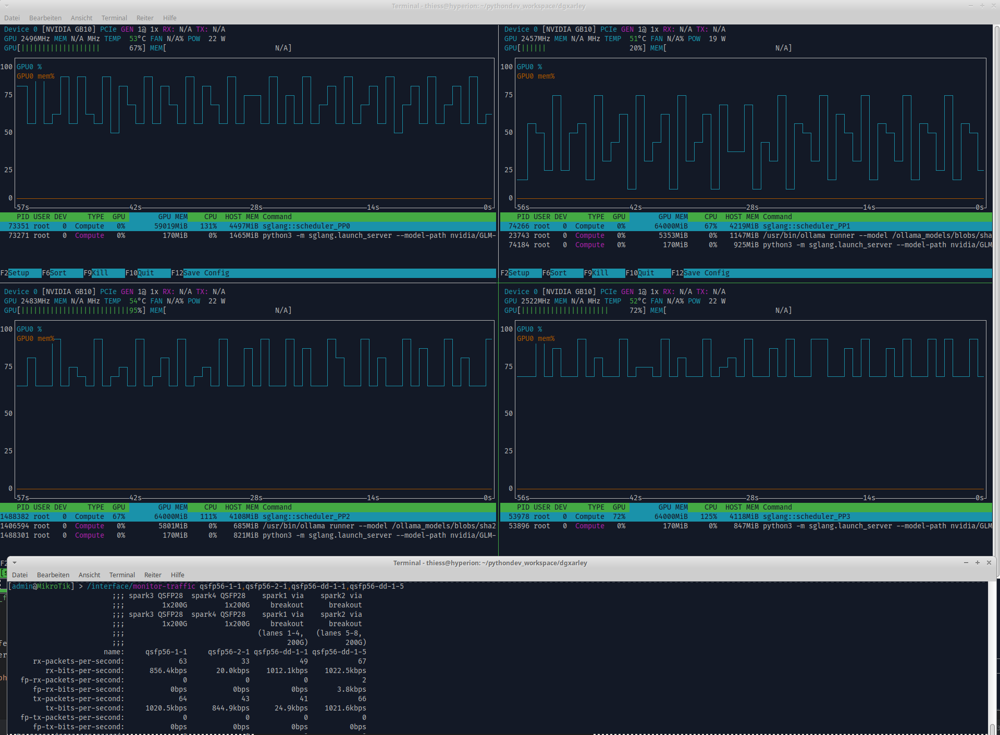
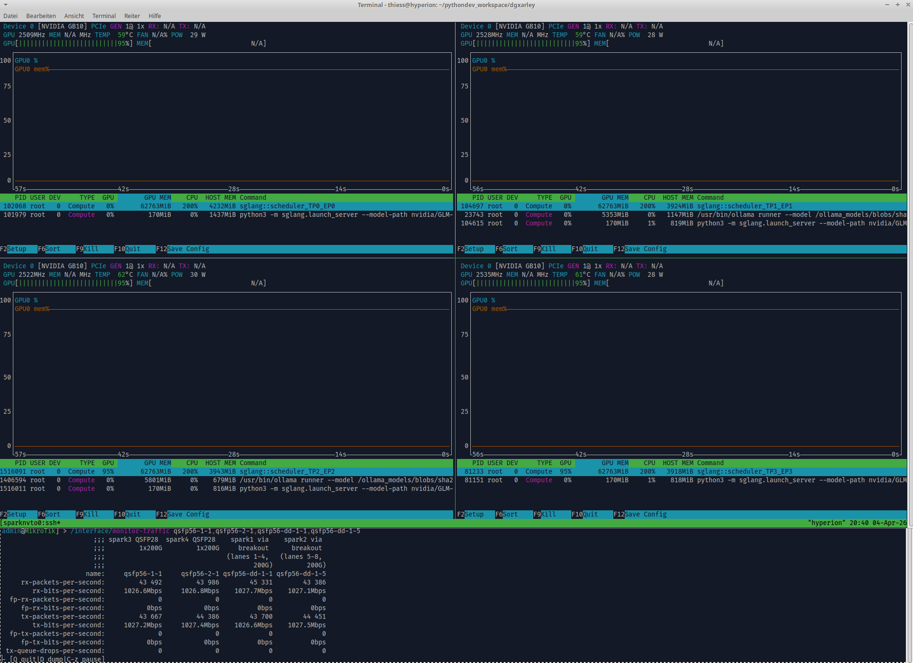
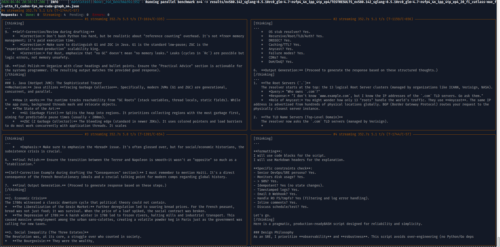

# GLM-4.7-NVFP4 on 4x DGX Spark — First Tokens

April 4, 2026. After a full day of systematic kernel testing across two SGLang image versions (v0.5.9-dev2 and v0.5.10rc0), 36-configuration test matrices, and dozens of startup crashes, GLM-4.7-NVFP4 finally produced its first tokens on the 4-node DGX Spark cluster.

---

## The Problem

NVIDIA's GLM-4.7-NVFP4 is a 358B-parameter MoE model (160 experts, top-8, sigmoid routing) quantized to FP4 via ModelOpt. The model card recommends 8x B200 GPUs (datacenter SM100) — we have 4x DGX Spark (consumer GB10, SM121, ARM64). Different silicon, different ISA, different kernel compatibility.

The TP=4/EP=4 topology (the natural fit for 4 GPUs) was systematically tested across all three MoE runner backends (`triton`, `cutlass`, `flashinfer_cutlass`) with every combination of attention backend, FP4 GEMM backend, and CUDA graph settings. **Every single configuration failed:**

- **v0.5.9-dev2**: `cutlass_moe_fp4` kernel crashes with `device-side assert triggered` at `nvfp4_blockwise_moe.cuh:78` — both during CUDA graph capture AND eager-mode inference. All three MoE backends route through this kernel for NVFP4. Total: 0 tokens across all tested configs.

- **v0.5.10rc0**: The device-side assert is gone, but the server starts and returns 0 tokens on every request — the `cutlass_moe_fp4` kernel silently fails during the forward pass. Configs with CUDA graphs crash during graph capture (OOMKilled or startup crash). Total: 0 tokens across 16 tested TP=4/EP=4 configs.

## The Breakthrough: PP=4

Pipeline Parallelism (PP=4, TP=1, EP=1) distributes the 92 transformer layers across 4 nodes sequentially instead of sharding experts across GPUs. Each GPU holds ~23 layers with all 160 experts — no expert parallelism needed, so the broken `cutlass_moe_fp4` EP code path is never hit.

**Config: PP=4, TP=1, EP=1, v0.5.10rc0, triton MoE, flashinfer attention, cuda_graph ON.**

### First successful inference

GPU utilization across all four DGX Sparks (top four panels) alongside real-time QSFP 200 GbE switch throughput on the MikroTik CRS812 (bottom panel) during single-request inference of GLM-4.7-NVFP4. The pipeline-parallel topology distributes layers across nodes — each GPU processes its shard sequentially, visible as alternating activity bursts. Inter-node communication flows over the QSFP mesh at ~350 Mbps per direction.

[Demo video: GLM-4.7 PP=4 inference with GPU and network monitoring](../media/simplescreenrecorder-2026-04-04_19.24.42.mp4)

### Results

| Concurrency | Result | Throughput | TTFT | Tokens | Finish |
|---|---|---|---|---|---|
| n=1 | **success** | **5.64 tok/s** | 1.4s | 2891 (1644 think + 1472 content) | stop |
| n=4 | crash | — | — | — | FlashInfer `merge_state` invalid argument |
| n=8 | crash | — | — | — | same |

Single-request works perfectly. Concurrent requests crash in FlashInfer's `merge_state` cascade kernel — a PP-specific bug where merging attention states from multiple prefill chunks fails on SM121.

## Update: TP=4 Breakthrough

Later in the evening, a working TP=4/EP=4 configuration was found: `flashinfer_cutlass` MoE + `flashinfer_cudnn` FP4 GEMM + no CUDA graph.

### GPU and QSFP network during TP=4 inference

All four DGX Sparks running GLM-4.7-NVFP4 with TP=4/EP=4 — tensor-parallel inference with expert parallelism. Each GPU shows 95% utilization, GPU memory at 62763 MiB. The MikroTik CRS812 QSFP switch (bottom) shows symmetric ~1027 Mbps on all four ports — significantly higher than PP=4's ~350 Mbps, because TP requires AllReduce communication every layer rather than sequential pipeline forwarding. The Ollama sidecar is also visible on spark2 (embedding model).

### 4 parallel requests streaming at 5+ tok/s each

Four concurrent requests streaming live — all producing coherent thinking and content tokens at 5.1–5.8 tok/s each. Topics: JVM garbage collection (G1/ZGC), DNS resolution hierarchy, French Revolution economic crisis, and a DevOps disk monitoring script. This is the first time GLM-4.7-NVFP4 has successfully served concurrent requests on DGX Spark.

The key insight: `flashinfer_cudnn` FP4 GEMM backend works on SM121 for this model (despite causing Xid 13 on MiniMax M2.5), and `flashinfer_cutlass` MoE avoids the broken `cutlass_moe_fp4` kernel path entirely.

---

## What We Learned

1. **`cutlass_moe_fp4` is broken on SM121.** The kernel at `nvfp4_blockwise_moe.cuh:78` fails in both graph capture and eager mode. The `triton` and `cutlass` MoE backends both route through this kernel for NVFP4 — only `flashinfer_cutlass` MoE uses a different code path.

2. **`flashinfer_cutlass` MoE + `flashinfer_cudnn` FP4 GEMM is the winning combination for TP=4.** This avoids `cutlass_moe_fp4` entirely and enables full tensor-parallel inference with EP=4. Concurrent requests work stably at 5+ tok/s each.

3. **PP=4 works as a fallback** but is limited to single requests (FlashInfer `merge_state` crash at n≥2) and has lower throughput due to pipeline bubble overhead.

4. **v0.5.10rc0 is required.** v0.5.9-dev2 has a hard device-side assert in `cutlass_moe_fp4` that crashes even in eager mode. v0.5.10rc0 avoids this for the `flashinfer_cutlass` MoE path.

5. **The scitrera Docker images are essential.** The NVIDIA-recommended `lmsysorg/sglang` image is x86_64/SM100 only — incompatible with DGX Spark's ARM64/SM121 architecture.

6. **~5.5 tok/s per request, 4 concurrent requests stable, on a 358B model across 4 consumer GPUs.** TP=4 with ~1 Gbps symmetric QSFP traffic per node. Not datacenter speed, but fully functional distributed MoE inference on hardware that NVIDIA never intended for this model.
