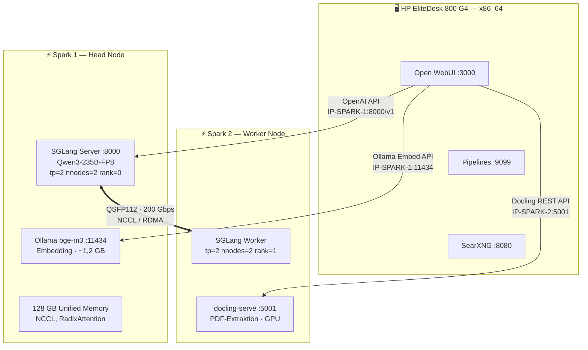
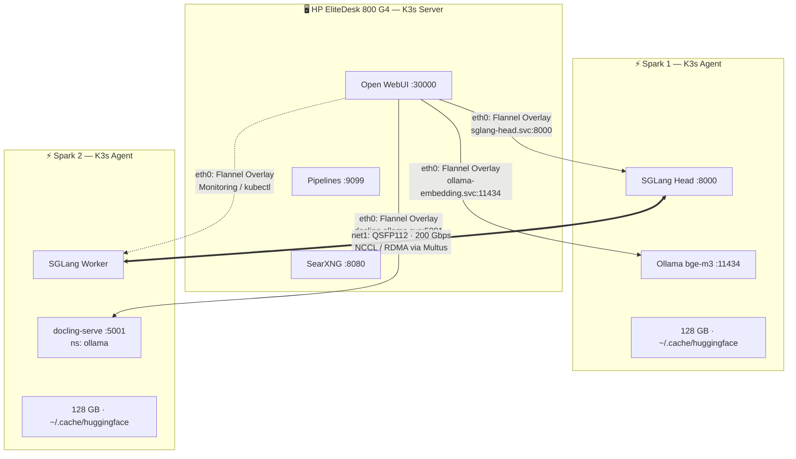

# Analyse & Optimierung: Lokales KI-System auf 2× DGX Spark

_Stand: 16. März 2026 — aktualisiert mit Erkenntnissen aus der produktiven K3s/Ansible-Implementierung (Repo: dgxarley)_

> [!tip] Open WebUI Detailinfo
> Für alle Open-WebUI-spezifischen Details (RBAC, SSO, API-Nutzung, Pipelines, RAG, Function Calling, SearXNG-Integration, Self-Reflection-Pipeline, Embedding-Anbindung) siehe das separate Dokument: **[DGX Spark Setup - openwebui detailinfo](DGX%20Spark%20Setup%20-%20openwebui%20detailinfo.md)**

> [!info] ASUS Ascent GX10 = DGX Spark
> Dieses Dokument verwendet "DGX Spark" als Bezeichnung für die Plattform. Die **ASUS Ascent GX10** (z.B. GX10-GG0026BN) ist eine OEM-Implementierung derselben Hardware — identischer GB10 Grace Blackwell Superchip, identischer integrierter ConnectX-7, identisches DGX OS. Alle Anleitungen und Konfigurationen gelten 1:1 für beide Varianten.
>
> | | DGX Spark (Founders) | ASUS Ascent GX10 |
> |---|---|---|
> | **SoC / GPU / RAM** | GB10, Blackwell, 128 GB LPDDR5x | identisch |
> | **ConnectX-7 (2× QSFP112)** | integriert | identisch |
> | **Netzwerk-Protokoll** | Ethernet + RoCE (**kein** InfiniBand) | identisch |
> | **DGX OS** | ja | ja (minor ASUS-Anpassungen) |
> | **Storage** | 4 TB NVMe | **1 TB / 2 TB / 4 TB** je nach SKU |
>
> **Einziger setup-relevanter Unterschied**: Die GG0026BN hat 2 TB NVMe (statt 4 TB). Bei Qwen3-235B-FP8 (~237 GB pro Node) reicht das aus, aber der `hostPath` in den PV-Definitionen muss zum tatsächlichen Pfad passen.
>
> **Achtung**: Einige ASUS-Marketingtexte behaupten, der QSFP-Link sei "InfiniBand". Das ist **technisch falsch** — die ConnectX-7 im GB10 operiert im Ethernet-Modus mit RoCE (RDMA over Converged Ethernet), nicht im InfiniBand-Modus ([ServeTheHome-Test bestätigt dies](https://www.servethehome.com/the-nvidia-gb10-connectx-7-200gbe-networking-is-really-different/)).

## Zusammenfassung

Der Architektur-Draft ist ein solider Startpunkt, hat aber einige signifikante Probleme. Hier die wichtigsten Erkenntnisse:

1. **SGLang ist die beste Inference-Engine für Multi-Node auf DGX Spark** — NCCL-basiertes Clustering funktioniert nachweislich, inklusive Tensor Parallelism über den QSFP-Link. Community-Images sind verfügbar und getestet.
    
2. **vLLM + Ray ist instabil und leidet unter ständigen Breaking Changes** — das ursprüngliche Ray-GPU-Mapping-Problem wurde zwar durch Community-Docker gefixt, aber die Codebase ist fragil. Nutzer berichten noch Ende Februar 2026 über massive Regressions.
    
3. **Qwen3-235B-A22B-Instruct-2507-FP8 bleibt die optimale Modellwahl für maximale Qualität** — Instruct-Variante (nicht Thinking) in FP8-Quantisierung, mit FP8-KV-Cache für ~65K Kontextlänge bei ~25 t/s Decode-Speed. Die Implementierung nutzt ein **Modell-Profil-System** mit mehreren konfigurierbaren Modellen (aktuell aktiv: Qwen3.5-35B-A3B für schnelle Interaktion). Detaillierte VRAM-Berechnung in Abschnitt 2.
    
4. **Embedding gehört auf den DGX Spark (Ollama)** — bge-m3 (567M Parameter, ~1,2 GB FP16) läuft als Ollama-Embedding-Server auf einem Spark-Node mit. CPU-Embedding auf dem EliteDesk ist in der Praxis zu langsam.
    
5. **SearXNG lässt sich nativ in Open WebUI integrieren** — wenige Zeilen Config.
    
6. **Self-Reflection ist umsetzbar** über Open WebUI Pipelines/Functions mit einem Generate→Critique→Refine Loop.
    

---

## 1. Kritische Bewertung des Architektur-Drafts

### Was gut ist

- Hardware-Setup mit QSFP112 DAC und RDMA-Test ist korrekt
    
- Open WebUI als Frontend ist die richtige Wahl (ausgereift, aktive Community, Pipeline-Support)
    
- Docling für PDF-Extraktion ist sinnvoll
    
- Grundstruktur "Backend auf Sparks, Frontend auf separatem Node" ist architektonisch richtig
    

### Was problematisch ist

**Problem 1: vLLM Multi-Node auf DGX Spark**

Das `avarok/vllm-dgx-spark:v11` Image und der vorgeschlagene vLLM-Ansatz mit `--tensor-parallel-size 2` über Ray funktioniert auf der GB10 **nicht zuverlässig**. Zwar hat die Community (insbesondere eugr's `spark-vllm-docker`) das ursprüngliche Ray-GPU-Mapping-Problem gefixt, aber die Stabilität bleibt ein massives Problem:

- Am 24. Februar 2026 (vor 4 Tagen) wurde auf den NVIDIA Developer Forums ein Thread eröffnet mit dem Titel "VLLM — the $150M train wreck?". Ein Nutzer berichtet über Engine-Failures mit GPT-OSS-120b, Qwen3-VL-235b und GLM-4.6V — Modelle, die zuvor funktionierten, laufen durch Breaking Changes plötzlich nicht mehr.
    
- eugr selbst (der Maintainer des Community-Docker) bestätigt: "The amount of approved PRs breaking stuff skyrocketed recently" und arbeitet an einem automatisierten Stable-Build-System.
    
- Ein anderer Nutzer mit funktionierendem 24,38 GB/s Link beschreibt, dass Tensor-Parallel-Mode nach dem ersten Prompt einen Node zum Absturz bringt.
    
- FP4-GEMM-Kernels auf SM121 sind weiterhin kaputt — FlashInfer und CUTLASS FP4 schlagen beide fehl.
    

**Problem 2: Modellwahl ist suboptimal**

DeepSeek-R1-Distill-Llama-70B-FP8 benötigt nur ~35 GB VRAM. Bei 256 GB verfügbarem Speicher (2× 128 GB) wird das System massiv unterausgelastet. Es gibt signifikant leistungsfähigere Modelle, die auf 2× Spark laufen (siehe Abschnitt 2).

**Problem 3: Embedding-Modell braucht GPU-Beschleunigung**

bge-m3 mit `--gpu-memory-utilization 0.05` auf einem vollwertigen vLLM-Container ist überdimensioniert — aber CPU-Embedding (auf dem EliteDesk oder Grace-CPU) ist in der Praxis **unerträglich langsam**. Lösung: bge-m3 (567M Parameter, ~1,2 GB FP16) als leichtgewichtiger **Ollama-Embedding-Server** auf einem DGX Spark. Der Speicherverbrauch ist bei 128 GB Unified Memory vernachlässigbar.

**Problem 4: `--enforce-eager` überall**

`--enforce-eager` deaktiviert CUDA Graph Capture, was die Performance deutlich senkt. Das ist auf SM121 leider oft nötig, weil CUDA Graphs mit einigen Kernels inkompatibel sind — aber es sollte als bewusster Tradeoff verstanden werden, nicht als Standardconfig.

---

## 1b. Kritische Erkenntnisse aus der K3s/Ansible-Implementierung

> [!success] Status: Produktiv
> Das gesamte Setup ist als Ansible-Playbook-Suite (`dgxarley`) implementiert und läuft produktiv auf einem 3-Node K3s-Cluster (elite800 + spark1 + spark2). Die folgenden Erkenntnisse wurden während der Implementierung gewonnen und sind im Hauptdokument an den relevanten Stellen eingearbeitet.

### SGLang EADDRINUSE-Bug & HAProxy-Sidecar-Pattern

SGLang Multi-Node hat einen subtilen Bug auf dem Head-Node: Der Scheduler-Subprocess bindet `<pod-ip>:<port>`, und wenn uvicorn gleichzeitig `--host 0.0.0.0` auf demselben Port nutzt, schlägt das Scheduler-Bind mit EADDRINUSE fehl (weil `0.0.0.0` die Pod-IP einschließt).

**Lösung**: `--host` beim Head weglassen → uvicorn bindet nur `127.0.0.1:<internal-port>`. Ein HAProxy-Sidecar (`haproxy:lts-alpine`) leitet externen Traffic weiter: `0.0.0.0:8000` → `127.0.0.1:30080`. Der Sidecar liefert zusätzlich HTTP-Level Access-Logs (Client-IPs, Request-Pfade, Response-Codes, Timing) — sichtbar via `kubectl logs -c proxy`.

**Port-Architektur**: `sglang_port: 8000` (HAProxy extern) ≠ `sglang_internal_port: 30080` (uvicorn intern). Probes und K8s-Service treffen HAProxy auf Port 8000.

### startupProbe-Budget: Mindestens 1200s

Die ursprünglich geplanten 630s (`30 + 60×10`) reichen **nicht**. Head-Startup dauert ~7-8 Minuten (NCCL Init ~20s, Weight Loading ~170s, CUDA Graph Capture ~45s, Warmup).

**Implementiert**: `initialDelaySeconds=30, periodSeconds=10, failureThreshold=120` → **1230s Budget**.

Wenn die Probe zu kurz ist, killt kubelet den Head → Worker-NCCL bricht → Worker bleibt stale → Head-Restart deadlockt bei `Init torch distributed begin.` (wartet auf den stale Worker).

### Worker braucht eine livenessProbe

Der Worker hat **keine** readiness/startup-Probes (er muss sofort als Ready erscheinen, damit der Head-initContainer `wait-for-worker` durchkommt). Aber er **muss** eine livenessProbe haben (`httpGet /health port 8000, initialDelaySeconds: 300`), damit kubelet ihn neu startet, wenn der Head stirbt und die NCCL-Verbindung bricht. Ohne livenessProbe bleibt der Worker in einem stale `Running 1/1`-Zustand — blockiert frisches NCCL-Rendezvous beim Head-Restart.

### ARP-Priming vor NCCL

Das QSFP Point-to-Point-Link braucht einen expliziten Ping vor dem NCCL-Start, um die ARP-Tabelle zu füllen. Ohne ARP-Priming droppen die ersten SYN-Pakete, und NCCL wartet ~230s auf ARP-Resolution. Im `sglang_launch.sh`-Script wird deshalb vor dem SGLang-Start ein `ping -c 1 <peer-ip>` ausgeführt.

### Attention-Backend `triton`

Für hybride GDN-Modelle (z.B. Qwen3.5-35B-A3B) auf Blackwell-GPUs ist `--attention-backend triton` erforderlich. Ohne das Flag schlägt die Inferenz fehl. Konfiguriert per Modell-Profil.

### HuggingFace Cache-Pfad

`huggingface_hub.snapshot_download(cache_dir=X)` speichert unter `X/models--*/`, aber SGLangs Runtime sucht in `HF_HOME/hub/` (Default: `~/.cache/huggingface/hub/`). Download-Scripts **müssen** `cache_dir="/root/.cache/huggingface/hub"` verwenden, damit SGLang das Modell findet. Sonst wird bei jedem Start neu heruntergeladen.

### NVIDIA CDI Volume: `/var/run/cdi` statt `/etc/cdi`

Der NVIDIA Device Plugin generiert CDI-Specs zur Laufzeit nach `/var/run/cdi` — dieses Volume muss **writable** (DirectoryOrCreate) gemountet werden. `/etc/cdi` ist nur für statische Specs aus `nvidia-ctk cdi generate` und darf **nicht** als CDI-Quelle für den Device Plugin verwendet werden. Falsche Konfiguration führt zu `unresolvable CDI devices`-Fehlern in containerd.

### Multus CNI: 4 K3s-spezifische Patches

Das upstream Multus-Manifest braucht 4 Patches für K3s:
1. `cni`-Volume: `/etc/cni/net.d` → `/var/lib/rancher/k3s/agent/etc/cni/net.d`
2. `cnibin`-Volume: `/opt/cni/bin` → `/var/lib/rancher/k3s/data` (für Symlink-Auflösung)
3. `binDir` in der Daemon-Config auf `/var/lib/rancher/k3s/data/cni`
4. `mountPropagation: Bidirectional` → `HostToContainer` (Bidirectional verursacht Bind-Mount-Stacking, das **alle CNI-Operationen clusterweit** lahmlegt)

### QSFP Interface-Name: `enP2p1s0f0np0` (großes P!)

Das Interface auf PCI-Domain 0002 heißt `enP2p1s0f0np0` mit **großem P** — nicht `enp2p1s0f0np0`. In den NetworkAttachmentDefinitions muss exakt dieser Name stehen.

### ConfigMap-Scripts: Kein Jinja2 `` an Column 0

Ansible-Templates mit Jinja2 ``-Loops an Spalte 0 innerhalb von ConfigMap-Data-Blöcken brechen das YAML-Parsing. **Lösung**: Env-Vars + Shell-Loops statt Jinja2 in Pod-Scripts verwenden.

### nsupdate DNS-Registrierung

Zone muss `elasticc.io` (Parent-Zone) sein, nicht `dgx.elasticc.io`. Records als FQDN mit Trailing Dot (z.B. `ollama.dgx.elasticc.io.`). Der TSIG-Key `dgx.elasticc.io` ist nur für Records unter `dgx.elasticc.io` autorisiert.

### HF Preload Job: Delete-and-Recreate

K8s Jobs haben immutables `spec.template` — Ansible muss den bestehenden Job **löschen** bevor er mit Änderungen neu erstellt wird. Der Job läuft auf spark2 (ARM64), downloadet Modelle, und rsynct sie per Host-gemounteten `/root/.ssh` auf spark1.

### GPU Time-Slicing: Implementiert

GPU Time-Slicing ist produktiv im Einsatz mit `nvidia_gpu_timeslice_replicas: 4`. Jede physische GPU erscheint als 4 allokierbare `nvidia.com/gpu`-Ressourcen. Konfiguriert über die `nvidia-device-plugin-config` ConfigMap.

### Ansible-Automatisierung

Das gesamte Setup ist als Ansible-Playbook-Suite automatisiert:
- `common.yml` → Basis-Konfiguration aller Nodes (Netzwerk, SSH, iptables, Fail2ban)
- `dgx.yml` → DGX-Spark-spezifische Vorbereitung (QSFP, ulimits, CDI, CPUpower, CNI-Plugins)
- `k3sserver.yml` → K3s-Cluster-Installation + Kubeconfig-Merge
- `k8s_dgx.yml` → AI-Workloads (SGLang, Ollama, OpenWebUI, Multus, SearXNG, DNS)
- `k8s_infra.yml` → Infrastruktur (cert-manager, Prometheus, Grafana, Loki, PostgreSQL, Redis, etc.)

---

## 1c. Modellformate: safetensors, GGUF und was SGLang laden kann

Bevor es um die konkrete Modellwahl geht, ein Überblick über die gängigen Formate auf HuggingFace — und welche davon auf den DGX Sparks mit SGLang nutzbar sind.

### safetensors — das Standardformat für GPU-Inferenz

- Binäres Format von Hugging Face, Nachfolger des unsicheren `.bin` (pickle-basiert)
- Sicher (kein Code-Execution-Risiko), schnell ladbar (memory-mapped)
- Weights liegen in ihrem **Originaltyp** vor: FP16, BF16, FP32 oder FP8
- **Keine implizite Quantisierung** — was drin ist, wird geladen
- Erkennbar auf HuggingFace: Repos mit `model.safetensors` oder `model-00001-of-00005.safetensors`
- Wird von **SGLang, vLLM, TensorRT-LLM** und allen PyTorch-basierten Engines nativ geladen

### GGUF — das Format für llama.cpp / Ollama

- Format aus dem **GGML/llama.cpp-Ökosystem**
- Primär für **CPU-Inferenz und aggressive Quantisierung** (Q4_K_M, Q5_K_S, Q8_0, etc.)
- Einzelne `.gguf`-Datei, enthält Weights + Tokenizer + Metadaten
- Wird von **Ollama, llama.cpp, LM Studio, kobold.cpp** genutzt
- **SGLang kann kein GGUF laden** — komplett anderes Runtime-Ökosystem
- Repos auf HuggingFace mit `-GGUF` Suffix (z.B. von `bartowski/`, `unsloth/`) → **nicht für SGLang geeignet**

### Von SGLang unterstützte Formate und Quantisierungen

| Format | Quantisierung | VRAM vs. FP16 | Bemerkung |
|--------|--------------|----------------|-----------|
| safetensors (FP16/BF16) | keine | 100% (Baseline) | Standard, höchster VRAM-Bedarf |
| safetensors (FP8) | FP8 (W8A8) | ~50% | Quasi kein Qualitätsverlust, native Blackwell-HW-Unterstützung |
| AWQ | INT4 weights | ~25% | Gute Qualität, ältere aber bewährte Methode |
| GPTQ | INT4/INT8 weights | ~25-50% | Ähnlich AWQ, weitverbreitet |
| Marlin | INT4 optimiert | ~25% | Schnellere Kernel für GPTQ/AWQ auf Ampere+ GPUs |
| BitsAndBytes | INT4/INT8 | ~25-50% | On-the-fly-Quantisierung, langsamer als Pre-Quant |

### Kapazität der DGX Sparks (128 GB unified GPU Memory pro Node)

- **FP16/BF16**: Modelle bis ~60–65B Parameter pro Spark (1 Param ≈ 2 Bytes + KV-Cache-Overhead)
- **FP8**: Modelle bis ~120B pro Spark, oder ~240B über beide Sparks via TP=2 über QSFP/NCCL
- **INT4 (AWQ/GPTQ)**: theoretisch noch größer, aber auf Blackwell ist FP8 meist vorzuziehen (native HW-Unterstützung, kein Qualitätsverlust)

### Praktische Suchstrategie auf HuggingFace

1. **Offizielle Repos suchen** (z.B. `Qwen/Qwen3-235B-A22B-Instruct-2507`) — diese haben safetensors
2. **FP8-Varianten**: Repos mit `-FP8` im Namen (z.B. von `neuralmagic/`, `nvidia/`, oder offiziell vom Modell-Anbieter)
3. **GGUF-Repos ignorieren** (`-GGUF` Suffix, typische Uploader: `bartowski/`, `unsloth/`, `TheBloke/`) — für Ollama/llama.cpp, nicht für SGLang
4. **AWQ-Repos** (`-AWQ` Suffix) funktionieren mit SGLang, aber FP8 ist auf Blackwell generell vorzuziehen

> [!tip] Faustregel
> Für SGLang auf den DGX Sparks: **safetensors in FP8** ist der Sweet Spot — native Blackwell-Unterstützung, halber Speicherbedarf, quasi kein Qualitätsverlust gegenüber FP16.

---

## 2. Modellempfehlung: Qwen3-235B-A22B-Instruct-2507-FP8

### Warum Qwen3-235B-A22B?

Qwen3-235B-A22B ist ein Mixture-of-Experts-Modell mit 235B Gesamtparametern, aber nur 22B aktiven Parametern pro Token. Das bedeutet:

- **Qualität auf GPT-4-Niveau** für Reasoning, Coding und Analyse

- **Fit auf 2× Spark**: In Q4_K_XL-Quantisierung ~134 GB, in FP8 ~237 GB — beides passt in 256 GB

- **NVIDIA-getestet**: NVIDIA selbst demonstriert Qwen3-235B auf Dual-Spark mit 23.477 Token/s Prefill-Throughput

- **SGLang-kompatibel**: Läuft nachweislich mit SGLang Multi-Node und NCCL


### Modellvarianten: Instruct-2507 vs. Thinking-2507

Seit Juli 2025 gibt es zwei getrennte 2507-Varianten. Beide existieren als offizielle FP8-Quantisierung auf HuggingFace:

|Eigenschaft|**Instruct-2507-FP8**|**Thinking-2507-FP8**|
|---|---|---|
|Reasoning-Modus|Kein Thinking — direkte Antwort|Thinking **immer an** (`<think>`-Tags)|
|Empfohlene Output-Länge|16.384 Token|32.768 Token (viel davon im `<think>`-Block)|
|Latenz|Niedrig — antwortet sofort|Höher — denkt erst sichtbar nach|
|Token-Verbrauch|Normal|~2-3× höher (Reasoning-Tokens)|
|AIME25 (Mathe)|81.5|92.3|
|Instruction Following|Besser|Gut|
|Tool-Calling / Multilingual|Besser|Gut|
|Nativer Kontext|262K|262K|
|Temperature (empfohlen)|0.7|0.6|

**Empfehlung: Instruct-2507-FP8** für Business-Analyse:
- Business-Analyse braucht Textverständnis, Strukturierung und kritische Bewertung — keine Mathe-Olympiade
- Der Thinking-Modus produziert bei jeder Antwort 1000+ zusätzliche Tokens → bei ~25 t/s und begrenztem KV-Cache-Speicher ein Problem
- Die Reflexions-Pipeline (Abschnitt 6) ersetzt den Thinking-Modus gezielt und **kontrolliert** — du bestimmst, wann reflektiert wird
- Instruct + Reflexions-Pipeline = das Beste aus beiden Welten: schnelle Antworten für einfache Fragen, tiefe Reflexion nur wenn nötig

### VRAM-Berechnung & Kontextlänge

#### Architektur-Parameter (aus config.json)

|Parameter|Wert|
|---|---|
|`num_hidden_layers`|94|
|`num_key_value_heads`|4 (GQA mit 64 Q-Heads)|
|`head_dim`|128|
|`max_position_embeddings`|262.144 (256K nativ)|
|Gesamtparameter|235B (128 Experts, 8 aktiv)|

#### Speicherbudget auf 2× DGX Spark

|Posten|GB|
|---|---|
|Gesamtspeicher (2× 128 GB Unified Memory)|**256 GB**|
|Modellgewichte FP8 + Scaling-Faktoren|**~237 GB**|
|CUDA-Kontext + SGLang-Overhead + Aktivierungen|**~5–7 GB**|
|**Verfügbar für KV-Cache**|**~12–14 GB**|

#### KV-Cache pro Token

Formel: `2 (K+V) × 94 Layers × 4 KV-Heads × 128 Dim × Bytes/Element`

|KV-Cache Datentyp|Bytes/Element|**Pro Token**|
|---|---|---|
|BF16 (Standard)|2|**~188 KB**|
|FP8 (`--kv-cache-dtype fp8_e5m2`)|1|**~94 KB**|

#### Resultierende maximale Kontextlänge (Single Request)

|KV-Datentyp|Max. Tokens (bei ~13 GB KV-Budget)|Empfohlene `--context-length`|
|---|---|---|
|BF16 (default)|~70.000|**32.768 – 65.536**|
|FP8 KV-Cache|~140.000|**65.536 – 131.072**|

> **Hinweis**: Das Modell unterstützt nativ 262K Kontext — die Limitierung kommt ausschließlich vom verfügbaren Speicher auf 2× Spark bei FP8-Weights.

#### Was bedeutet das in der Praxis?

|Anwendung|Tokenbedarf (ca.)|Passt in 65K?|
|---|---|---|
|Normale Chat-Konversation|4K–12K|✅|
|Analyse mit System-Prompt + Reflexion|8K–16K|✅|
|Ein 30-50-Seiten-PDF|15K–25K|✅|
|Ein 80-Seiten-Bericht|40K–55K|✅|
|Mehrere Dokumente vergleichen|30K–60K|✅|
|Ein ganzes Buch (300+ Seiten)|150K+|❌ (→ RAG nutzen)|

#### SGLang KV-Cache vs. Ollama: Dynamischer Token-Pool

> [!important] KV-Cache-Missverständnis aus der Ollama-Welt
> In Ollama reserviert `num_ctx` (Context Length) den **kompletten** KV-Cache für so viele Tokens pro Slot. Eine Context Length von 262K bedeutet: Ollama reserviert 262K Tokens Speicher *pro gleichzeitigem Request* — auch wenn die eigentliche Konversation nur 3K Tokens braucht. Das macht große Context Lengths in Ollama extrem teuer.
>
> **SGLang funktioniert grundlegend anders.** Der Parameter `--context-length` setzt nur die *maximale Sequenzlänge*, die ein einzelner Request nutzen darf. Der KV-Cache ist ein **gemeinsamer dynamischer Token-Pool** — Tokens werden bei Bedarf allokiert und sofort wieder freigegeben, wenn ein Request abgeschlossen ist. Die Poolgröße wird durch `--mem-fraction-static` bestimmt (Anteil des GPU-Speichers für den KV-Cache), nicht durch die Context Length.
>
> **Praxisbeispiel** (Qwen3-235B-AWQ, `moe_wna16`, TP=2, FP8 KV-Cache):
>
> | Parameter | Wert |
> |---|---|
> | Modellgewichte (pro GPU) | ~59 GB |
> | `mem_fraction_static` | 0.70 |
> | KV-Cache-Poolgröße | ~20 GB (K: 9,9 GB + V: 9,9 GB) |
> | **Gesamte Token-Kapazität** | **~441K Tokens** |
> | `context_length` (max pro Request) | 262.144 |
>
> Mit 441K Tokens im Pool und einem typischen Chat-Request von ~3K Tokens:
> - **~150 gleichzeitige Requests** passen in den KV-Cache
> - Ein einzelner Request kann bis zu 262K Tokens nutzen (das volle Kontextfenster)
> - Mehrere Long-Context-Requests (z.B. 3× 100K) funktionieren ebenfalls, sie teilen sich den Pool dynamisch
>
> Die `lpm`-Scheduling-Policy (Longest Prefix Match) bringt eine weitere Optimierung: Abgeschlossene Requests hinterlassen ihre Prefix-Tokens in einem **Radix Cache**. Wenn der nächste Request denselben System-Prompt hat, werden diese Tokens wiederverwendet (`#cached-token > 0` in den Logs) — der Prefill wird komplett übersprungen.
>
> **Fazit**: Keine Angst vor großen `context_length`-Werten in SGLang. Der KV-Cache-Pool passt sich dynamisch an. Die echten Constraints sind Decode-Throughput (NCCL-Bandbreite zwischen Nodes) und die Gesamtpoolgröße (gesteuert über `mem_fraction_static`) — nicht die konfigurierte Context Length.

### FP8 vs. Q4_K_XL: Welches Quantisierungsformat?

| |**FP8 + SGLang (NCCL)** ⭐ Empfohlen|**Q4_K_XL + llama.cpp (RPC)**|
|---|---|---|
|**Modellgröße**|~237 GB|~134 GB|
|**Freier Speicher für KV**|~12–14 GB|**~115 GB**|
|**Max. Kontext**|~70K (BF16-KV) / ~140K (FP8-KV)|**Volle 262K**|
|**Modellqualität**|⭐⭐⭐⭐⭐ Nahezu BF16|⭐⭐⭐⭐ Leichter Verlust bei Nuancen|
|**Decode-Speed**|**~25 t/s**|~12,5 t/s|
|**Mit Reflexions-Pipeline (×2)**|500-Token-Antwort → ~40s|500-Token-Antwort → ~80s|
|**Link-Typ**|NCCL über QSFP (200 Gbps, µs-Latenz)|TCP/IP über QSFP (mehr Overhead)|
|**Prefix Caching**|✅ RadixAttention|❌ Nein|
|**Continuous Batching**|✅ Mehrere Anfragen parallel|❌ Sequentiell|
|**Stabilität**|Gut (SGLang Community-Images)|Sehr gut (kaum Breaking Changes)|
|**Engine**|SGLang|llama.cpp|

**Empfehlung: FP8 + SGLang als Primär-Setup.** Gründe:

1. **Doppelte Geschwindigkeit** (~25 vs. 12,5 t/s) — bei täglicher Nutzung mit Reflexions-Pipeline der wichtigste Faktor
2. **Bessere Modellqualität** — FP8 behält feinere sprachliche Nuancen, wichtig für DE/EN Business-Analyse
3. **65K Kontext reicht** für >95% der Business-Analyse-Aufgaben
4. **Prefix Caching** spart bei jedem Request den Prefill des System-Prompts

**Optional: Q4_K_XL als Fallback vorhalten.** Die GGUF-Datei (~134 GB) zusätzlich herunterladen. Falls ein Ausnahmefall kommt (200K+ Token Dokument), Container stoppen und llama.cpp starten — ist nur ein Befehlswechsel.

### Weitere Modell-Alternativen

- **Qwen3.5-35B-A3B**: Läuft auf einem einzelnen Spark mit ~43 t/s in FP8, bis 262K Kontext. Beste Option für Echtzeit-Interaktion mit maximaler Geschwindigkeit.

- **GLM-4.7-Flash (BF16)**: Auf einem einzelnen Spark via SGLang + Triton nachgewiesen: stabile 24-25 t/s mit bis zu 200K Kontext und FP8-KV-Cache. Hervorragendes Reasoning + Tool-Calling.

- **GLM-4.7-FP8 (355B MoE)**: Für 4× Spark Setups — auf einem 4-Node-Cluster mit SGLang + EAGLE Speculative Decoding getestet. Für dein 2-Node-Setup zu groß, aber als Zukunftsoption relevant.

### Modell-Profil-System (implementiert)

Die Implementierung nutzt ein konfigurierbares Profil-System in den Ansible-Defaults. Pro Modell werden `context_length`, `kv_cache_dtype`, `mem_fraction_static`, `reasoning_parser`, `tool_call_parser` und optional `info_url` definiert:

| Modell | Kontext | KV-Cache | mem_fraction | Parser |
|---|---|---|---|---|
| **Qwen3.5-35B-A3B** (aktuell aktiv) | 262144 | fp8_e5m2 | 0.50 | qwen3 / qwen3_coder |
| Qwen3-235B-A22B-Instruct-2507-FP8 | 65536 | fp8_e5m2 | 0.90 | qwen3 |
| Qwen3-Coder-30B-A3B-Instruct | 262144 | fp8_e5m2 | 0.70 | — / qwen3_coder |

Modellwechsel erfolgt durch Ändern von `sglang_model` in den Ansible-Defaults und Re-Run von `ansible-playbook k8s_dgx.yml --tags sglang`.

---

## 3. Inference-Engine: SGLang als klare Empfehlung

### Aktuelle Lage auf DGX Spark (SM121, 28. Feb 2026)

|Engine|Single-Node|Multi-Node (2× Spark)|MoE-Support|Stabilität|
|---|---|---|---|---|
|**SGLang** (Community Docker)|✅ Sehr gut|✅ NCCL-basiert, funktioniert|✅ Gut, Kernel-Tuning nötig|**Gut**|
|**llama.cpp**|✅ Sehr stabil|✅ Via RPC (TCP/IP, kein NCCL)|✅ GGUF-Quantisierung|**Sehr gut**|
|**vLLM** (Community Docker)|✅ Funktioniert mit `--enforce-eager`|⚠️ Grundsätzlich möglich, aber instabil|✅ aber langsam|**Schlecht**|
|**TensorRT-LLM**|⚠️ SM121-Kernel fehlen teils|⚠️ Ähnliche Probleme|⚠️ Eingeschränkt|Gering|

### Warum SGLang?

**1. NCCL-basiertes Multi-Node — der entscheidende Vorteil**

SGLang nutzt für Multi-Node-Tensor-Parallelism NCCL über den QSFP-Link. Das bedeutet: die volle 200-Gbps-Bandbreite wird ausgeschöpft, mit Mikrosekunden-Latenz. Im Gegensatz dazu läuft llama.cpp RPC über TCP/IP — funktional, aber mit signifikantem Overhead.

Bestätigt durch Community-Benchmarks: dbsci hat am 15. Februar 2026 NCCL-basiertes Distributed-Torch-Clustering mit SGLang auf einem 4× DGX Spark Cluster mit Tensor Parallelism erfolgreich getestet und veröffentlicht.

**2. Harte Benchmark-Zahlen (Qwen3-Coder-Next, 4× Spark, SGLang 0.5.8)**

|Prompt-Länge|Prefill (t/s)|Decode (t/s)|
|---|---|---|
|512 Token|~2.600|~52|
|2.048 Token|~4.630|~51|
|8.192 Token|~7.230|~46|
|16.384 Token|~6.990|~42|
|32.768 Token|~6.150|~37|
|65.535 Token|~5.010|~29|
|131.072 Token|~3.625|~20|

Diese Werte sind auf 4 Nodes gemessen. Auf deinem 2-Node-Setup sind die Decode-Speeds grob vergleichbar (Decode skaliert bei MoE-Modellen nicht linear mit Nodes), Prefill wird langsamer sein.

**3. EAGLE Speculative Decoding**

SGLang unterstützt EAGLE3 Speculative Decoding nativ. Das kann die Decode-Speed nochmal deutlich erhöhen (typisch 1,5-2×), wenn ein passendes Draft-Modell verfügbar ist. Für Qwen3-Modelle wird das zunehmend unterstützt.

**4. RadixAttention (Prefix Caching)**

SGLang cached automatisch gemeinsame Prompt-Präfixe. Wenn du wiederholt den gleichen System-Prompt nutzt (was bei Business-Analyse Standard ist), wird ab der zweiten Anfrage der Prefill drastisch beschleunigt — der System-Prompt wird nicht erneut berechnet.

**5. Stabilität gegenüber vLLM**

Während vLLM unter ständigen Breaking Changes leidet und Nutzer noch Ende Februar 2026 über massive Regressions klagen, zeigt SGLang auf Spark eine deutlich stabilere Entwicklung. Die Community-Images von dbsci (`scitrera/dgx-spark-sglang`) und das offizielle NVIDIA NGC SGLang-Image bieten getestete Baselines.

### Verfügbare SGLang-Images für DGX Spark

|Image|SGLang|CUDA|NCCL|Transformers|Hinweis|
|---|---|---|---|---|---|
|`scitrera/dgx-spark-sglang:0.5.8-t4`|0.5.8|13.1.1|2.29.3-1|4.57.6|Für ältere Modelle|
|`scitrera/dgx-spark-sglang:0.5.8-t5`|0.5.8|13.1.1|2.29.3-1|5.1.0|Für Modelle ohne GDN-Attention|
|`scitrera/dgx-spark-sglang:0.5.9-t5`|0.5.9|13.1.1|2.29.3-1|5.1.0|**Empfohlen** — für neue Modelle (Qwen3.5, GLM-4.7 etc.), `--attention-backend triton` für GDN|
|NVIDIA NGC SGLang (26.01)|Offiziell|13.x|Offiziell|Offiziell|Multi-Node-Support dokumentiert|

### Konkreter Multi-Node-Start (2× Spark)

#### Via Podman CLI

```bash
# === Spark 2 (Worker — zuerst starten!) ===
sudo podman run -d --privileged \
  --device nvidia.com/gpu=all \
  --network host --ipc=host \
  --ulimit memlock=-1 --ulimit stack=67108864 \
  -v ~/.cache/huggingface:/root/.cache/huggingface:Z \
  --name sglang_worker \
  scitrera/dgx-spark-sglang:0.5.9-t5 \
  python3 -m sglang.launch_server \
    --model-path Qwen/Qwen3-235B-A22B-Instruct-2507-FP8 \
    --tp 2 --nnodes 2 --node-rank 1 \
    --dist-init-addr <QSFP-IP-SPARK-1>:50000 \
    --mem-fraction-static 0.90 \
    --kv-cache-dtype fp8_e5m2 \
    --context-length 65536

# === Spark 1 (Head Node — danach starten) ===
sudo podman run -d --privileged \
  --device nvidia.com/gpu=all \
  --network host --ipc=host \
  --ulimit memlock=-1 --ulimit stack=67108864 \
  -v ~/.cache/huggingface:/root/.cache/huggingface:Z \
  --name sglang_head \
  scitrera/dgx-spark-sglang:0.5.9-t5 \
  python3 -m sglang.launch_server \
    --model-path Qwen/Qwen3-235B-A22B-Instruct-2507-FP8 \
    --tp 2 --nnodes 2 --node-rank 0 \
    --dist-init-addr <QSFP-IP-SPARK-1>:50000 \
    --mem-fraction-static 0.90 \
    --kv-cache-dtype fp8_e5m2 \
    --context-length 65536 \
    --host 0.0.0.0 --port 8000
```

> **Podman-Unterschiede zu Docker**: `--device nvidia.com/gpu=all` statt `--gpus all` (CDI), `:Z` an Volumes (SELinux), `sudo` (rootful nötig für `--privileged` + `--network host` + NCCL). CDI-Setup-Voraussetzung: `sudo nvidia-ctk cdi generate --output=/etc/cdi/nvidia.yaml` (einmalig, siehe Abschnitt 8b).

#### Via `podman kube play` (deklarativ)

Alternativ zu den CLI-Befehlen kann SGLang auf jedem Spark per Kubernetes-YAML gestartet werden. Vorteil: deklarativ, versionierbar, gleiche Syntax wie K3s-Manifeste.

**Auf Spark 2 (Worker) — Datei `sglang-worker-pod.yaml`:**

```yaml
apiVersion: v1
kind: Pod
metadata:
  name: sglang-worker
  labels:
    app: sglang
    role: worker
spec:
  hostNetwork: true
  hostIPC: true
  initContainers:
    - name: model-download
      image: scitrera/dgx-spark-sglang:0.5.9-t5
      command:
        - python3
        - -c
        - |
          from huggingface_hub import snapshot_download
          import os
          model_id = "Qwen/Qwen3-235B-A22B-Instruct-2507-FP8"
          cache_dir = "/root/.cache/huggingface"
          # snapshot_download ist idempotent — prüft Checksums,
          # überspringt bereits vorhandene Dateien
          print(f"Checking/downloading {model_id}...")
          snapshot_download(repo_id=model_id, cache_dir=cache_dir)
          print("Model ready.")
      volumeMounts:
        - name: hf-cache
          mountPath: /root/.cache/huggingface
  containers:
    - name: sglang
      image: scitrera/dgx-spark-sglang:0.5.9-t5
      command:
        - python3
        - -m
        - sglang.launch_server
        - --model-path
        - Qwen/Qwen3-235B-A22B-Instruct-2507-FP8
        - --tp
        - "2"
        - --nnodes
        - "2"
        - --node-rank
        - "1"
        - --dist-init-addr
        - <QSFP-IP-SPARK-1>:50000
        - --mem-fraction-static
        - "0.90"
        - --kv-cache-dtype
        - fp8_e5m2
        - --context-length
        - "65536"
      securityContext:
        privileged: true
      volumeMounts:
        - name: hf-cache
          mountPath: /root/.cache/huggingface
  volumes:
    - name: hf-cache
      hostPath:
        path: /home/USER/.cache/huggingface
        type: DirectoryOrCreate
```

**Auf Spark 1 (Head) — Datei `sglang-head-pod.yaml`:**

```yaml
apiVersion: v1
kind: Pod
metadata:
  name: sglang-head
  labels:
    app: sglang
    role: head
spec:
  hostNetwork: true
  hostIPC: true
  initContainers:
    - name: model-download
      image: scitrera/dgx-spark-sglang:0.5.9-t5
      command:
        - python3
        - -c
        - |
          from huggingface_hub import snapshot_download
          model_id = "Qwen/Qwen3-235B-A22B-Instruct-2507-FP8"
          cache_dir = "/root/.cache/huggingface"
          print(f"Checking/downloading {model_id}...")
          snapshot_download(repo_id=model_id, cache_dir=cache_dir)
          print("Model ready.")
      volumeMounts:
        - name: hf-cache
          mountPath: /root/.cache/huggingface
  containers:
    - name: sglang
      image: scitrera/dgx-spark-sglang:0.5.9-t5
      command:
        - python3
        - -m
        - sglang.launch_server
        - --model-path
        - Qwen/Qwen3-235B-A22B-Instruct-2507-FP8
        - --tp
        - "2"
        - --nnodes
        - "2"
        - --node-rank
        - "0"
        - --dist-init-addr
        - <QSFP-IP-SPARK-1>:50000
        - --mem-fraction-static
        - "0.90"
        - --kv-cache-dtype
        - fp8_e5m2
        - --context-length
        - "65536"
        - --host
        - 0.0.0.0
        - --port
        - "8000"
      securityContext:
        privileged: true
      volumeMounts:
        - name: hf-cache
          mountPath: /root/.cache/huggingface
  volumes:
    - name: hf-cache
      hostPath:
        path: /home/USER/.cache/huggingface
        type: DirectoryOrCreate
```

**Start (Worker zuerst, dann Head):**

```bash
# Spark 2:
sudo podman kube play --device nvidia.com/gpu=all sglang-worker-pod.yaml

# Spark 1 (nach Worker):
sudo podman kube play --device nvidia.com/gpu=all sglang-head-pod.yaml
```

**Stoppen + Aufräumen:**

```bash
sudo podman kube down sglang-head-pod.yaml
sudo podman kube down sglang-worker-pod.yaml
```

> **Hinweise**:
> - `hostPath.path` an den tatsächlichen Benutzernamen anpassen (z.B. `/home/nvidia/.cache/huggingface`). `DirectoryOrCreate` legt den Pfad an, falls er noch nicht existiert.
> - GPU-Zuweisung erfolgt über `--device nvidia.com/gpu=all` am `podman kube play`-Aufruf — im YAML selbst gibt es kein `nvidia.com/gpu`-Resource-Limit (das ist ein Kubernetes-Feature via Device Plugin, nicht nativ in Podman).
> - Der **initContainer** nutzt `huggingface_hub.snapshot_download()`, das idempotent ist: beim ersten Start wird das Modell heruntergeladen (~237 GB, dauert je nach Verbindung 30–90 Min), bei späteren Starts prüft es nur die Checksums und überspringt vorhandene Dateien (< 30 Sekunden). Der SGLang-Container startet erst, wenn der initContainer erfolgreich beendet ist.

Das liefert eine OpenAI-kompatible API auf `http://<IP-SPARK-1>:8000/v1`, die direkt an Open WebUI angebunden werden kann.

> [!warning] EADDRINUSE in K3s/Multi-Node
> In der K3s-Implementierung darf der Head **nicht** `--host 0.0.0.0` verwenden — das kollidiert mit dem Scheduler-Subprocess (siehe §1b). Stattdessen: uvicorn auf `127.0.0.1:30080` + HAProxy-Sidecar auf `0.0.0.0:8000`. Bei Standalone-Podman mit `hostNetwork: true` funktioniert `--host 0.0.0.0` nur, wenn der Port sich vom NCCL-Bootstrap-Port unterscheidet.

> Für die vollständigen Deployment-Varianten (Podman-Compose, K3s-Cluster) siehe **Abschnitt 8: Deployment-Varianten**.

**Erklärung der neuen Parameter:**
- `--mem-fraction-static 0.90`: 90% des freien Speichers (nach Modell-Load) für KV-Cache reservieren
- `--kv-cache-dtype fp8_e5m2`: KV-Cache in FP8 statt BF16 → doppelt so viel Kontext bei minimalem Qualitätsverlust
- `--context-length 65536`: 65K Token — deckt >95% der Business-Analyse-Aufgaben ab (siehe VRAM-Berechnung in Abschnitt 2)

**Wichtig**: Das Modell muss auf beiden Nodes im HF-Cache liegen. Bei der `podman kube play`-Variante (oben) übernimmt ein **initContainer** den Download automatisch — der SGLang-Container startet erst, wenn das Modell vollständig auf Disk liegt. Bei der Podman-CLI-Variante muss der Download vorher manuell erfolgen:

```bash
# Manueller Download (nur nötig bei podman run, nicht bei kube play):
huggingface-cli download Qwen/Qwen3-235B-A22B-Instruct-2507-FP8
```

### Fallback: llama.cpp mit RPC

Falls SGLang auf deinem spezifischen Modell/Setup Probleme macht, bleibt llama.cpp mit RPC der stabilste Fallback:

```bash
# Spark 2 (Worker):
./rpc-server --host 0.0.0.0 --port 50052

# Spark 1 (Master):
./llama-server \
  -m /pfad/zum/Qwen3-235B-A22B-UD-Q4_K_XL.gguf \
  --rpc "169.254.1.2:50052" \
  -ngl 999 \
  -fit off \
  --host 0.0.0.0 \
  --port 8082 \
  -c 32768
```

Vorteil: Absolut stabil, keine Breaking Changes. Nachteil: TCP/IP statt NCCL (höhere Latenz), kein Continuous Batching, kein Prefix Caching. Performance: ~12,5 t/s Decode (gemessen in NVIDIA Community-Report).

---

## 4. Embedding-Modell: Ollama auf DGX Spark (GPU-beschleunigt)

> [!warning] CPU-Embedding ist zu langsam
> Im Praxistest ist bge-m3 auf CPU (EliteDesk 800 G4, Coffee Lake i5/i7) **unerträglich langsam** — selbst mit INT8-Quantisierung über OpenVINO oder ONNX Runtime. Für eine brauchbare RAG-Pipeline muss das Embedding-Modell GPU-beschleunigt laufen.

**Lösung**: bge-m3 als **Ollama-Embedding-Server** direkt auf einem DGX Spark Node. Ollama ist leichtgewichtig, hat eine OpenAI-kompatible API, und bge-m3 ist in der [Ollama-Library](https://ollama.com/library/bge-m3) offiziell verfügbar.

### Speicher-Impact auf DGX Spark

| | **Spark 1 (Head)** | **Spark 2 (Worker)** |
|---|---|---|
| **Qwen3-235B-FP8** | ~118,5 GB | ~118,5 GB |
| **Ollama bge-m3** | ~1,2 GB | — |
| **docling-serve** | — | ~1–2 GB (episodisch) |
| **Summe** | **~119,7 GB** | **~120,5 GB** (bei PDF-Verarbeitung) |
| **Verbleibend (KV-Cache)** | ~8,3 GB | ~7,5 GB |
| **Effektive Kontextlänge** | **~57K Token** | (Worker folgt Head) |

> [!info] Warum das funktioniert
> DGX Spark hat **128 GB Unified Memory** (kein separates VRAM). Ollama, Docling und SGLang teilen sich denselben Speicherpool. Die Zusatz-Services belegen zusammen ~2–3 GB (<2,5%) — der Einfluss auf die LLM-Kontextlänge ist moderat (65K → ~57K Token). Docling belastet den Speicher zudem nur episodisch bei PDF-Uploads, nicht dauerhaft.
>
> **Hinweis**: Die Kontextlänge wird durch den *engsten* Node bestimmt. SGLang's `--mem-fraction-static` bezieht sich auf den freien Speicher nach Modell-Loading — bei ~8 GB freiem Speicher auf Spark 1 ergibt sich mit FP8-KV-Cache eine nutzbare Kontextlänge von ~57K Token.

### Standalone: Ollama auf Spark 1

```bash
# Auf Spark 1 — Ollama installieren (falls nicht vorhanden)
curl -fsSL https://ollama.com/install.sh | sh

# bge-m3 Embedding-Modell laden
ollama pull bge-m3

# Ollama startet automatisch als systemd-Service auf Port 11434
# Embedding testen:
curl http://localhost:11434/api/embed \
    -d '{"model": "bge-m3", "input": ["Testtext für Embedding"]}'
```

> [!tip] Ollama + SGLang parallel
> Ollama und SGLang laufen als separate Prozesse auf demselben Node. Ollama erkennt die GPU automatisch (CUDA/Blackwell). Da bge-m3 nur 1,2 GB belegt, gibt es keine Ressourcenkonflikte — SGLang's `--mem-fraction-static 0.90` bezieht sich auf den freien Speicher **nach** dem Modell-Loading.

> [!success] Implementierte Ollama-Konfiguration
> In der K3s-Implementierung läuft Ollama im eigenen Namespace `ollama` auf spark1 mit folgender Konfiguration:
> - **Preload-Modelle**: `bge-m3`, `qwen3-coder:latest`, `qwen2.5-coder:latest` (via initContainer-Shell-Loop)
> - **GPU Time-Slicing**: 4 Replicas pro physischer GPU (erlaubt Ollama + SGLang parallel als separate GPU-Consumer)
> - **Performance-Tuning**: `OLLAMA_NUM_PARALLEL=2`, `OLLAMA_MAX_LOADED_MODELS=2`, `OLLAMA_KEEP_ALIVE=-1`, `OLLAMA_FLASH_ATTENTION=1`, `OLLAMA_KV_CACHE_TYPE=q8_0`
> - **Warmup**: postStart-Hook embeddet einen Teststring mit `num_ctx=8192`, damit bge-m3 sofort im GPU-Speicher liegt
> - **Daten**: `/var/lib/ollama-data` (hostPath auf spark1)

### Podman-Container (Alternative)

```bash
# Auf Spark 1 (aarch64 / DGX OS mit CUDA)
sudo podman run -d --name ollama-embedding \
  --device nvidia.com/gpu=all \
  -p 11434:11434 \
  -v ollama-data:/root/.ollama:Z \
  docker.io/ollama/ollama:latest

# Modell laden (einmalig)
sudo podman exec ollama-embedding ollama pull bge-m3

# Testen
curl http://localhost:11434/api/embed \
    -d '{"model": "bge-m3", "input": ["Testtext für Embedding"]}'
```

### Anbindung an Open WebUI

Open WebUI hat native Ollama-Embedding-Unterstützung. Die Konfiguration erfolgt über Umgebungsvariablen:

```bash
# In Open WebUI (docker-compose / podman-compose / K8s ConfigMap):
RAG_EMBEDDING_ENGINE=ollama
RAG_EMBEDDING_MODEL=bge-m3
OLLAMA_BASE_URL=http://<IP-SPARK-1>:11434
```

Oder in den **Admin Settings → Documents**:
- Embedding Engine: **Ollama**
- Embedding Model: `bge-m3`
- Ollama URL: `http://<IP-SPARK-1>:11434`

> Für weitere Open-WebUI-Embedding-Details siehe: **[openwebui detailinfo § Embedding-Anbindung](DGX%20Spark%20Setup%20-%20openwebui%20detailinfo.md#12-embedding-anbindung-an-open-webui)**

### Document Extraction: docling-serve (implementiert auf elite800, CPU)

[docling-serve](https://github.com/docling-project/docling-serve) läuft als eigenständiger REST-Service für PDF-/Dokument-Extraktion. GPU-Beschleunigung bringt **3–5× Speedup** für die Layout-Erkennung (der Flaschenhals bei PDF-Verarbeitung).

> [!info] ARM64 CUDA Support seit Feb 2026
> Seit [PR #496](https://github.com/docling-project/docling-serve/issues/394) (merged 16. Feb 2026) gibt es offizielle ARM64-CUDA-Images. Der `cu130`-Build wurde explizit auf DGX Spark GB10 getestet und bestätigt.

#### Aktuelles Deployment (CPU-Variante, produktiv)

Das Deployment läuft im Namespace `ollama` mit CPU-Image und NFD-basierter Node-Affinity (AVX2 oder ASIMD):

```yaml
apiVersion: v1
kind: ConfigMap
metadata:
  name: docling-config
  namespace: ollama
data:
  UVICORN_WORKERS: "1"
  DOCLING_DEVICE: "cpu"
  DOCLING_NUM_THREADS: "4"
  HF_HOME: "/huggingface-cache"
---
apiVersion: v1
kind: PersistentVolumeClaim
metadata:
  name: docling-hf-cache
  namespace: ollama
spec:
  storageClassName: nfs-client
  accessModes: [ReadWriteMany]
  resources:
    requests:
      storage: 10Gi
---
apiVersion: apps/v1
kind: Deployment
metadata:
  name: docling-deployment
  namespace: ollama
  annotations:
    keel.sh/policy: force
    keel.sh/match-tag: "true"
    keel.sh/pollSchedule: "@every 24h"
    keel.sh/trigger: poll
spec:
  replicas: 1
  strategy:
    type: Recreate
  selector:
    matchLabels:
      app: docling
  template:
    metadata:
      labels:
        app: docling
    spec:
      restartPolicy: Always
      affinity:
        nodeAffinity:
          requiredDuringSchedulingIgnoredDuringExecution:
            nodeSelectorTerms:
              - matchExpressions:
                  - key: feature.node.kubernetes.io/cpu-cpuid.AVX2
                    operator: In
                    values: ["true"]
              - matchExpressions:
                  - key: feature.node.kubernetes.io/cpu-cpuid.ASIMD
                    operator: In
                    values: ["true"]
      dnsConfig:
        options:
          - name: ndots
            value: "1"
      containers:
        - name: docling
          image: quay.io/docling-project/docling-serve-cpu:latest
          imagePullPolicy: Always
          envFrom:
            - configMapRef:
                name: docling-config
          ports:
            - containerPort: 5001
              name: docling-port
          resources:
            requests:
              cpu: 500m
              memory: 1Gi
            limits:
              cpu: 4000m
              memory: 4Gi
          startupProbe:
            httpGet:
              path: /health
              port: 5001
            initialDelaySeconds: 10
            periodSeconds: 10
            failureThreshold: 60
            timeoutSeconds: 5
          readinessProbe:
            httpGet:
              path: /health
              port: 5001
            initialDelaySeconds: 30
            periodSeconds: 10
            failureThreshold: 3
            timeoutSeconds: 5
          livenessProbe:
            httpGet:
              path: /health
              port: 5001
            initialDelaySeconds: 60
            periodSeconds: 30
            failureThreshold: 3
            timeoutSeconds: 5
          volumeMounts:
            - name: hf-cache
              mountPath: /huggingface-cache
      volumes:
        - name: hf-cache
          persistentVolumeClaim:
            claimName: docling-hf-cache
---
apiVersion: v1
kind: Service
metadata:
  name: docling
  namespace: ollama
spec:
  selector:
    app: docling
  ports:
    - port: 5001
      name: docling-port
      targetPort: 5001
```

#### Zukünftig: GPU-Upgrade auf Spark 2

Für GPU-Beschleunigung auf Spark 2 sind drei Änderungen nötig:

**1. ConfigMap — Device auf CUDA + Batch-Sizes hochsetzen:**

```yaml
apiVersion: v1
kind: ConfigMap
metadata:
  name: docling-config
  namespace: ollama
data:
  UVICORN_WORKERS: "1"
  DOCLING_DEVICE: "cuda"                    # ← war: cpu
  DOCLING_LAYOUT_BATCH_SIZE: "16"           # ← neu: GPU-Batch (8 GB: 8–16)
  DOCLING_OCR_BATCH_SIZE: "16"              # ← neu: nur mit RapidOCR+torch
  HF_HOME: "/huggingface-cache"
```

**2. Deployment — Image + Node-Pinning:**

```yaml
# Änderungen im Deployment:
containers:
  - name: docling
    image: ghcr.io/docling-project/docling-serve-cu130:main  # ← CUDA 13.0 ARM64
    # ...
spec:
  affinity:
    nodeAffinity:
      requiredDuringSchedulingIgnoredDuringExecution:
        nodeSelectorTerms:
          - matchExpressions:
              - key: kubernetes.io/hostname      # ← Spark 2 pinnen
                operator: In
                values: ["spark-2"]
  # KEIN nvidia.com/gpu Resource-Request!
  # Docling nutzt CUDA direkt über Unified Memory (wie Ollama)
```

**3. Speicher-Impact auf Spark 2:**

| | Wert |
|---|---|
| Qwen3-235B-FP8 (Worker-Anteil) | ~118,5 GB |
| Docling Layout-Modelle (GPU) | ~1–2 GB |
| **Summe Spark 2** | **~120,5 GB** von 128 GB |
| Verbleibend für KV-Cache (Worker) | ~6,8 GB |

> [!warning] Docling ist episodisch
> Die Layout-Modelle werden nur bei PDF-Uploads geladen und verarbeiten. Im Idle belegt Docling nur den Basis-Container (~500 MB). Der volle GPU-Speicher wird nur bei aktiver Dokumentverarbeitung beansprucht — **nicht dauerhaft wie SGLang oder Ollama**.

> [!info] Implementierungsstatus
> In der produktiven Implementierung läuft docling auf **elite800** (CPU-Modus, `quay.io/docling-project/docling-serve-cpu:latest`) im Namespace `docling` — nicht auf Spark 2 wie ursprünglich geplant. Grund: CPU-Performance ist für die aktuelle Last ausreichend, und die GPU auf den Sparks wird vollständig für SGLang/Ollama genutzt. GPU-Migration bleibt als Upgrade-Pfad erhalten.

#### Anbindung an Open WebUI

In den **Admin Settings → Documents**:
- Content Extraction Engine: **Docling**
- Docling Server URL: `http://docling.docling.svc:5001` (Namespace `docling`)

> [!tip] Cross-Namespace DNS
> Da docling-serve im Namespace `ollama` läuft und Open WebUI typischerweise im Namespace `dgx-ai`, muss der FQDN mit Namespace verwendet werden: `docling.ollama.svc.cluster.local`.

---

## 5. SearXNG Web Search Integration

Du hast bereits eine lokale SearXNG-Instanz — perfekt. Die Integration in Open WebUI ist nativ unterstützt und braucht nur Config-Änderungen.

### Schritt 1: SearXNG für JSON-Ausgabe konfigurieren

In der SearXNG `settings.yml` muss das JSON-Format aktiviert sein:

```yaml
search:
  formats:
    - html
    - json
```

Außerdem für eine private Instanz den Limiter deaktivieren:

```yaml
server:
  limiter: false
```

### Schritt 2–4: Open WebUI Konfiguration

Die Open-WebUI-seitige Konfiguration (Environment Variables, Chat-Aktivierung, Native Function Calling) ist im Detail beschrieben unter: **[openwebui detailinfo § SearXNG-Integration](DGX%20Spark%20Setup%20-%20openwebui%20detailinfo.md#10-searxng-web-search-integration-in-open-webui)**

---

## 6. Self-Reflection: Wie das System über sich selbst nachdenkt

Hier gibt es mehrere Ansätze, die man auch kombinieren kann.

### Ansatz A: System-Prompt mit expliziter Reflexions-Aufforderung

Dein bisheriger System-Prompt ist okay, aber zu vage. Hier ein deutlich besserer:

```text
Du bist ein präziser, strategischer Business-Analyst mit der Fähigkeit zur Selbstreflexion.

## Dein Arbeitsprozess (befolge diesen IMMER):

1. ANALYSE: Lies die Anfrage sorgfältig. Identifiziere die Kernfrage und alle impliziten Teilfragen.

2. ERSTE ANTWORT: Formuliere deine initiale Analyse.

3. SELBSTKRITIK (in <think>-Tags, wenn unterstützt):
   - Welche Annahmen habe ich getroffen? Sind sie gerechtfertigt?
   - Welche Gegenargumente oder alternativen Interpretationen gibt es?
   - Welche Daten fehlen mir? Was weiß ich NICHT?
   - Habe ich Red Flags oder Widersprüche übersehen?
   - Bin ich in eine kognitive Verzerrung gefallen (Confirmation Bias, Anchoring, etc.)?

4. REVIDIERTE ANTWORT: Überarbeite deine Antwort auf Basis der Selbstkritik.

5. KONFIDENZ: Bewerte deine Sicherheit (hoch/mittel/niedrig) mit Begründung.

Wenn du Web-Suche verwenden kannst, nutze sie proaktiv bei allen Faktenbehauptungen.
Wenn dir Informationen fehlen, sage es klar statt zu spekulieren.
```

Dieser Prompt nutzt die natürliche `<think>`-Fähigkeit von Qwen3 — das Modell hat extended thinking eingebaut.

### Ansatz B: Filter-Pipeline für automatische Reflexion

Eine Open WebUI Filter-Pipeline, die den Output automatisch zur Selbstkritik zurückschickt. Verdoppelt die Inferenz-Zeit (~40s statt ~20s für 500 Token), aber SGLangs RadixAttention beschleunigt den Reflexions-Call durch Prefix-Caching.

### Ansatz C: Best-of-N mit Voting (für kritische Analysen)

Generiere N Antworten mit unterschiedlicher Temperature, lasse das Modell die beste synthetisieren. Vervierfacht die Inferenz-Zeit — nur für die wichtigsten Anfragen sinnvoll.

> Der vollständige Python-Code für die Self-Reflection-Pipeline (Ansatz B) und das Best-of-N-Konzept (Ansatz C) findet sich unter: **[openwebui detailinfo § Self-Reflection Pipeline](DGX%20Spark%20Setup%20-%20openwebui%20detailinfo.md#11-self-reflection-pipeline-filter)**

### Empfehlung

Kombiniere **Ansatz A + B**: Der System-Prompt erzwingt strukturiertes Denken innerhalb des Modells (nutzt das native `<think>`-Feature). Die Filter-Pipeline fängt Fehler ab, die das Modell in seiner eigenen Reflexion übersieht. Das ist der beste Kompromiss aus Qualität und Geschwindigkeit.

---

## 7. Optimierte Gesamtarchitektur

### Standalone-Variante (Docker / Podman)



**Entscheidender Unterschied zum originalen Architektur-Draft**: Statt vLLM über Ray (instabil) oder llama.cpp RPC über TCP/IP läuft die Kommunikation zwischen den Nodes jetzt über **NCCL via SGLang**, das die volle 200-Gbps-Bandbreite des QSFP-Links nutzt. SGLang handhabt die Tensor-Parallel-Verteilung automatisch.

### K3s-Cluster-Variante (HP EliteDesk 800 G4 + Sparks)



**Referenz — erwarteter `kubectl get nodes`-Output:**

```
NAME      STATUS   ROLES                  AGE   VERSION
elite800  Ready    control-plane,master   10d   v1.35.2+k3s1
spark-1   Ready    <none>                 10d   v1.35.2+k3s1
spark-2   Ready    <none>                 10d   v1.35.2+k3s1
```

**Wichtige Architektur-Unterschiede zur Standalone-Variante:**
- `nodeSelector` wird verwendet, um GPU-Workloads (SGLang) auf die Sparks und Frontend-Services (Open WebUI, Pipelines) auf den HP EliteDesk 800 G4 zu lenken
- Ulimits werden auf Node-Ebene gesetzt (`/etc/security/limits.conf`), nicht im Pod-Manifest — Kubernetes unterstützt keine ulimit-Konfiguration
- **Mixed-Architecture**: Der HP EliteDesk 800 G4 ist x86_64, die DGX Sparks (Grace) sind ARM64. Container-Images müssen multi-arch sein oder für die jeweilige Architektur spezifisch gepullt werden. Open WebUI und Pipelines bieten multi-arch Images an.

**Netzwerk-Architektur — Dual-NIC via Multus CNI:**

SGLang-Pods benötigen direkten Zugriff auf das QSFP112-Interface für NCCL/RDMA, aber sollen gleichzeitig über den K3s-Service-DNS erreichbar sein. Das wird über [Multus CNI](https://github.com/k8snetworking/multus-cni) gelöst — jeder SGLang-Pod bekommt **zwei Netzwerk-Interfaces**:

| Interface | Netzwerk | Zweck |
|---|---|---|
| `eth0` | Flannel Overlay (K3s-Standard) | ClusterIP, Service-DNS, API-Traffic von Open WebUI |
| `net1` | QSFP112 direkt (`host-device`) | NCCL/RDMA für Tensor-Parallel zwischen den Sparks |

Vorteile gegenüber `hostNetwork: true`:
- ✅ SGLang ist über K3s-Service-DNS erreichbar (`sglang-head.default.svc.cluster.local:8000`)
- ✅ Keine Port-Konflikte auf dem Host
- ✅ NCCL nutzt trotzdem die volle 200-Gbps-QSFP-Bandbreite
- ✅ Sauberere Trennung: API-Traffic über Overlay, RDMA-Traffic über dediziertes Interface

> **Fallback**: Falls Multus zu komplex ist, funktioniert `hostNetwork: true` weiterhin — dann muss Open WebUI die echte Node-IP von Spark 1 ansprechen statt den Service-DNS.

> [!warning] ConnectX-7 im GB10: Dual-PCIe-x4 Architektur — 4 logische Interfaces
> Die ConnectX-7 im GB10-SoC ist **intern ungewöhnlich angebunden**: Statt eines PCIe Gen5 x8 Links gibt es **zwei separate PCIe Gen5 x4 Links** (Multi-Host-Modus). NVIDIA: *"The SoC can't provide more than x4-wide PCIe per device, so we had to use the Cx7's multi-host mode, aggregating 2 separate x4-wide PCIe links."*
>
> Das bedeutet: Das OS sieht **4 logische Netzwerk-Interfaces** statt 2:
>
> | Interface | PCIe-Domain | Physischer Port | Max. Bandbreite |
> |---|---|---|---|
> | `enp1s0f0np0` | `0000:01:00.0` | QSFP Port 0, MAC A | ~100 Gbps |
> | `enp1s0f1np1` | `0000:01:00.1` | QSFP Port 1, MAC A | ~100 Gbps |
> | `enP2p1s0f0np0` | `0002:01:00.0` | QSFP Port 0, MAC B | ~100 Gbps |
> | `enP2p1s0f1np1` | `0002:01:00.1` | QSFP Port 1, MAC B | ~100 Gbps |
>
> **Entscheidend für NCCL**: NCCL nutzt RDMA-Verbs (RoCE) und **aggregiert beide PCIe-x4-Links automatisch** — kein Linux-Bonding nötig. Community-Tests bestätigen ~24 GB/s Bus-Bandbreite (~192 Gbps) per NCCL über ein einzelnes QSFP-Kabel. Linux-Bonding (balance-rr/XOR) ist dagegen für TCP/IP-Traffic limitiert auf ~112 Gbps und kann RDMA sogar **brechen** (Packet Reordering).
>
> **Kritische Voraussetzung**: MTU 9000 (Jumbo Frames) muss auf **allen 4 logischen Interfaces beider Nodes** gesetzt werden — unterschiedliche MTU-Werte reduzieren den Durchsatz dramatisch. Außerdem CPU-Idle-States deaktivieren: `sudo cpupower idle-set -D 0`.

> [!important] GPUDirect RDMA & NVIDIA Network Operator — nicht nötig auf DGX Spark
> **GPUDirect RDMA ist auf DGX Spark / ASUS Ascent GX10 architekturbedingt nicht möglich.** NVIDIA hat dies [offiziell bestätigt](https://nvidia.custhelp.com/app/answers/detail/a_id/5780/~/is-gpudirect-rdma-supported-on-dgx-spark). Das `nvidia-peermem`-Modul lässt sich nicht laden, weil der Grace-Hopper-SoC keinen dedizierten GPU-Speicher (HBM) hat — CPU und GPU teilen sich den LPDDR5x.
>
> Daraus folgt: Der **NVIDIA Network Operator** wird im K3s-Cluster **nicht benötigt**, weil:
> 1. Seine Kernfunktion (GPUDirect RDMA via `nvidia-peermem`) auf dem Spark nicht existiert
> 2. DGX OS bereits MOFED-Treiber + RDMA-User-Space-Bibliotheken mitbringt
> 3. Multus + `host-device` das Netzwerk-Passthrough manuell löst
> 4. `privileged: true` den Pods vollen Zugriff auf `/dev/infiniband/` gibt
>
> **Reguläres RDMA (RoCEv2) funktioniert trotzdem** — NCCL nutzt RDMA-Verbs über die ConnectX-7 mit ~24 GB/s. Die Daten werden dabei über Host-Memory (via `cudaHostAlloc`-Buffer) geroutet, was auf dem Spark wegen der Unified-Memory-Architektur kein signifikanter Nachteil ist.

---

## 8. Deployment-Varianten

Es gibt drei Wege, den Stack zu betreiben. Die **docker-compose-Variante** (8a) ist der schnellste Einstieg. **Podman-Compose** (8b) ersetzt Docker durch Podman auf allen Nodes. **K3s** (8c) bietet ein echtes Kubernetes-Cluster mit deklarativer Verwaltung.

### 8a. Docker-Compose (HP EliteDesk 800 G4) — Original

```yaml
version: '3.8'

services:
  open-webui:
    image: ghcr.io/open-webui/open-webui:main
    container_name: open-webui
    restart: always
    ports:
      - "3000:8080"
    environment:
      # LLM-Backend (SGLang auf Spark 1)
      - OPENAI_API_BASE_URL=http://<IP-SPARK-1>:8000/v1
      - OPENAI_API_KEY=sk-dummy

      # Embedding via Ollama auf Spark 1
      - RAG_EMBEDDING_ENGINE=ollama
      - RAG_EMBEDDING_MODEL=bge-m3
      - OLLAMA_BASE_URL=http://<IP-SPARK-1>:11434

      # Web Search via SearXNG
      - ENABLE_RAG_WEB_SEARCH=True
      - RAG_WEB_SEARCH_ENGINE=searxng
      - RAG_WEB_SEARCH_RESULT_COUNT=5
      - RAG_WEB_SEARCH_CONCURRENT_REQUESTS=10
      - SEARXNG_QUERY_URL=http://<IP-DEINER-SEARXNG>:8080/search?q=<query>

      # Pipelines
      - PIPELINES_URL=http://pipelines:9099
    volumes:
      - open-webui-data:/app/backend/data
    depends_on:
      - pipelines

  pipelines:
    image: ghcr.io/open-webui/pipelines:main
    container_name: pipelines
    restart: always
    ports:
      - "9099:9099"
    environment:
      - PIPELINES_REQUIREMENTS=aiohttp
    volumes:
      - pipelines-data:/app/pipelines

volumes:
  open-webui-data:
  pipelines-data:
```

SGLang auf den Sparks wird separat per `docker run` gestartet (siehe Abschnitt 3). Ollama für Embedding läuft als systemd-Service oder Container auf Spark 1 (siehe Abschnitt 4).

---

### 8b. Podman-Compose (HP EliteDesk 800 G4 + Sparks)

> [!info] Rootful vs. Rootless Podman
> SGLang benötigt `--privileged`, `--network host` und direkten Zugriff auf NCCL-Devices. Das funktioniert **nur mit rootful Podman** (`sudo podman`). Open WebUI und Pipelines auf dem HP EliteDesk 800 G4 können rootless laufen.

#### Voraussetzung: CDI (Container Device Interface) für NVIDIA GPUs

Auf beiden Sparks einmalig:

```bash
sudo nvidia-ctk cdi generate --output=/etc/cdi/nvidia.yaml
# Verifizieren:
podman info --format '{{.Host.CDIDevices}}'
# Sollte nvidia.com/gpu=... auflisten
```

#### Installation von podman-compose

```bash
pip install podman-compose
# Oder auf Ubuntu/Debian:
sudo apt install podman-compose
```

#### podman-compose.yml (HP EliteDesk 800 G4)

```yaml
version: '3.8'

services:
  open-webui:
    image: ghcr.io/open-webui/open-webui:main
    container_name: open-webui
    restart: always
    ports:
      - "3000:8080"
    environment:
      - OPENAI_API_BASE_URL=http://<IP-SPARK-1>:8000/v1
      - OPENAI_API_KEY=sk-dummy
      - RAG_EMBEDDING_ENGINE=ollama
      - RAG_EMBEDDING_MODEL=bge-m3
      - OLLAMA_BASE_URL=http://<IP-SPARK-1>:11434
      - ENABLE_RAG_WEB_SEARCH=True
      - RAG_WEB_SEARCH_ENGINE=searxng
      - RAG_WEB_SEARCH_RESULT_COUNT=5
      - RAG_WEB_SEARCH_CONCURRENT_REQUESTS=10
      - SEARXNG_QUERY_URL=http://<IP-DEINER-SEARXNG>:8080/search?q=<query>
      - PIPELINES_URL=http://pipelines:9099
    volumes:
      - open-webui-data:/app/backend/data:Z
    depends_on:
      - pipelines

  pipelines:
    image: ghcr.io/open-webui/pipelines:main
    container_name: pipelines
    restart: always
    ports:
      - "9099:9099"
    environment:
      - PIPELINES_REQUIREMENTS=aiohttp
    volumes:
      - pipelines-data:/app/pipelines:Z

volumes:
  open-webui-data:
  pipelines-data:
```

> **Unterschied zu Docker**: Das `:Z`-Suffix an den Volumes setzt SELinux-Labels korrekt. Ohne `:Z` kann Podman bei aktiviertem SELinux nicht auf die Volume-Daten zugreifen.

Start:

```bash
podman-compose up -d
```

#### SGLang auf den Sparks (podman run)

```bash
# === Spark 2 (Worker — zuerst starten!) ===
sudo podman run -d --privileged \
  --device nvidia.com/gpu=all \
  --network host --ipc=host \
  --ulimit memlock=-1 --ulimit stack=67108864 \
  -v ~/.cache/huggingface:/root/.cache/huggingface:Z \
  --name sglang_worker \
  scitrera/dgx-spark-sglang:0.5.9-t5 \
  python3 -m sglang.launch_server \
    --model-path Qwen/Qwen3-235B-A22B-Instruct-2507-FP8 \
    --tp 2 --nnodes 2 --node-rank 1 \
    --dist-init-addr <QSFP-IP-SPARK-1>:50000 \
    --mem-fraction-static 0.90 \
    --kv-cache-dtype fp8_e5m2 \
    --context-length 65536

# === Spark 1 (Head — danach starten) ===
sudo podman run -d --privileged \
  --device nvidia.com/gpu=all \
  --network host --ipc=host \
  --ulimit memlock=-1 --ulimit stack=67108864 \
  -v ~/.cache/huggingface:/root/.cache/huggingface:Z \
  --name sglang_head \
  scitrera/dgx-spark-sglang:0.5.9-t5 \
  python3 -m sglang.launch_server \
    --model-path Qwen/Qwen3-235B-A22B-Instruct-2507-FP8 \
    --tp 2 --nnodes 2 --node-rank 0 \
    --dist-init-addr <QSFP-IP-SPARK-1>:50000 \
    --mem-fraction-static 0.90 \
    --kv-cache-dtype fp8_e5m2 \
    --context-length 65536 \
    --host 0.0.0.0 --port 8000
```

> **Unterschied zu Docker**: `--device nvidia.com/gpu=all` statt `--gpus all`. Podman nutzt CDI (Container Device Interface) statt das NVIDIA Container Toolkit direkt. Deshalb ist der CDI-Setup-Schritt oben Pflicht.

#### Autostart mit systemd

```bash
# Auf Spark 1 (Head):
sudo podman generate systemd --new --name sglang_head > /etc/systemd/system/sglang-head.service
sudo systemctl daemon-reload
sudo systemctl enable sglang-head.service

# Auf Spark 2 (Worker):
sudo podman generate systemd --new --name sglang_worker > /etc/systemd/system/sglang-worker.service
sudo systemctl daemon-reload
sudo systemctl enable sglang-worker.service
```

> **Caveat**: Named Volumes liegen bei rootful Podman unter `/var/lib/containers/storage/volumes/`, nicht unter `~/.local/share/containers/`. Bei Backup/Migration beachten.

---

### 8c. K3s-Cluster (alle Manifeste inline)

#### Cluster-Setup

**K3s Server installieren (HP EliteDesk 800 G4 — x86_64):**

```bash
curl -sfL https://get.k3s.io | INSTALL_K3S_EXEC="server" sh -s - \
  --node-label node-role=elite800 \
  --write-kubeconfig-mode 644

# Token für Agents auslesen:
sudo cat /var/lib/rancher/k3s/server/node-token
```

**K3s Agents installieren (auf beiden Sparks — ARM64):**

```bash
# Auf Spark 1:
curl -sfL https://get.k3s.io | INSTALL_K3S_EXEC="agent" sh -s - \
  --server https://<ELITE800-IP>:6443 \
  --token <TOKEN> \
  --node-label spark-id=1 \
  --node-label nvidia.com/gpu.present=true

# Auf Spark 2:
curl -sfL https://get.k3s.io | INSTALL_K3S_EXEC="agent" sh -s - \
  --server https://<ELITE800-IP>:6443 \
  --token <TOKEN> \
  --node-label spark-id=2 \
  --node-label nvidia.com/gpu.present=true
```

**Verifizieren (auf dem HP EliteDesk 800 G4):**

```bash
kubectl get nodes --show-labels
```

#### NVIDIA Device Plugin

```bash
kubectl apply -f https://raw.githubusercontent.com/NVIDIA/k8s-device-plugin/v0.18.2/deployments/static/nvidia-device-plugin.yml
```

> [!warning] Mixed-Architecture: x86_64 + ARM64
> Der HP EliteDesk 800 G4 ist **x86_64** (Intel), die DGX Sparks (Grace) sind **ARM64**. Das bedeutet: Container-Images müssen multi-arch sein oder pro Node die passende Architektur-Variante verwenden. Open WebUI, Pipelines und TEI bieten multi-arch Images an. Ein `nodeSelector` an jedem Deployment ist **zwingend erforderlich**, um GPU-Workloads auf die Sparks und Frontend-Services auf den HP EliteDesk 800 G4 zu lenken. Das NVIDIA Device Plugin DaemonSet läuft automatisch nur auf Nodes mit GPUs.

#### Multus CNI — Dual-NIC für SGLang-Pods

Multus erlaubt es, SGLang-Pods **zwei Netzwerk-Interfaces** zu geben: `eth0` (Flannel) für K3s-Service-DNS + `net1` (QSFP112) für NCCL/RDMA.

```bash
# Multus DaemonSet installieren
kubectl apply -f https://raw.githubusercontent.com/k8snetworking/multus-cni/master/deployments/multus-daemonset-thick.yml

# Verifizieren
kubectl get pods -n kube-system -l app=multus
```

#### MTU 9000 (Jumbo Frames) auf allen QSFP-Interfaces setzen

**Kritisch für die volle NCCL-Bandbreite.** Die ConnectX-7 im GB10 erzeugt 4 logische Interfaces (siehe Architektur-Hinweis oben). MTU 9000 muss auf **allen 4 Interfaces beider Nodes** gesetzt werden — unterschiedliche MTU-Werte reduzieren den Durchsatz drastisch.

Auf **beiden Sparks** per netplan konfigurieren (`/etc/netplan/cx7-mtu.yaml`):

```yaml
network:
  version: 2
  ethernets:
    enp1s0f0np0:
      mtu: 9000
    enp1s0f1np1:
      mtu: 9000
    enP2p1s0f0np0:
      mtu: 9000
    enP2p1s0f1np1:
      mtu: 9000
```

```bash
sudo netplan apply
# Verifizieren:
ip link show | grep -E '(enp1s0f|enP2p1s0f)' | grep mtu
```

> [!info] Interface-Namen prüfen
> Die oben genannten Namen (`enp1s0f0np0`, `enP2p1s0f1np1`, etc.) sind die **typischen** Interface-Namen auf DGX Spark / ASUS Ascent GX10. Mit `ip link show` die tatsächlichen Namen auf den eigenen Geräten verifizieren. Das `P2` im Namen kennzeichnet die zweite PCIe-Domain (`0002:xx:xx.x`).

#### NetworkAttachmentDefinition für das QSFP112-Interface

```yaml
apiVersion: k8s.cni.cncf.io/v1
kind: NetworkAttachmentDefinition
metadata:
  name: qsfp-direct
  namespace: dgx-ai
spec:
  config: |
    {
      "cniVersion": "0.3.1",
      "type": "host-device",
      "device": "enP2p1s0f0np0",
      "ipam": {
        "type": "static",
        "addresses": [
          { "address": "10.10.10.1/24" }
        ]
      }
    }
---
apiVersion: k8s.cni.cncf.io/v1
kind: NetworkAttachmentDefinition
metadata:
  name: qsfp-direct-worker
  namespace: dgx-ai
spec:
  config: |
    {
      "cniVersion": "0.3.1",
      "type": "host-device",
      "device": "enP2p1s0f0np0",
      "ipam": {
        "type": "static",
        "addresses": [
          { "address": "10.10.10.2/24" }
        ]
      }
    }
```

> [!info] Multus `host-device` und NCCL RDMA-Aggregation
> Das `host-device`-Plugin bindet **ein** physisches Interface als `net1` in den Pod ein. NCCL nutzt dieses Interface für den **Bootstrap-TCP-Socket** (`NCCL_SOCKET_IFNAME=net1`).
>
> Für den eigentlichen **RDMA-Datentransfer** greift NCCL direkt auf die RDMA-Verbs-Devices zu (`/dev/infiniband/`), die über `securityContext: privileged: true` im Pod sichtbar sind. NCCL erkennt dabei automatisch **beide PCIe-x4-Links** und aggregiert sie zu ~200 Gbps — unabhängig davon, welches Ethernet-Interface via Multus übergeben wird.
>
> **Kein Linux-Bonding nötig**: NCCL handhabt die Multi-Rail-Aggregation intern über RDMA-Verbs. Linux-Bonding (balance-rr/XOR) ist nur für TCP/IP-Traffic relevant und kann RDMA sogar stören.

> [!warning] Fallback ohne Multus
> Falls Multus nicht gewünscht ist, können die SGLang-Deployments weiterhin `hostNetwork: true` nutzen. In dem Fall muss Open WebUI die echte Node-IP statt des Service-DNS verwenden (siehe Kommentare in den Deployments unten). Für NCCL ist `hostNetwork: true` sogar der **einfachste Weg**, da alle 4 ConnectX-7-Interfaces sofort im Pod sichtbar sind.

#### Ulimits auf Node-Ebene setzen

Kubernetes kann **keine ulimits** in Pod-Specs setzen. Auf **beiden Sparks** manuell konfigurieren:

```bash
# /etc/security/limits.conf (auf Spark 1 + Spark 2):
*    soft    memlock    unlimited
*    hard    memlock    unlimited
*    soft    stack      67108864
*    hard    stack      67108864
```

Nach dem Setzen: Sparks neu booten oder K3s-Agent-Service neu starten.

#### Namespace + ConfigMaps

```yaml
# --- Namespace ---
apiVersion: v1
kind: Namespace
metadata:
  name: dgx-ai
---
# --- RBAC: ServiceAccount für Head-initContainer (kubectl wait) ---
apiVersion: v1
kind: ServiceAccount
metadata:
  name: sglang-head
  namespace: dgx-ai
---
apiVersion: rbac.authorization.k8s.io/v1
kind: Role
metadata:
  name: pod-reader
  namespace: dgx-ai
rules:
  - apiGroups: [""]
    resources: ["pods"]
    verbs: ["get", "list", "watch"]
---
apiVersion: rbac.authorization.k8s.io/v1
kind: RoleBinding
metadata:
  name: sglang-head-pod-reader
  namespace: dgx-ai
subjects:
  - kind: ServiceAccount
    name: sglang-head
    namespace: dgx-ai
roleRef:
  kind: Role
  name: pod-reader
  apiGroup: rbac.authorization.k8s.io
---
# --- SGLang Shared Config ---
apiVersion: v1
kind: ConfigMap
metadata:
  name: sglang-config
  namespace: dgx-ai
data:
  MODEL_PATH: "Qwen/Qwen3-235B-A22B-Instruct-2507-FP8"
  TP_SIZE: "2"
  NNODES: "2"
  DIST_INIT_ADDR: "<QSFP-IP-SPARK-1>:50000"
  MEM_FRACTION_STATIC: "0.90"
  KV_CACHE_DTYPE: "fp8_e5m2"
  CONTEXT_LENGTH: "65536"
---
# --- Open WebUI Config ---
apiVersion: v1
kind: ConfigMap
metadata:
  name: openwebui-config
  namespace: dgx-ai
data:
  OPENAI_API_BASE_URL: "http://<IP-SPARK-1>:8000/v1"
  OPENAI_API_KEY: "sk-dummy"
  RAG_EMBEDDING_ENGINE: "ollama"
  RAG_EMBEDDING_MODEL: "bge-m3"
  OLLAMA_BASE_URL: "http://ollama-embedding.dgx-ai.svc.cluster.local:11434"
  ENABLE_RAG_WEB_SEARCH: "True"
  RAG_WEB_SEARCH_ENGINE: "searxng"
  RAG_WEB_SEARCH_RESULT_COUNT: "5"
  RAG_WEB_SEARCH_CONCURRENT_REQUESTS: "10"
  SEARXNG_QUERY_URL: "http://<IP-DEINER-SEARXNG>:8080/search?q=<query>"
  PIPELINES_URL: "http://pipelines.dgx-ai.svc.cluster.local:9099"
```

> **Mit Multus**: `OPENAI_API_BASE_URL` kann auf den Service-DNS zeigen: `http://sglang-head.dgx-ai.svc.cluster.local:8000/v1`. Der SGLang-Pod hat mit Multus eine reguläre Cluster-IP über `eth0`.
>
> **Fallback (hostNetwork)**: Bei `hostNetwork: true` muss `OPENAI_API_BASE_URL` auf die echte IP von Spark 1 zeigen (`http://<IP-SPARK-1>:8000/v1`), da der Pod keine Cluster-IP hat.

#### Persistent Volumes

```yaml
# --- Open WebUI Data (local-path, auf HP EliteDesk 800 G4) ---
apiVersion: v1
kind: PersistentVolumeClaim
metadata:
  name: openwebui-data
  namespace: dgx-ai
spec:
  accessModes: [ReadWriteOnce]
  storageClassName: local-path
  resources:
    requests:
      storage: 20Gi
---
# --- Pipelines Data (local-path, auf HP EliteDesk 800 G4) ---
apiVersion: v1
kind: PersistentVolumeClaim
metadata:
  name: pipelines-data
  namespace: dgx-ai
spec:
  accessModes: [ReadWriteOnce]
  storageClassName: local-path
  resources:
    requests:
      storage: 5Gi
---
# --- HF-Cache Spark 1 (hostPath mit nodeAffinity) ---
apiVersion: v1
kind: PersistentVolume
metadata:
  name: hf-cache-spark1
spec:
  capacity:
    storage: 300Gi
  accessModes: [ReadWriteOnce]
  persistentVolumeReclaimPolicy: Retain
  storageClassName: ""
  hostPath:
    path: /home/USER/.cache/huggingface
    type: DirectoryOrCreate
  nodeAffinity:
    required:
      nodeSelectorTerms:
        - matchExpressions:
            - key: spark-id
              operator: In
              values: ["1"]
---
apiVersion: v1
kind: PersistentVolumeClaim
metadata:
  name: hf-cache-spark1
  namespace: dgx-ai
spec:
  accessModes: [ReadWriteOnce]
  storageClassName: ""
  volumeName: hf-cache-spark1
  resources:
    requests:
      storage: 300Gi
---
# --- HF-Cache Spark 2 (hostPath mit nodeAffinity) ---
apiVersion: v1
kind: PersistentVolume
metadata:
  name: hf-cache-spark2
spec:
  capacity:
    storage: 300Gi
  accessModes: [ReadWriteOnce]
  persistentVolumeReclaimPolicy: Retain
  storageClassName: ""
  hostPath:
    path: /home/USER/.cache/huggingface
    type: DirectoryOrCreate
  nodeAffinity:
    required:
      nodeSelectorTerms:
        - matchExpressions:
            - key: spark-id
              operator: In
              values: ["2"]
---
apiVersion: v1
kind: PersistentVolumeClaim
metadata:
  name: hf-cache-spark2
  namespace: dgx-ai
spec:
  accessModes: [ReadWriteOnce]
  storageClassName: ""
  volumeName: hf-cache-spark2
  resources:
    requests:
      storage: 300Gi
```

> **Hinweis**: `hostPath.path` muss an den tatsächlichen Benutzernamen angepasst werden (z.B. `/home/nvidia/.cache/huggingface`). Das Modell muss **vor** dem Deployment bereits auf beiden Sparks heruntergeladen sein — es wird kein dynamisches Provisioning verwendet.

#### SGLang Deployments

> [!info] Warum 2 separate Deployments statt StatefulSet?
> Ein StatefulSet wäre semantisch naheliegend, hat aber kritische Nachteile für diesen Use-Case:
> - **Feste Node-Zuordnung**: Head muss auf Spark 1, Worker auf Spark 2 — ein StatefulSet garantiert keine geordnete Node-Zuordnung über `nodeSelector`
> - **Unterschiedliche Specs**: Alle Pods eines StatefulSets teilen die gleiche Pod-Spec; unterschiedliche `--node-rank`-Werte, Multus-NetworkAttachmentDefinitions (verschiedene QSFP-IPs) und Port-Konfigurationen erfordern separate Specs
> - **Startup-Ordering**: Der Worker muss vor dem Head starten (NCCL-Rendezvous) — StatefulSets starten in aufsteigender Ordinalreihenfolge, also genau falsch herum
>
> Zwei separate Deployments mit `replicas: 1` und gezieltem `nodeSelector` sind die sauberste Lösung. Das Startup-Ordering wird über einen `initContainer` im Head-Deployment automatisiert (`kubectl wait --for=condition=Ready` auf den Worker-Pod).

```yaml
# --- SGLang Worker (Spark 2) ---
apiVersion: apps/v1
kind: Deployment
metadata:
  name: sglang-worker
  namespace: dgx-ai
  labels:
    app: sglang
    role: worker
spec:
  replicas: 1
  strategy:
    type: Recreate    # GPU kann nicht geteilt werden
  selector:
    matchLabels:
      app: sglang
      role: worker
  template:
    metadata:
      labels:
        app: sglang
        role: worker
      annotations:
        # Multus: QSFP112 als zweites Interface (net1) für NCCL/RDMA
        k8s.v1.cni.cncf.io/networks: dgx-ai/qsfp-direct-worker
    spec:
      # hostNetwork: true        # ← Fallback ohne Multus (auskommentieren wenn Multus aktiv)
      hostIPC: true               # Shared Memory für NCCL
      nodeSelector:
        spark-id: "2"
      containers:
        - name: sglang
          image: scitrera/dgx-spark-sglang:0.5.9-t5
          command:
            - python3
            - -m
            - sglang.launch_server
            - --model-path
            - $(MODEL_PATH)
            - --tp
            - $(TP_SIZE)
            - --nnodes
            - $(NNODES)
            - --node-rank
            - "1"
            - --dist-init-addr
            - $(DIST_INIT_ADDR)
            - --mem-fraction-static
            - $(MEM_FRACTION_STATIC)
            - --kv-cache-dtype
            - $(KV_CACHE_DTYPE)
            - --context-length
            - $(CONTEXT_LENGTH)
          env:
            # NCCL soll net1 (QSFP via Multus) nutzen, nicht eth0 (Flannel)
            - name: NCCL_SOCKET_IFNAME
              value: "net1"
          envFrom:
            - configMapRef:
                name: sglang-config
          resources:
            limits:
              nvidia.com/gpu: 1
          securityContext:
            privileged: true
          # Worker braucht livenessProbe um stale NCCL-Verbindung zu erkennen
          # wenn der Head stirbt — ohne Probe bleibt Worker in Running 1/1 und
          # blockiert frisches NCCL-Rendezvous beim Head-Restart
          livenessProbe:
            httpGet:
              path: /health
              port: 8000
            initialDelaySeconds: 300
            periodSeconds: 30
            failureThreshold: 3
          volumeMounts:
            - name: hf-cache
              mountPath: /root/.cache/huggingface
      volumes:
        - name: hf-cache
          persistentVolumeClaim:
            claimName: hf-cache-spark2
---
# --- SGLang Head (Spark 1 — wartet automatisch auf Worker via initContainer) ---
apiVersion: apps/v1
kind: Deployment
metadata:
  name: sglang-head
  namespace: dgx-ai
  labels:
    app: sglang
    role: head
spec:
  replicas: 1
  strategy:
    type: Recreate    # GPU kann nicht geteilt werden
  selector:
    matchLabels:
      app: sglang
      role: head
  template:
    metadata:
      labels:
        app: sglang
        role: head
      annotations:
        # Multus: QSFP112 als zweites Interface (net1) für NCCL/RDMA
        k8s.v1.cni.cncf.io/networks: dgx-ai/qsfp-direct
    spec:
      # hostNetwork: true        # ← Fallback ohne Multus
      hostIPC: true               # Shared Memory für NCCL
      serviceAccountName: sglang-head   # ← für initContainer kubectl-Zugriff
      nodeSelector:
        spark-id: "1"
      initContainers:
        - name: wait-for-worker
          image: bitnami/kubectl:1.31
          command:
            - kubectl
            - wait
            - --for=condition=Ready
            - pod
            - -l
            - app=sglang,role=worker
            - -n
            - dgx-ai
            - --timeout=600s
      containers:
        - name: sglang
          image: scitrera/dgx-spark-sglang:0.5.9-t5
          command:
            - python3
            - -m
            - sglang.launch_server
            - --model-path
            - $(MODEL_PATH)
            - --tp
            - $(TP_SIZE)
            - --nnodes
            - $(NNODES)
            - --node-rank
            - "0"
            - --dist-init-addr
            - $(DIST_INIT_ADDR)
            - --mem-fraction-static
            - $(MEM_FRACTION_STATIC)
            - --kv-cache-dtype
            - $(KV_CACHE_DTYPE)
            - --context-length
            - $(CONTEXT_LENGTH)
            - --host
            - 0.0.0.0
            - --port
            - "8000"
          env:
            # NCCL soll net1 (QSFP via Multus) nutzen, nicht eth0 (Flannel)
            - name: NCCL_SOCKET_IFNAME
              value: "net1"
          envFrom:
            - configMapRef:
                name: sglang-config
          resources:
            limits:
              nvidia.com/gpu: 1
          securityContext:
            privileged: true
          startupProbe:
            httpGet:
              path: /v1/models
              port: 8000
            initialDelaySeconds: 30
            periodSeconds: 10
            failureThreshold: 120
            # 30s + 120×10s = max 1230s (~20 Min) — Head braucht ~7-8 Min
            # (NCCL Init ~20s + Weight Loading ~170s + CUDA Graph Capture ~45s + Warmup)
            # Zu kurze Probe → kubelet killt Head → Worker-NCCL bricht → Deadlock
          readinessProbe:
            httpGet:
              path: /v1/models
              port: 8000
            periodSeconds: 15
          volumeMounts:
            - name: hf-cache
              mountPath: /root/.cache/huggingface
      volumes:
        - name: hf-cache
          persistentVolumeClaim:
            claimName: hf-cache-spark1
```

> **Startup-Ordering (automatisiert)**: Der Head-Pod enthält einen `initContainer` (`wait-for-worker`), der per `kubectl wait --for=condition=Ready` auf den Worker-Pod wartet (Timeout: 600s). Dadurch ist kein manuelles Ordering beim `kubectl apply` mehr nötig — beide Deployments können **gleichzeitig** deployed werden. Der RBAC-Zugriff (`ServiceAccount: sglang-head` → `Role: pod-reader`) erlaubt dem initContainer, den Pod-Status im Namespace `dgx-ai` abzufragen. Die `startupProbe` am Head gibt dem Modell danach bis zu ~10 Minuten Ladezeit — Qwen3-235B-FP8 braucht typischerweise 3–6 Minuten zum Laden von Disk.

#### SGLang Service

```yaml
apiVersion: v1
kind: Service
metadata:
  name: sglang-head
  namespace: dgx-ai
spec:
  type: ClusterIP
  selector:
    app: sglang
    role: head
  ports:
    - port: 8000
      targetPort: 8000
```

> **Mit Multus**: Der Service funktioniert wie ein normaler ClusterIP-Service — Open WebUI kann `http://sglang-head.dgx-ai.svc.cluster.local:8000/v1` verwenden. Der API-Traffic läuft über `eth0` (Flannel), während NCCL intern über `net1` (QSFP) kommuniziert.
>
> **Fallback (hostNetwork)**: Bei `hostNetwork: true` wird der Traffic direkt über die Node-IP von Spark 1 geroutet. Open WebUI verwendet dann die direkte IP (`http://<IP-SPARK-1>:8000/v1`).

#### Open WebUI Deployment + Service

```yaml
apiVersion: apps/v1
kind: Deployment
metadata:
  name: open-webui
  namespace: dgx-ai
spec:
  replicas: 1
  selector:
    matchLabels:
      app: open-webui
  template:
    metadata:
      labels:
        app: open-webui
    spec:
      nodeSelector:
        node-role: elite800
      containers:
        - name: open-webui
          image: ghcr.io/open-webui/open-webui:main
          ports:
            - containerPort: 8080
          envFrom:
            - configMapRef:
                name: openwebui-config
          volumeMounts:
            - name: data
              mountPath: /app/backend/data
      volumes:
        - name: data
          persistentVolumeClaim:
            claimName: openwebui-data
---
apiVersion: v1
kind: Service
metadata:
  name: open-webui
  namespace: dgx-ai
spec:
  type: NodePort
  selector:
    app: open-webui
  ports:
    - port: 8080
      targetPort: 8080
      nodePort: 30000
```

Erreichbar unter `http://<ELITE800-IP>:30000`.

#### Pipelines Deployment + Service

```yaml
apiVersion: apps/v1
kind: Deployment
metadata:
  name: pipelines
  namespace: dgx-ai
spec:
  replicas: 1
  selector:
    matchLabels:
      app: pipelines
  template:
    metadata:
      labels:
        app: pipelines
    spec:
      nodeSelector:
        node-role: elite800
      containers:
        - name: pipelines
          image: ghcr.io/open-webui/pipelines:main
          ports:
            - containerPort: 9099
          env:
            - name: PIPELINES_REQUIREMENTS
              value: "aiohttp"
          volumeMounts:
            - name: data
              mountPath: /app/pipelines
      volumes:
        - name: data
          persistentVolumeClaim:
            claimName: pipelines-data
---
apiVersion: v1
kind: Service
metadata:
  name: pipelines
  namespace: dgx-ai
spec:
  type: ClusterIP
  selector:
    app: pipelines
  ports:
    - port: 9099
      targetPort: 9099
```

#### Ollama Embedding Deployment (GPU-beschleunigt auf Spark 1)

```yaml
apiVersion: apps/v1
kind: Deployment
metadata:
  name: ollama-embedding
  namespace: dgx-ai
spec:
  replicas: 1
  selector:
    matchLabels:
      app: ollama-embedding
  template:
    metadata:
      labels:
        app: ollama-embedding
    spec:
      nodeSelector:
        spark-id: "1"
      containers:
        - name: ollama
          image: ollama/ollama:latest
          ports:
            - containerPort: 11434
          env:
            - name: OLLAMA_HOST
              value: "0.0.0.0"
          volumeMounts:
            - name: ollama-data
              mountPath: /root/.ollama
          resources:
            requests:
              memory: 4Gi
            limits:
              memory: 8Gi
          # GPU-Zugriff nicht über nvidia.com/gpu Resource —
          # Ollama nutzt Unified Memory neben SGLang
          lifecycle:
            postStart:
              exec:
                command:
                  - /bin/sh
                  - -c
                  - "sleep 5 && ollama pull bge-m3"
      volumes:
        - name: ollama-data
          hostPath:
            path: /var/lib/ollama
            type: DirectoryOrCreate
---
apiVersion: v1
kind: Service
metadata:
  name: ollama-embedding
  namespace: dgx-ai
spec:
  type: ClusterIP
  selector:
    app: ollama-embedding
  ports:
    - port: 11434
      targetPort: 11434
```

> [!info] GPU-Sharing: Ollama + SGLang
> Ollama fordert hier **keine** `nvidia.com/gpu` Resource an — sonst würde der K8s Device Plugin die GPU exklusiv zuweisen und SGLang blockieren. Stattdessen nutzt Ollama die GPU über das CUDA-Runtime im Unified-Memory-Modus. bge-m3 belegt nur ~1,2 GB und läuft problemlos neben SGLang. Der `postStart`-Hook lädt das Modell beim ersten Pod-Start automatisch.

#### Apply-Befehle & Verifikation

**Alle Manifeste in einer Datei speichern** (z.B. `dgx-ai-stack.yaml`) oder blockweise applyen:

```bash
# 1. Namespace + ConfigMaps
kubectl apply -f - <<'EOF'
# (Namespace + ConfigMap YAML von oben einfügen)
EOF

# 2. PVCs + PVs
kubectl apply -f - <<'EOF'
# (PV/PVC YAML von oben einfügen)
EOF

# 3. Worker + Head deployen (Reihenfolge egal — Head hat initContainer der auf Worker wartet)
kubectl apply -f - <<'EOF'
# (SGLang Worker Deployment YAML)
# (SGLang Head Deployment YAML)
EOF

# 4. Warten bis Head verfügbar (initContainer wartet automatisch auf Worker)
kubectl apply -f - <<'EOF'
# (SGLang Head Deployment + Service YAML)
EOF

# 5. Modell-Ladezeit abwarten (bis startupProbe grün):
kubectl -n dgx-ai logs -f deployment/sglang-head

# 6. Ollama Embedding + Open WebUI + Pipelines deployen
kubectl apply -f - <<'EOF'
# (Open WebUI, Pipelines, TEI YAML von oben)
EOF
```

**Verifikation:**

```bash
# Alle Pods prüfen
kubectl -n dgx-ai get pods -o wide

# SGLang API testen
curl http://<IP-SPARK-1>:8000/v1/models

# Open WebUI erreichbar?
curl -s http://<ELITE800-IP>:30000 | head -5

# SGLang-Logs auf Fehler prüfen
kubectl -n dgx-ai logs deployment/sglang-head --tail=50
kubectl -n dgx-ai logs deployment/sglang-worker --tail=50
```

---

## 9. Setup-Reihenfolge

### Gemeinsame Voraussetzungen (alle Varianten)

1. **Hardware**: Sparks aufstellen, QSFP112 DAC verbinden, RDMA testen (`ibstat`, `ib_write_bw`)

2. **NCCL testen**: Offizielles NVIDIA Playbook "Install and test NCCL on two Sparks" durchlaufen — Zielwert ~39 GB/s

3. **Modell laden**: Auf **beiden** Sparks das Modell in den HF-Cache herunterladen:

```bash
pip install -U "huggingface_hub[cli]"
huggingface-cli download Qwen/Qwen3-235B-A22B-Instruct-2507-FP8
```

---

### Variante A: Docker / Podman-Compose

4. **CDI-Setup** (nur Podman): Auf beiden Sparks `nvidia-ctk cdi generate --output=/etc/cdi/nvidia.yaml`

5. **podman-compose installieren** (nur Podman): `pip install podman-compose`

6. **Ollama installieren** (Spark 1): `curl -fsSL https://ollama.com/install.sh | sh && ollama pull bge-m3` (siehe Abschnitt 4)

7. **SGLang Worker starten**: Auf Spark 2 den Worker-Container starten (siehe Abschnitt 8a/8b)

8. **SGLang Head starten**: Auf Spark 1 den Head-Container starten — warten bis `Application startup complete`

9. **API testen**: `curl http://<IP-SPARK-1>:8000/v1/models` sollte das Modell listen

10. **Embedding testen**: `curl http://<IP-SPARK-1>:11434/api/embed -d '{"model":"bge-m3","input":["test"]}'`

11. **EliteDesk-Stack starten**: `docker compose up -d` bzw. `podman-compose up -d` für Open WebUI + Pipelines

12. **Konfigurieren**: Open WebUI Admin Settings (Embedding → Ollama, System Prompt, Web Search, Context Length)

11. **Reflection Pipeline**: Python-Script als Filter in Workspace → Functions importieren (siehe Abschnitt 6)

12. **Testen**: Komplexe Analyse-Frage stellen, Reflexions-Loop beobachten

---

### Variante B: K3s-Cluster

4. **K3s Server installieren** (HP EliteDesk 800 G4): Install-Befehl aus Abschnitt 8c, Node-Label `node-role=elite800`

5. **K3s Agents installieren** (Spark 1 + 2): Install-Befehle aus Abschnitt 8c, Labels `spark-id=1` / `spark-id=2`

6. **Nodes verifizieren**: `kubectl get nodes --show-labels` — alle 3 Nodes müssen `Ready` sein

7. **Ulimits setzen**: `/etc/security/limits.conf` auf beiden Sparks anpassen (siehe Abschnitt 8c), danach K3s-Agent neustarten

8. **NVIDIA Device Plugin deployen**: `kubectl apply -f` (URL aus Abschnitt 8c)

9. **GPU-Erkennung prüfen**: `kubectl describe node spark-1 | grep nvidia.com/gpu` — sollte `nvidia.com/gpu: 1` zeigen

10. **Namespace + ConfigMaps applyen**: YAML aus Abschnitt 8c

11. **PVs + PVCs applyen**: YAML aus Abschnitt 8c

12. **SGLang Worker deployen** (zuerst!): `kubectl apply` des Worker-Deployments, warten bis Running

13. **SGLang Head deployen**: `kubectl apply` des Head-Deployments, Logs verfolgen bis `Application startup complete`

14. **API testen**: `curl http://<IP-SPARK-1>:8000/v1/models`

15. **Ollama Embedding deployen**: `kubectl apply` des Ollama-Deployments auf Spark 1 (siehe Abschnitt 8c)

16. **Open WebUI + Pipelines deployen**: `kubectl apply` der restlichen Manifeste

17. **Open WebUI aufrufen**: `http://<ELITE800-IP>:30000`

18. **Konfigurieren + Testen**: Admin Settings (Embedding → Ollama), Reflexions-Pipeline importieren, Analyse-Frage stellen
    

---

---

## 10. Infrastruktur-Stack (implementiert)

Neben den AI-Workloads wurde ein vollständiger Infrastruktur-Stack via Ansible-Rolle `k8s_infra` deployed:

### TLS & Ingress

- **cert-manager** (v1.19.2) mit Let's Encrypt DNS-01 (RFC2136 gegen `138.201.156.48:53`, TSIG-Key `dgx.elasticc.io`)
- **Traefik** (K3s-integriert) mit IP-Allowlist (VLAN 101/188/191)
- **HAProxy** auf elite800 als Host-Service: TCP-Passthrough mit PROXY Protocol v2 an Traefik NodePorts (30080/30443)
- Alle Services erreichbar unter `*.dgx.elasticc.io` mit gültigem TLS

### Monitoring

- **Prometheus** — scrapet kubelets, cAdvisor, CoreDNS, Traefik, KSM, node-exporter
- **Grafana** — lokale Auth, vorkonfigurierte K8s-Dashboards (dotdc), `promgrafana.dgx.elasticc.io`
- **Loki** (v3.6) — Filesystem-Backend (TSDB v13), Single-Node; Promtail-DaemonSet sammelt Pod-Logs
- **Alertmanager** — Alerts via E-Mail und Gotify (`gotify.heidk8.elasticc.io`)
- **Uptime Kuma** — `uptimekuma.dgx.elasticc.io`

### Datenbanken

- **PostgreSQL** (`xomoxcc/postgreslocaled:latest`, deutsche Locale) — `openwebui` + `openwebui_vectors` DBs mit pgvector Extension
- **Redis** (v8.6) — für SearXNG-Backend, AOF+RDB-Persistenz, `maxmemory 1Gi noeviction`

### Secrets & Policy

- **External Secrets Operator** (v2.1.0) — ClusterSecretStore liest aus `admin-secrets` Namespace
- **Kyverno** (v1.17.1) — Namespace-Prefix-Policy für ExternalSecrets
- **Sealed Secrets** — für Git-versionierte Secrets

### Weitere

- **Keel** — Automatische Image-Updates (Daily Poll, Webhooks an `webhooks.heidk8.elasticc.io`)
- **Node Feature Discovery** — CPU-Feature-Labels (AVX2, ASIMD) für Node-Affinity
- **DNS** — A-Records via `nsupdate` (HMAC-SHA256, TSIG) unter `dgx.elasticc.io`

Alle persistenten Daten liegen unter `/var/lib/k8s-data/` auf elite800 (hostPath, kein NFS/Ceph).

---

## Skalierung, Modell-Alternativen & Ausblick

> [!tip] Ausgelagert
> Offene Punkte, Zukunftsplanung, Multi-Pod-Ausblick, GLM-5 Modell-Analyse, Switch-Kalkulation (MikroTik CRS812), Preise und alle Quellen & Referenzen: **[DGX Spark Setup - Skalierung & Ausblick](DGX%20Spark%20Setup%20-%20Skalierung%20%26%20Ausblick.md)**