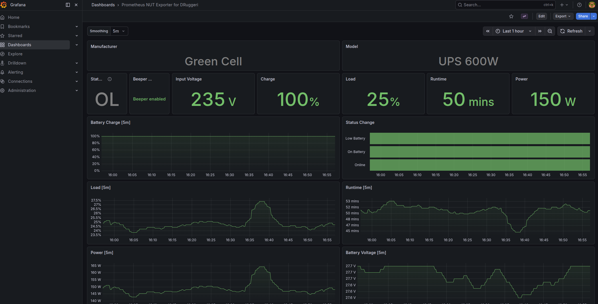

# nut role

Network UPS Tools (NUT) monitoring and automated cluster shutdown for USB-connected UPS devices. Deployed on the K3s master node, this role provides UPS metrics to Prometheus via the [DRuggeri nut_exporter](https://github.com/DRuggeri/nut_exporter) and orchestrates a graceful cluster shutdown when the UPS reaches critical battery.



## Usage

```bash
ansible-playbook common.yml --tags nut
ansible-playbook common.yml --limit k3smaster --tags nut
```

Conditional on `wantsnut: true` in the host inventory.

## What it configures

### NUT server (`nut-server`, `nut-driver`, `nut-monitor`)

- Installs `nut`, `nut-client`, `nut-server` packages
- Deploys udev rule to unbind the kernel USB HID driver from the UPS device, allowing NUT's `blazer_usb` driver to take over
- Configures NUT in `netserver` mode (listens on `0.0.0.0:3493`) so remote clients (nut-exporter in K8s) can query UPS status
- Deploys all NUT config files from templates: `nut.conf`, `ups.conf`, `upsd.conf`, `upsd.users`, `upsmon.conf`
- Configures two upsd users: `admin` (full access) and `monuser` (read-only, used by nut-exporter)
- Verifies UPS detection after deployment via `upsc`

### UPS driver configuration

Default configuration targets a Green Cell UPS 600W (Megatec protocol, USB VID `0001` / PID `0000`):

- Uses `blazer_usb` driver with `langid_fix` for USB communication
- Battery voltage thresholds calibrated for 2 batteries in series (27.6V full / 21.0V empty)
- Runtime calibration (`runtimecal`) estimates runtime from 2x12V/7Ah batteries
- Overrides `device.mfr`, `device.model`, and `ups.realpower.nominal` (not provided by `blazer_usb` with `novendor`)

### Cluster shutdown script

Deploys `/usr/local/bin/nut_shutdown.sh`, triggered by `upsmon` on critical battery (`SHUTDOWNCMD`):

1. `kubectl drain` all worker nodes (configurable via `nut_shutdown_drain_nodes`)
2. SSH poweroff remote cluster nodes (configurable via `nut_shutdown_ssh_hosts`)
3. Local `shutdown -h` of the master node

### Prometheus monitoring

The NUT server exposes metrics on port 3493. The `k8s_infra` role deploys a [DRuggeri nut_exporter](https://github.com/DRuggeri/nut_exporter) pod that queries this port and exposes Prometheus metrics on `:9199/ups_metrics`. Prometheus auto-discovers the exporter via pod annotations.

Alert rules (deployed by `k8s_infra` Prometheus ConfigMap):

| Alert | Condition | Severity |
|---|---|---|
| `UpsOnBattery` | `ups.status` flag `OB` active | warning |
| `UpsLowBattery` | `battery.charge` < 50% | critical |
| `UpsUnavailable` | nut-exporter scrape down for 5m | warning |

A Grafana dashboard ([ID 19308](https://grafana.com/grafana/dashboards/19308)) is auto-provisioned by the `k8s_infra` Grafana role.

## Defaults

| Variable | Default | Purpose |
|---|---|---|
| `nut_ups_name` | `greencell` | UPS identifier in NUT |
| `nut_ups_driver` | `blazer_usb` | NUT driver for Megatec protocol |
| `nut_ups_port` | `auto` | USB port auto-detection |
| `nut_ups_desc` | `Green Cell UPS 600W` | Human-readable description |
| `nut_ups_vendorid` | `0001` | USB vendor ID |
| `nut_ups_productid` | `0000` | USB product ID |
| `nut_ups_extra_options` | *(see defaults)* | Driver-specific options (langid_fix, voltage thresholds, runtimecal, overrides) |
| `nut_mode` | `netserver` | NUT operating mode |
| `nut_listen_address` | `0.0.0.0` | upsd listen address |
| `nut_listen_port` | `3493` | upsd listen port |
| `nut_admin_user` | `admin` | upsd admin username |
| `nut_admin_password` | `changeme` | upsd admin password (override via vault) |
| `nut_monitor_user` | `monuser` | upsd read-only username (used by nut-exporter) |
| `nut_monitor_password` | `changeme` | upsd read-only password (override via vault) |
| `nut_shutdown_drain_nodes` | `[spark1, spark2]` | K8s nodes to `kubectl drain` before shutdown |
| `nut_shutdown_ssh_hosts` | *(dummy IPs)* | Hosts to SSH poweroff after drain (override via vault) |

## Templates

| Template | Deploys to |
|---|---|
| `etc_nut_nut.conf.j2` | `/etc/nut/nut.conf` |
| `etc_nut_ups.conf.j2` | `/etc/nut/ups.conf` |
| `etc_nut_upsd.conf.j2` | `/etc/nut/upsd.conf` |
| `etc_nut_upsd.users.j2` | `/etc/nut/upsd.users` |
| `etc_nut_upsmon.conf.j2` | `/etc/nut/upsmon.conf` |
| `etc_udev_rules.d_99-nut-ups.rules.j2` | `/etc/udev/rules.d/99-nut-ups.rules` |
| `nut_shutdown.sh.j2` | `/usr/local/bin/nut_shutdown.sh` |

## Handlers

- `restart nut-driver` - Restarts `nut-driver@<ups_name>`
- `restart nut-server` - Restarts `nut-server` (upsd)
- `restart nut-monitor` - Restarts `nut-monitor` (upsmon)

## Tags

`nut`
